# AI_AGENT_ARCHITECTURE.md

> **Document Classification:** AI Agent Architecture — Source of Truth  
> **Parent Documents:** ARCHITECTURE_VISION.md · REPOSITORY_MASTER_STRUCTURE.md · SYSTEM_ARCHITECTURE.md · BACKEND_MODULE_ARCHITECTURE.md · FRONTEND_MODULE_ARCHITECTURE.md  
> **Status:** Approved — Foundation Release  
> **Version:** 1.0.0  
> **Scope:** Complete AI agent architecture for the ArchitectIQ platform — philosophy, lifecycle, catalog, contracts, execution model, orchestration, memory, prompts, tools, validation, governance, and future extension  
> **LLM Provider Assumption:** Current implementation assumes OpenAI as the sole provider. The architecture is designed to be provider-independent; the provider assumption is implementation-scoped and does not constrain the architectural contracts.

---

## Table of Contents

1. [Agent Philosophy](#1-agent-philosophy)
2. [Agent Execution Pipeline](#2-agent-execution-pipeline)
3. [Agent Lifecycle](#3-agent-lifecycle)
4. [Agent Communication Rules](#4-agent-communication-rules)
5. [Agent Contracts](#5-agent-contracts)
6. [Agent Execution Model](#6-agent-execution-model)
7. [Agent Catalog](#7-agent-catalog)
8. [Agent Interfaces](#8-agent-interfaces)
9. [Agent Context](#9-agent-context)
10. [Agent Result Model](#10-agent-result-model)
11. [Agent Registry](#11-agent-registry)
12. [Agent Memory Strategy](#12-agent-memory-strategy)
13. [Prompt Strategy](#13-prompt-strategy)
14. [Tool Calling Strategy](#14-tool-calling-strategy)
15. [Retry Strategy](#15-retry-strategy)
16. [Error Handling](#16-error-handling)
17. [Confidence Scoring](#17-confidence-scoring)
18. [Validation Strategy](#18-validation-strategy)
19. [Human Review Integration](#19-human-review-integration)
20. [Agent State Management](#20-agent-state-management)
21. [Agent Versioning](#21-agent-versioning)
22. [Logging and Audit Trail](#22-logging-and-audit-trail)
23. [Decision Recording](#23-decision-recording)
24. [Agent Security](#24-agent-security)
25. [Agent Performance Guidelines](#25-agent-performance-guidelines)
26. [Agent Scalability](#26-agent-scalability)
27. [Future Agent Extension](#27-future-agent-extension)
28. [Document Status and Metadata](#28-document-status-and-metadata)

---

## 1. Agent Philosophy

### 1.1 What an Agent Is

In ArchitectIQ, an agent is a bounded, independently executable unit of AI-driven work. Each agent owns exactly one capability in the architecture pipeline. It knows how to perform that one capability well — and it knows nothing about what comes before it or after it in the pipeline. An agent does not orchestrate. An agent does not coordinate. An agent executes, produces a typed result, and exits.

This narrow definition is intentional. An agent that does more than one thing is an agent that cannot be independently tested, independently replaced, or independently improved. The single-responsibility principle applies to agents with the same force that it applies to software modules.

### 1.2 What an Agent Is Not

An agent is not a chatbot. It does not maintain conversational turns with the user. It does not freestyle. It does not decide what to do next. It does not call other agents. It does not decide when to invoke tools. Every agent has a precisely defined input contract and a precisely defined output contract. Within those contracts, it applies AI reasoning to produce its output. Outside those contracts, it does nothing.

An agent is not a general-purpose AI assistant. Its system prompt is crafted for its specific responsibility. Its retrieval context is scoped to its specific domain. Its output schema is defined and validated before the output is accepted as a result.

### 1.3 Core Agent Principles

| Principle | Description |
|-----------|-------------|
| **One Agent, One Responsibility** | Every agent performs exactly one task. Scope creep is an architectural violation. |
| **Orchestrator-Mediated Communication** | No agent calls another agent. All data flows between agents pass through the Orchestrator. |
| **Contract-First Design** | Every agent's input schema and output schema are defined before the agent is built. The contract is the agent's specification. |
| **Cite Everything** | Every recommendation, finding, or design decision produced by an agent must carry a traceable citation. An uncited output is an invalid output. |
| **Confidence is Required** | Every agent result includes a calculated confidence score. Agents are not permitted to produce results without self-assessed certainty. |
| **Graceful Failure** | An agent that cannot produce a valid result fails explicitly with a typed error. It does not produce a low-quality result and hope downstream agents handle it. |
| **Human Authority is Absolute** | Agents propose. The architect disposes. No agent has authority to approve, reject, or publish a design. That authority belongs exclusively to the human architect. |
| **Independent Testability** | Every agent must be testable with a constructed input context and mocked dependencies. An agent that requires a running pipeline to be tested has a design defect. |
| **Independent Configurability** | Every agent's behavior is controlled through its configuration: model selection, prompt version, parameters, timeouts. Changing an agent's behavior does not require changing its code. |
| **Independent Replaceability** | Every agent can be replaced by a different implementation (including a non-AI implementation) without changing the Orchestrator, other agents, or the pipeline stage it participates in. |

### 1.4 Agent vs. Tool

An agent in ArchitectIQ is not the same as a tool. A tool is a discrete, atomic capability that an agent invokes during its execution — for example, querying the knowledge base, searching a technology catalog, or calling an external API. An agent is the reasoning unit that decides when to invoke tools, constructs the prompt, invokes the LLM, and validates the output. Tools are the agent's hands; the agent is the brain.

---

## 2. Agent Execution Pipeline

### 2.1 Pipeline Overview

The agent pipeline is the ordered sequence of agent stages that transforms an unstructured business requirement into a validated, human-approved architecture proposal and a set of generated deliverables. The pipeline is divided into five stage groups. Each stage group produces outputs consumed by the next.

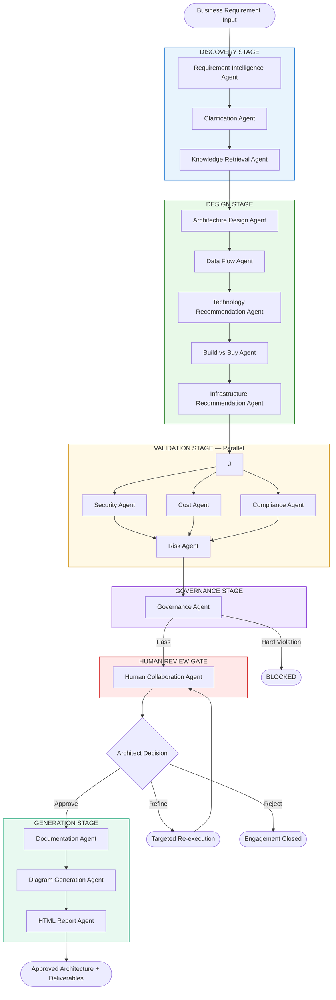

### 2.2 Stage Group Definitions

| Stage Group | Stage | Execution Pattern | Human Gate | Output |
|-------------|-------|------------------|------------|--------|
| Discovery | Stage 1 | Sequential | No | Structured requirements + retrieved knowledge |
| Design | Stage 2 | Sequential within stage | No | Candidate architectures + tech selections + IaC guidance |
| Validation | Stage 3 | Parallel (Security, Cost, Compliance) → Risk aggregates | No | Security findings, TCO, compliance checklist, risk register |
| Governance | Stage 4 | Sequential | No (hard block only) | Policy compliance verdict |
| Human Review | Gate | Awaits architect decision | **Yes — mandatory** | Approve / Refine / Reject |
| Generation | Stage 5 | Sequential | No | Documents, diagrams, HTML reports |

---

## 3. Agent Lifecycle

### 3.1 Individual Agent Execution Lifecycle

Every agent — regardless of category — executes through the same lifecycle. The lifecycle is enforced by the `BaseAgent` class. Individual agents implement the step-specific logic; they do not override or bypass the lifecycle sequence.

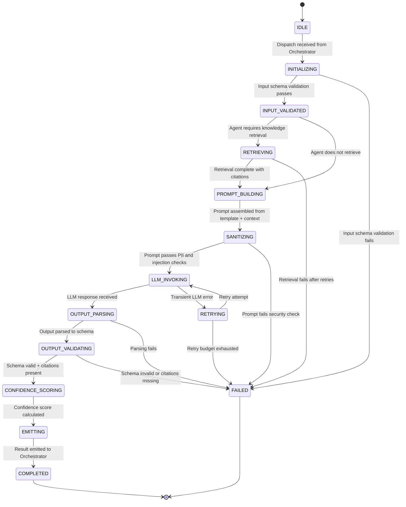

### 3.2 Lifecycle Step Responsibilities

| Step | Responsibility | Failure Behavior |
|------|---------------|-----------------|
| **INITIALIZING** | Validate the incoming `AgentContext` against the agent's declared input schema | Emit `AgentInputValidationError` — pipeline stage fails |
| **RETRIEVING** | Query the Knowledge Layer via `KnowledgeInterface` for relevant context | On retrieval failure: produce a degraded context, flag low confidence, continue |
| **PROMPT_BUILDING** | Merge retrieved context + engagement inputs + versioned prompt template | If template version not found: emit `PromptVersionNotFoundError` |
| **SANITIZING** | Pass prompt through PII, secret, and injection detection checks | On detection: block invocation, emit security event, fail agent |
| **LLM_INVOKING** | Invoke LLM via the `LLMInterface` using the configured model and parameters | On transient error: retry. On non-retryable error: fail |
| **OUTPUT_PARSING** | Extract structured data from the LLM text response against the output schema | On parse failure: fail agent — do not propagate malformed output |
| **OUTPUT_VALIDATING** | Validate schema conformance, citation presence, and minimum field completeness | Citation absence is a hard failure — not a warning |
| **CONFIDENCE_SCORING** | Calculate composite confidence score from retrieval relevance, schema completeness, internal consistency | Score always calculated — a score of zero is a valid (failing) score |
| **EMITTING** | Wrap validated output, citations, confidence score, token usage, and timing into `AgentResult` | If any mandatory field is missing from `AgentResult`: fail rather than emit incomplete |

---

## 4. Agent Communication Rules

### 4.1 The Orchestrator-Only Rule

No agent imports, instantiates, or calls another agent. This rule has no exceptions. Agent-to-agent data flow is exclusively mediated by the Orchestrator. The Orchestrator collects an agent's output, places it in the context for the next agent, and dispatches the next agent. Agents are leaves in the dependency graph — they have no knowledge of the graph's structure.

### 4.2 Communication Flow

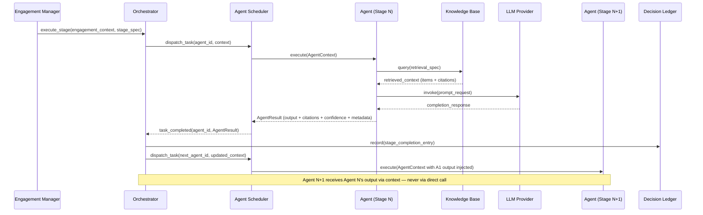

### 4.3 Allowed and Forbidden Communication

| Communication | Allowed | Notes |
|--------------|---------|-------|
| Orchestrator → Agent | ✅ | Via `AgentInterface.execute(context)` only |
| Agent → Knowledge Base | ✅ | Via `KnowledgeInterface.query()` only |
| Agent → LLM | ✅ | Via `LLMInterface.invoke()` only |
| Agent → Decision Ledger | ✅ | Via `LedgerInterface.append()` for agent-specific audit entries only |
| Agent → Agent | ❌ | Never. No exceptions. |
| Agent → Orchestrator | ❌ | Agents return results; they do not call the Orchestrator |
| Agent → Storage (write) | ❌ | Agents do not write to persistent storage. The Orchestrator persists agent outputs. |
| Agent → Storage (read) | ⚠️ | Only via defined read interface for reference data (technology catalog, compliance frameworks) |
| Orchestrator → External Systems | ❌ | The Orchestrator calls agents. External system calls belong to Infrastructure adapters. |

---

## 5. Agent Contracts

### 5.1 Contract Definition Principle

Every agent has a contract — a formal specification of what it accepts as input and what it guarantees as output. The contract is defined before any agent implementation begins. The contract does not change without an architectural review. A change to an agent's input or output contract is a breaking change that requires a new agent version.

### 5.2 Contract Components

Every agent contract specifies:

**Input contract:** The schema of the `AgentContext` payload the agent will accept. Fields are classified as required (absence causes input validation failure) or optional (absence causes reduced confidence or conditional behavior). All field types are typed.

**Output contract:** The schema of the data payload within the `AgentResult` that the agent guarantees to produce. Every field in the output contract is either required (always present on success) or conditionally present (present under declared conditions). An agent that cannot produce a required output field on a success path must return a failure result instead.

**Citation contract:** The agent declares the minimum number of citations required in its output. An agent that declares a minimum of one citation and produces zero citations is an output validation failure — not a soft warning.

**Confidence contract:** The agent declares the confidence calculation model it uses (which signals are combined, how they are weighted). This declaration is part of the agent's specification and enables the architect to understand the basis of a given confidence score.

**Dependency contract:** The agent declares which tools it requires, which knowledge base queries it issues, and which other interfaces it depends on. This contract enables the infrastructure to validate that all dependencies are available before the agent is dispatched.

---

## 6. Agent Execution Model

### 6.1 Orchestration Sequence

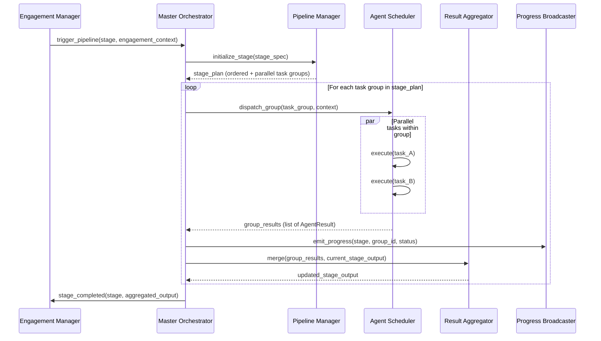

### 6.2 Parallel Execution in the Validation Stage

The Validation Stage is the primary application of parallel execution. Security, Cost, and Compliance agents run simultaneously on the Design Stage output. The Risk Agent waits for the other three to complete before aggregating their findings.

```mermaid
gantt
    title Validation Stage — Parallel Execution Timeline
    dateFormat  ss
    axisFormat  %Ss

    section Security Agent
    Execute       :a1, 00, 45s

    section Cost Agent
    Execute       :a2, 00, 30s

    section Compliance Agent
    Execute       :a3, 00, 40s

    section Risk Agent
    Wait for deps :crit, r_wait, 00, 45s
    Execute       :r1, after r_wait, 25s
```

### 6.3 Targeted Re-execution in Refinement

When an architect requests refinement, the Orchestrator does not re-execute the entire pipeline. It re-executes only the agents whose outputs are affected by the architect's feedback. The re-execution plan is produced by the `RefinementRouter` (defined in BACKEND_MODULE_ARCHITECTURE.md) and passed to the Orchestrator as a partial stage specification.

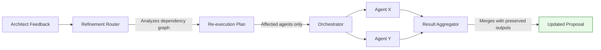

Unaffected agent outputs are preserved from the prior cycle. The Human Collaboration Agent re-packages the proposal with the re-executed outputs merged with the preserved outputs and presents the updated proposal to the architect.

---

## 7. Agent Catalog

### 7.1 Catalog Overview

ArchitectIQ defines seventeen agents organized into five functional categories. Each agent in this catalog extends the twelve agents established in BACKEND_MODULE_ARCHITECTURE.md with five additional specialized agents that provide finer-grained capability separation.

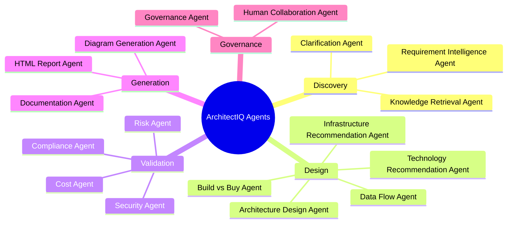

---

### 7.2 DISCOVERY AGENTS

#### Agent 1 — Requirement Intelligence Agent

**Purpose:** The first agent in every pipeline. Converts unstructured architect input (free text, document, form data) into a structured, schema-validated requirement set. This is the foundation on which every subsequent agent builds.

**Responsibility:** Extract functional requirements, non-functional requirements (availability, latency, scalability, data residency, retention), technical constraints, organizational constraints, compliance obligations mentioned by the architect, and success criteria. Flag ambiguities rather than assume. Flag under-specified NFRs rather than invent values.

**Inputs:**
- Raw architect input (text, parsed document content, or structured form submission)
- Prior conversation context (for requirement refinement scenarios)
- Domain context (inferred or declared domain: healthcare, financial services, generic, etc.)

**Outputs:**
- Structured functional requirement list with requirement ID, description, and source attribution
- Structured non-functional requirement set organized by NFR category
- Ambiguity flag list (each with: ambiguous statement, the agent's best interpretation, confidence, and a clarification question for the architect)
- Compliance obligations mentioned or implied by the input
- Constraint list (technical and organizational)
- Overall extraction confidence score

**Dependencies:** Versioned prompt template, conversation history (for context), LLM invocation.

---

#### Agent 2 — Clarification Agent

**Purpose:** Resolves flagged ambiguities by generating targeted clarification questions for the architect and, when the architect responds, incorporating the clarifications into the structured requirement set.

**Responsibility:** Analyze the ambiguity flags from the Requirement Intelligence Agent. Prioritize ambiguities by their impact on architecture decisions. Generate a minimal, ordered set of clarification questions (avoiding redundancy, avoiding questions answerable from context). On receiving architect responses, update the structured requirement set with the clarified values and remove the resolved ambiguity flags.

**Inputs:**
- Structured requirements output from the Requirement Intelligence Agent (including ambiguity flags)
- Architect clarification responses (if this is a follow-up invocation after the architect has answered questions)

**Outputs:**
- Updated structured requirement set with resolved ambiguities incorporated
- Remaining unresolved ambiguity list (flagged for architect awareness in the review gate)
- Clarification question set (for first invocation, when questions have not yet been asked)
- Delta summary (what changed between the pre-clarification and post-clarification requirement set)

**Dependencies:** Requirement Intelligence Agent output (in context), LLM invocation.

**Note:** The Clarification Agent is invoked twice in an engagement — once to generate questions (whose answers are presented in the chat panel), and once to incorporate responses. If the architect chooses to skip clarification, the agent's unresolved ambiguity list is preserved and surfaced at the review gate.

---

#### Agent 3 — Knowledge Retrieval Agent

**Purpose:** Queries the enterprise knowledge base to surface relevant architecture patterns, prior technology decisions, regulatory frameworks, and approved precedents that will ground the Design Stage agents' reasoning.

**Responsibility:** Formulate retrieval queries from the structured requirements. Execute semantic retrieval via the RAG Engine. Apply structured filters for domain and knowledge type. Rank and assemble the retrieved context package with source citations. Declare the retrieval confidence (based on relevance scores of the top-K results).

**Inputs:**
- Structured requirements from the Clarification Agent
- Domain context, compliance obligation list, declared technology constraints
- Retrieval parameters (top-K, domain filter, knowledge type filter, recency bias)

**Outputs:**
- Ranked list of relevant knowledge items (architecture patterns, technology evaluations, regulatory frameworks, prior approved decisions)
- Source citation for every retrieved item (knowledge entry ID, entry type, relevance score)
- Retrieval coverage assessment (are all major requirement areas covered by retrieved knowledge, or are there gaps?)
- Retrieval confidence score (aggregate relevance score of the retrieved context)

**Dependencies:** `KnowledgeInterface.query()`, RAG Engine, LLM invocation (for query formulation and context assembly).

---

### 7.3 DESIGN AGENTS

#### Agent 4 — Architecture Design Agent

**Purpose:** The primary design reasoning agent. Generates one to three candidate architecture options grounded in retrieved patterns and structured requirements, each with explicit trade-off rationale.

**Responsibility:** Compose candidate architectures from patterns retrieved by the Knowledge Retrieval Agent. For each candidate: identify the pattern (Medallion, Lambda, Kappa, Data Mesh, Hub-and-Spoke, etc.), explain why it satisfies the stated requirements and NFRs, document where it creates trade-offs against alternative patterns, and declare confidence in the pattern fit.

**Inputs:**
- Structured requirements (from Clarification Agent)
- Retrieved knowledge context with citations (from Knowledge Retrieval Agent)
- Architecture constraints declared by the architect

**Outputs:**
- List of candidate architecture descriptions (one to three) each containing:
  - Pattern name and classification
  - Component list with responsibilities
  - Rationale for pattern selection
  - Trade-off analysis against the alternatives considered
  - Known risks associated with this pattern in the stated context
  - Pattern-level confidence score
- Recommended candidate (the agent's own assessment of best fit, with reasoning)
- Comparative summary table (candidates vs. shared evaluation criteria)

**Dependencies:** Retrieved knowledge context, LLM invocation.

---

#### Agent 5 — Data Flow Agent

**Purpose:** Designs the end-to-end data flow for each candidate architecture — from data sources through ingestion, processing, storage, and serving — with latency, throughput, and SLA characteristics.

**Responsibility:** For each candidate architecture from the Architecture Design Agent, produce a detailed data flow specification: identify data sources and their characteristics (volume, velocity, variety, format), design ingestion paths (streaming, batch, CDC, API), specify processing stages (transformation, enrichment, quality control), map storage tiers (raw, curated, serving), and define the serving layer (APIs, dashboards, exports). Annotate each stage with latency and throughput characteristics derived from the stated NFRs.

**Inputs:**
- Candidate architectures from the Architecture Design Agent
- Structured requirements (data characteristics, latency NFRs, throughput NFRs)
- Retrieved knowledge context (data platform patterns, integration patterns)

**Outputs:**
- Data flow specification per candidate architecture containing:
  - Data source inventory with volume and velocity characteristics
  - Ingestion pattern per source (streaming / micro-batch / batch / event-driven)
  - Processing stage sequence with transformation descriptions
  - Storage tier mapping (Bronze/Silver/Gold or equivalent pattern)
  - Serving layer specification
  - End-to-end latency estimate per data path
  - SLA mapping (which data paths are critical vs. best-effort)
- Data flow diagram description (structured for the Diagram Generation Agent)

**Dependencies:** Architecture Design Agent output (in context), LLM invocation.

---

#### Agent 6 — Technology Recommendation Agent

**Purpose:** Selects specific technologies for each component in each candidate architecture, evaluated against a standardized scoring framework and restricted to the enterprise-approved technology catalog.

**Responsibility:** For each component in each candidate architecture (ingestion, processing, storage, orchestration, serving, etc.), apply the technology scoring framework: maturity, licensing cost, integration compatibility, operational burden, team familiarity, and vendor support. Select the best-fit technology from the approved catalog. Document the scoring for every considered option, not just the selected one.

**Inputs:**
- Candidate architectures with data flow specifications
- Enterprise-approved technology catalog (loaded as reference data)
- Technology constraints declared by the architect (cloud preference, approved vendors, prohibited technologies)
- Structured requirements (cost sensitivity, operational maturity, team capabilities)

**Outputs:**
- Technology selection matrix: for each architecture component, the selected technology, its scoring across evaluation criteria, and the alternatives considered with their scores
- Technology justification narrative per selection
- Licensing and cost implications summary (input to the Cost Agent)
- Integration compatibility map (which selected technologies have known integration points vs. require custom connectors)
- Technology catalog exception flags (if no catalog-approved technology satisfies a requirement, flag for architect decision)

**Dependencies:** Technology catalog (reference data), Architecture Design Agent and Data Flow Agent outputs (in context), LLM invocation.

---

#### Agent 7 — Build vs Buy Agent

**Purpose:** For each architecture layer, provides a structured recommendation on whether to build a custom solution, use open-source software, or procure a managed commercial service — with explicit effort and cost trade-offs.

**Responsibility:** Evaluate each major capability in the candidate architectures (ingestion, processing, orchestration, storage, analytics, serving) on three options: build from scratch, adopt open-source, or buy a managed service. For each option, estimate relative implementation effort, operational burden, total cost of ownership trajectory, and vendor/community risk. Produce a recommendation with explicit reasoning.

**Inputs:**
- Candidate architectures with technology selections
- Cost constraints and budget signals from structured requirements
- Organizational capability context (from structured requirements: team size, engineering maturity, existing vendor relationships)
- Technology selections from the Technology Recommendation Agent

**Outputs:**
- Build vs Buy assessment per architecture layer containing:
  - Evaluated options (Build / Open-Source / Managed Service)
  - Effort estimate (relative: low / medium / high)
  - TCO trajectory (short-term vs. long-term cost implications)
  - Risk profile per option (vendor lock-in, community longevity, operational complexity)
  - Recommended option with justification
- Summary recommendation table (all layers × options with recommended row highlighted)
- Overall build vs buy posture (predominantly build / predominantly buy / hybrid)

**Dependencies:** Technology Recommendation Agent output, structured requirements, LLM invocation.

---

#### Agent 8 — Infrastructure Recommendation Agent

**Purpose:** Maps the logical architecture decisions into a physical deployment topology and produces infrastructure scaffolding guidance for the approved design.

**Responsibility:** Translate the logical architecture (components and their relationships) into a deployment topology: network segmentation, compute placement (container orchestration, serverless, managed services), storage tier placement, security boundary definition, and high-availability configuration. Produce an infrastructure scaffolding description that the IaC Generator (in the output layer) can use to produce Terraform or Bicep module references.

**Inputs:**
- Candidate architectures with technology selections and Build vs Buy recommendations
- Cloud platform constraint (if declared by architect)
- NFRs: availability SLA, disaster recovery targets (RTO/RPO), geo-distribution requirements
- Security requirements from structured requirements

**Outputs:**
- Deployment topology description per candidate architecture:
  - Compute placement and scaling specification
  - Network segmentation (zones, subnets, security boundaries)
  - Storage configuration (replication, durability class, encryption at rest)
  - Identity and access boundary definition
  - High-availability configuration (multi-zone or multi-region)
  - Disaster recovery topology
- IaC guidance description (module references and parameterization hints, not code)
- Topology diagram description (structured for the Diagram Generation Agent)

**Dependencies:** Design Stage agent outputs (in context), LLM invocation.

---

### 7.4 VALIDATION AGENTS

#### Agent 9 — Security Agent

**Purpose:** Performs threat modelling on each candidate architecture and validates the security design against the enterprise security baseline.

**Responsibility:** Apply threat modelling (STRIDE or equivalent framework) to each candidate architecture. Identify threats per component and data flow. Map security controls to threats. Classify findings by severity (Critical, High, Medium, Low). Identify uncontrolled threats. Flag deviations from the enterprise security baseline (encryption standards, IAM patterns, network segmentation requirements).

**Inputs:**
- Candidate architectures with deployment topology
- Data flow specifications (for identifying sensitive data paths)
- Enterprise security baseline (loaded as reference data)
- Data classification from structured requirements (PII, PHI, financial data, etc.)

**Outputs:**
- Threat model summary per candidate architecture:
  - Threat list with: threat ID, category (STRIDE), component, severity, likelihood, current control status
  - Uncontrolled threat list (blocking findings vs. advisory findings)
  - Control mapping (which controls satisfy which threats)
  - Security baseline deviation list
- Security posture score per candidate (aggregate of controlled vs. uncontrolled threats, weighted by severity)
- Security finding citations (knowledge base references for recommended controls)

**Dependencies:** Design Stage outputs (in context), security baseline reference data, LLM invocation.

---

#### Agent 10 — Cost Agent

**Purpose:** Models the infrastructure cost and total cost of ownership for each candidate architecture based on the technology selections and anticipated workload profile.

**Responsibility:** Project the infrastructure run-rate cost for each candidate architecture at the stated scale. Identify cost drivers (compute, storage, egress, licensing, operational). Project cost growth under stated scaling assumptions. Identify cost optimization opportunities (reserved capacity, tiering, right-sizing). Produce a TCO projection at 1-year and 3-year horizons.

**Inputs:**
- Candidate architectures with technology selections and Build vs Buy recommendations
- Infrastructure topology from the Infrastructure Recommendation Agent
- Workload profile from structured requirements (data volume, query concurrency, processing frequency)
- Budget constraints from structured requirements (if declared)

**Outputs:**
- TCO model per candidate architecture:
  - Component-level monthly cost estimate
  - Total monthly run-rate estimate
  - 1-year and 3-year TCO projections
  - Cost scaling curve (how cost grows with data volume / user concurrency)
  - Top three cost optimization recommendations with estimated savings
  - Licensing cost breakdown (open-source vs. commercial components)
- Cost comparison table across candidates
- Budget risk flag (if projected cost exceeds declared budget constraint)

**Dependencies:** Technology Recommendation Agent and Infrastructure Recommendation Agent outputs (in context), pricing reference data, LLM invocation.

---

#### Agent 11 — Compliance Agent

**Purpose:** Evaluates each candidate architecture against applicable regulatory and internal policy frameworks, producing a structured compliance checklist with pass/fail/needs-review status per control.

**Responsibility:** Identify the applicable regulatory frameworks from the structured requirements (GDPR, HIPAA, SOC 2, ISO 27001, PCI-DSS, FDA 21 CFR Part 11, etc.). For each framework, retrieve the relevant controls from the knowledge base. Evaluate each control against the candidate architecture's design elements (data residency, retention, encryption, access control, audit logging). Flag controls that are not satisfied or require architect clarification.

**Inputs:**
- Candidate architectures with technology selections and infrastructure topology
- Compliance obligations from structured requirements
- Applicable regulatory frameworks retrieved from the knowledge base
- Data classification from structured requirements

**Outputs:**
- Compliance assessment per candidate architecture and per regulatory framework:
  - Control checklist: control ID, requirement description, evaluation status (Pass / Fail / Needs Review), evidence from the architecture, recommended remediation for failures
  - Compliance coverage percentage per framework
  - Blocking compliance failures (design elements that categorically violate a mandatory control)
  - Advisory compliance items (design elements requiring architect judgment or additional evidence)
- Multi-framework summary (across all applicable frameworks)
- Compliance risk narrative

**Dependencies:** Regulatory framework reference data (knowledge base), Design Stage and Security Agent outputs (in context), LLM invocation.

---

#### Agent 12 — Risk Agent

**Purpose:** Aggregates the outputs of the Security, Cost, and Compliance agents into a unified, prioritized risk register. The Risk Agent is the final agent in the Validation Stage.

**Responsibility:** Consolidate findings from the three parallel Validation agents. Score each risk on a probability-impact matrix. Prioritize the risk register. Produce suggested mitigations for the highest-priority risks. Identify risk dependencies (risks that compound each other). Summarize the overall risk posture per candidate architecture.

**Inputs:**
- Security Agent findings (threat model, uncontrolled threats, severity classifications)
- Cost Agent findings (budget risk flags, cost overrun projections)
- Compliance Agent findings (blocking failures, advisory items)
- Technical delivery risks (inferred from the design complexity, Build vs Buy choices, team capability gaps)

**Outputs:**
- Unified risk register: risk ID, category (security / cost / compliance / delivery), description, probability, impact, risk score, affected candidate(s), suggested mitigation
- Risk priority ranking (top 10 risks by composite score)
- Risk dependency map (risks that elevate each other's probability or impact)
- Risk posture summary per candidate (overall risk classification: Low / Medium / High / Critical)
- Recommended risk acceptance or mitigation strategy per high-priority risk

**Dependencies:** Security Agent, Cost Agent, and Compliance Agent outputs (all in context), LLM invocation.

---

### 7.5 GENERATION AGENTS

#### Agent 13 — Documentation Agent

**Purpose:** Produces all structured written deliverables from the approved architecture state — HLD, LLD, executive summary, assumptions log, and risk register narrative.

**Responsibility:** Structure the approved architecture state (from the architect's approval decision) into all required document sections. Apply the versioned document template for each deliverable type. Ensure internal consistency across all documents (the same component name, the same technology selection, the same risk finding appears consistently across all document types). Do not introduce content not present in the approved design state.

**Inputs:**
- Approved architecture state (the single candidate approved by the architect, including all agent outputs incorporated)
- Document template specifications (format, section structure, depth per section)
- Architect overrides and refinements incorporated into the approved state
- Audience declaration (executive summary vs. implementation detail level)

**Outputs:**
- High-Level Design (HLD) document: architecture overview, component responsibilities, key design decisions, trade-off rationale, integration points
- Low-Level Design (LLD) document: component-level specifications, data schemas (conceptual), security configurations, API boundary descriptions, deployment configurations
- Executive Summary: business-facing summary of the architecture, expected outcomes, risks, and roadmap
- Assumptions and Constraints Log: all assumptions made during the design with their stated basis
- Risk Register narrative: prose rendering of the Risk Agent's structured risk register with context and mitigation guidance

**Dependencies:** Complete approved architecture state (all Design, Validation, and Governance outputs), versioned document templates, LLM invocation.

---

#### Agent 14 — Diagram Generation Agent

**Purpose:** Produces all architecture diagram source code in supported rendering formats from the approved architecture state.

**Responsibility:** Transform the structured architecture descriptions (from the Architecture Design Agent, Data Flow Agent, and Infrastructure Recommendation Agent) into valid, renderable diagram source in Mermaid format (primary) and Graphviz DOT format (for complex diagrams where Mermaid's expressiveness is insufficient). Each diagram type has a defined purpose and a defined scope.

**Inputs:**
- Approved architecture state
- Data flow specification (from Data Flow Agent)
- Deployment topology (from Infrastructure Recommendation Agent)
- Diagram type specifications (which diagrams to generate: architecture overview, data flow, deployment topology, security boundary, component interaction)
- Diagram style configuration (from template configuration)

**Outputs:**
- Architecture overview diagram (Mermaid): major components and their relationships
- Data flow diagram (Mermaid): end-to-end data movement from sources to serving
- Deployment topology diagram (Graphviz DOT): physical infrastructure placement
- Security boundary diagram (Mermaid): trust zones and data classification boundaries
- Component interaction diagram (Mermaid): runtime interaction sequence for key flows

Each diagram is provided as:
- Rendered source (Mermaid or Graphviz DOT text)
- Diagram title and description
- Legend declaration (component types, relationship types)

**Dependencies:** Documentation Agent output and full approved architecture state (in context), LLM invocation.

---

#### Agent 15 — HTML Report Agent

**Purpose:** Produces a self-contained, interactive HTML architecture report that presents the complete approved architecture in a professional, stakeholder-ready format.

**Responsibility:** Structure all architecture content — narrative, diagrams, validation findings, risk register, cost model, implementation roadmap — into a single-page, self-contained HTML document with interactive elements: collapsible sections, tab navigation, embedded diagram rendering (Mermaid rendered in-browser), print-optimized layout, and download capability. The HTML report is the primary client-deliverable format.

**Inputs:**
- All Documentation Agent outputs (HLD, LLD, Executive Summary, Assumptions Log, Risk Register)
- All Diagram Generation Agent outputs (diagram source strings)
- Cost Agent TCO model data
- Compliance Agent assessment summary
- Implementation roadmap (if generated)
- HTML report template (versioned)

**Outputs:**
- Self-contained HTML file containing:
  - Executive summary section
  - Architecture overview with embedded interactive Mermaid diagram
  - Data flow section with embedded diagram
  - Technology stack section with Build vs Buy summary
  - Validation findings section (security, cost, compliance, risk — tabbed)
  - Implementation roadmap section
  - Full HLD and LLD sections (collapsible)
  - Appendix (assumptions log, compliance checklist, agent execution metadata)
- HTML is self-contained — all CSS, JavaScript, and diagram source embedded. No external CDN dependency for core functionality.

**Dependencies:** All Documentation Agent and Diagram Generation Agent outputs (in context), HTML report template, LLM invocation for narrative assembly.

---

### 7.6 GOVERNANCE AGENTS

#### Agent 16 — Governance Agent

**Purpose:** Enforces enterprise architecture policies and platform-level guardrails against every generated output before the proposal reaches the human review gate.

**Responsibility:** Check all Design Stage and Validation Stage outputs against: the enterprise-approved technology catalog (flag non-approved technologies), mandatory security standards (flag encryption deviations, IAM deviations), non-negotiable NFR thresholds (flag designs that structurally cannot meet declared availability SLAs), and platform governance rules (flag designs that bypass required architectural patterns). Classify findings as hard violations (block the proposal from advancing) or advisory findings (surface but allow the architect to override).

**Inputs:**
- Complete Design Stage output (all five Design agents' results)
- Complete Validation Stage output (all four Validation agents' results)
- Enterprise architecture policy catalog (loaded as reference data)
- Enterprise-approved technology catalog

**Outputs:**
- Governance compliance verdict: PASS or BLOCKED
- Hard violation list (each with: violated policy ID, policy description, violating design element, no acceptable exception path) — present only when verdict is BLOCKED
- Advisory finding list (each with: policy ID, recommendation, architect override rationale required)
- Policy coverage summary (which policies were checked and their pass/fail status)
- Governance confidence score (how thoroughly the policy catalog was applied given the available context)

**Dependencies:** Complete pipeline output to this point (in context), enterprise policy catalog (reference data), LLM invocation.

---

#### Agent 17 — Human Collaboration Agent

**Purpose:** Consolidates all pipeline outputs into a single, coherent, navigable review package for the human architect. Routes architect feedback to the appropriate agents for targeted re-execution.

**Responsibility:** Receive the complete set of agent outputs from the Orchestrator. Assemble them into the structured review package consumed by the frontend's `review` module. Highlight the areas of highest importance for the architect's attention (blocking findings, low-confidence recommendations, open ambiguities). When the architect provides refinement feedback, analyze the feedback and produce a structured routing specification that the Orchestrator uses to determine which agents to re-execute.

**Inputs (proposal assembly):**
- Complete output from all 16 preceding agents
- Governance Agent verdict and findings
- Engagement version number (for multi-cycle review labeling)

**Inputs (feedback routing):**
- Architect refinement feedback (free text and/or structured override payload)
- Current engagement state (for dependency graph context)

**Outputs (proposal assembly):**
- Structured review package:
  - Proposal version identifier
  - Requirements interpretation summary with ambiguity flags
  - Candidate architecture summaries with comparison table
  - Validation summary (count of blocking vs. advisory findings across all validation domains)
  - Governance verdict summary
  - Attention items (ordered list of things the architect must consider before approving)
  - Citations panel (index of all knowledge base citations used in this proposal)

**Outputs (feedback routing):**
- Refinement routing specification: which agents to re-execute, in what order, with what feedback injected as additional context

**Dependencies:** All prior agent outputs (in context), LLM invocation.

---

## 8. Agent Interfaces

### 8.1 `AgentInterface`

The `AgentInterface` is the single contract that every agent must implement. It defines the method signature for agent execution. The Orchestrator interacts exclusively through this interface — it never calls concrete agent implementations directly.

**Contract:**
```
interface AgentInterface:
    AGENT_ID: string          # Unique identifier (e.g., "requirement_intelligence_v1")
    AGENT_VERSION: string     # Semantic version of this agent implementation
    AGENT_CATEGORY: enum      # DISCOVERY | DESIGN | VALIDATION | GENERATION | GOVERNANCE
    AGENT_NAME: string        # Human-readable name
    
    method execute(context: AgentContext) -> AgentResult
        # Synchronous execution. Blocks until result is ready.
        # Never calls other agents.
        # Raises AgentExecutionError on unrecoverable failure.
```

### 8.2 `BaseAgent` Abstract Class

`BaseAgent` is the abstract class that all 17 agents inherit. It implements the agent lifecycle (defined in Section 3) as a template method pattern. Subclasses implement the lifecycle step methods; they do not override the lifecycle orchestration.

**Template method structure:**
```
BaseAgent.execute(context):
    validate_input(context)          → subclass implements: _validate_input()
    retrieve_knowledge(context)      → subclass implements: _build_retrieval_query()
    build_prompt(context, knowledge) → subclass implements: _build_prompt()
    sanitize_prompt(prompt)          → BaseAgent implements (shared logic)
    invoke_llm(prompt)               → BaseAgent implements (shared logic via LLMInterface)
    parse_output(response)           → subclass implements: _parse_output()
    validate_output(output)          → subclass implements: _validate_output()
    calculate_confidence(output, knowledge) → subclass implements: _calculate_confidence()
    emit_result(output, confidence)  → BaseAgent implements (shared logic)
```

### 8.3 Tool Interface

Agents that invoke tools during execution use the `ToolInterface`. A tool is an atomic, deterministic capability (knowledge query, technology catalog lookup, pricing API call). Tools are declared in the agent's specification and registered in the agent's configuration.

```
interface ToolInterface:
    TOOL_ID: string
    TOOL_NAME: string
    
    method invoke(input: ToolInput) -> ToolResult
```

---

## 9. Agent Context

### 9.1 `AgentContext` — Concept

The `AgentContext` is the complete information package assembled by the Orchestrator and passed to each agent at dispatch time. It is the agent's entire view of the world — the agent consults nothing beyond its context and its tool invocations.

The `AgentContext` is immutable from the agent's perspective — the agent reads from it, does not write to it. The Orchestrator constructs a new `AgentContext` for each agent invocation, incorporating the outputs of prior agents as declared in the pipeline stage specification.

### 9.2 `AgentContext` Composition

| Field | Type | Description |
|-------|------|-------------|
| `context_id` | UUID | Unique identifier for this execution context |
| `engagement_id` | UUID | The engagement this execution belongs to |
| `session_id` | UUID | The session this engagement belongs to |
| `correlation_id` | UUID | Request-level trace identifier |
| `stage` | Enum | Which pipeline stage this execution belongs to |
| `agent_id` | String | Which agent this context is prepared for |
| `engagement_inputs` | Object | The original architect inputs (requirement text, attachments) |
| `structured_requirements` | Object | Structured requirements from the Clarification Agent (if available) |
| `retrieved_knowledge` | Object | Retrieved context package from the Knowledge Retrieval Agent (if available) |
| `prior_stage_outputs` | Map<AgentID, AgentResult> | Outputs of all prior agents whose results this agent depends on |
| `architect_overrides` | List | Architect-specified overrides from prior review cycles |
| `refinement_feedback` | String | Architect's refinement feedback (for re-execution invocations) |
| `agent_configuration` | Object | This agent's configuration: model_id, prompt_version, parameters, timeout |
| `execution_version` | Integer | Which review cycle iteration this is (1 for first execution, N for refinement N) |
| `domain_context` | Object | Active domain configuration (domain name, applicable regulatory frameworks, technology catalog partition) |

### 9.3 Context Construction Rules

- The Orchestrator constructs the `AgentContext`. No other component constructs it.
- Fields that are not yet available (e.g., `structured_requirements` for the first agent in the pipeline) are null — the receiving agent's input validation handles optional vs. required field checking.
- `prior_stage_outputs` contains only the outputs of agents whose results this specific agent is declared to depend on. Agents do not receive the outputs of agents they do not depend on.
- Sensitive context data (architect's raw input text, client names) is sanitized before the context is passed to the agent if those fields are not required for the agent's function.

---

## 10. Agent Result Model

### 10.1 `AgentResult` — Concept

The `AgentResult` is the standardized wrapper that every agent produces upon successful execution. The Orchestrator only accepts `AgentResult` objects from agents. An agent that cannot produce a valid `AgentResult` raises a typed exception instead.

### 10.2 `AgentResult` Composition

| Field | Type | Description |
|-------|------|-------------|
| `result_id` | UUID | Unique identifier for this result |
| `agent_id` | String | Which agent produced this result |
| `agent_version` | String | The agent implementation version that produced this result |
| `prompt_version` | String | The prompt template version used during this execution |
| `model_id` | String | The LLM model identifier used |
| `execution_status` | Enum | SUCCESS \| DEGRADED \| FAILED |
| `output` | Object | The agent's typed output payload (schema varies by agent) |
| `citations` | List[Citation] | All knowledge base citations referenced in the output |
| `confidence_score` | Float [0.0–1.0] | Overall confidence score for this result |
| `confidence_breakdown` | Object | Per-signal confidence scores: retrieval relevance, schema completeness, consistency |
| `tokens_consumed` | Object | Prompt tokens, completion tokens, total tokens |
| `execution_latency_ms` | Integer | Time from dispatch to result emission |
| `retrieval_metadata` | Object | Query used, items retrieved, average relevance score |
| `degradation_reason` | String | Present only when status is DEGRADED — explains what is missing |
| `failure_reason` | Object | Present only when status is FAILED — typed error with code and message |
| `context_id` | UUID | Back-reference to the `AgentContext` that produced this result |
| `produced_at` | Timestamp | UTC timestamp of result emission |

### 10.3 `Citation` Object

| Field | Type | Description |
|-------|------|-------------|
| `citation_id` | UUID | Unique identifier |
| `knowledge_entry_id` | UUID | Reference to the knowledge base entry |
| `knowledge_entry_type` | Enum | PATTERN \| PRECEDENT \| STANDARD \| FRAMEWORK \| CATALOG |
| `relevance_score` | Float | Similarity score from the retrieval query |
| `cited_claim` | String | The specific output claim this citation supports |
| `source_title` | String | Human-readable title of the knowledge entry |
| `source_excerpt` | String | The specific passage from the knowledge entry that grounds the claim |

### 10.4 Execution Status Semantics

| Status | Meaning | Propagation |
|--------|---------|-------------|
| `SUCCESS` | All output fields are valid, all required citations are present, confidence score is above the configured minimum threshold | Full result propagated to the next stage |
| `DEGRADED` | Output is usable but incomplete — e.g., retrieval failed so knowledge grounding is absent; some optional output fields are missing | Degraded result propagated with flags; downstream agents receive degraded context; architect is notified |
| `FAILED` | The agent cannot produce a usable result — input validation failure, LLM non-retryable error, output validation failure | No output propagated. Orchestrator applies failure policy (critical vs. advisory agent). Engagement state may be blocked. |

---

## 11. Agent Registry

### 11.1 Registry Purpose

The `AgentRegistry` is the runtime directory of all available agents. It enables the Orchestrator to discover, instantiate, and dispatch agents by their `AGENT_ID` without requiring the Orchestrator to enumerate agent class names. All 17 agents in the catalog are registered in the `AgentRegistry` at application startup.

### 11.2 Registry Operations

| Operation | Description |
|-----------|-------------|
| `register(agent_class, configuration)` | Called at startup for each agent. Associates the agent's `AGENT_ID` with its implementation class and configuration. |
| `get(agent_id)` -> `AgentInterface` | Returns a configured, dependency-injected agent instance ready for execution. Each call returns a new instance (transient lifetime). |
| `list()` -> `List[AgentDescriptor]` | Returns the registered agent catalog: agent IDs, names, versions, and categories. |
| `is_registered(agent_id)` -> `bool` | Validates that a given agent ID is registered before pipeline dispatch. |
| `get_by_category(category)` -> `List[AgentDescriptor]` | Returns all registered agents in a given category. |

### 11.3 Registration Mechanism

Agents are registered through a declarative configuration file (`config/agents/agent-registry.yaml`) that maps agent IDs to their implementation classes and configuration file references. The `AgentRegistry` reads this file at startup and validates that:
- Every declared agent ID is unique
- Every declared implementation class exists and implements `AgentInterface`
- Every declared configuration file exists and is valid
- Every declared prompt version exists in the prompt library

A startup validation failure on any registered agent terminates the application startup — a missing or misconfigured agent is not a runtime error, it is a configuration defect that must be resolved before the application starts.

### 11.4 Agent Discovery Flow

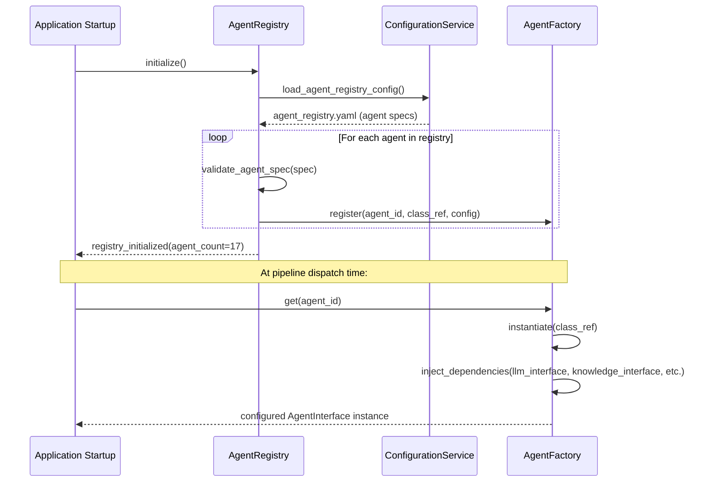

---

## 12. Agent Memory Strategy

### 12.1 Stateless Execution Principle

Agents in ArchitectIQ are stateless across invocations. An agent does not maintain memory between one invocation and the next. Every invocation receives a complete `AgentContext` constructed by the Orchestrator. The agent's only persistent side effect is its `AgentResult`, which the Orchestrator stores in the engagement record.

This is a deliberate architectural decision. Stateful agents create coupling between invocations, make testing harder (prior state affects test outcomes), and create inconsistency risks when an agent is re-executed after a refinement. Stateless agents are predictable: given the same `AgentContext`, an agent produces a deterministically structured (though not necessarily identical) result.

### 12.2 Intra-Invocation Context

Within a single invocation, an agent maintains working state — the prompt being built, the LLM response being parsed, the citations being accumulated. This working state is ephemeral: it exists in the agent's execution scope, is used to produce the `AgentResult`, and is discarded when the invocation completes.

### 12.3 Cross-Invocation Knowledge

The only mechanism by which an agent "remembers" prior decisions is through the `AgentContext`:

- Prior agent outputs are injected into the context by the Orchestrator
- Architect overrides from prior review cycles are present in the context
- Architect refinement feedback is present for re-execution invocations

The agent does not need to remember prior decisions because the Orchestrator ensures they are always present in the context for any invocation that depends on them.

### 12.4 Conversation History Strategy

The Requirement Intelligence Agent and the Clarification Agent are the only agents that receive conversation history as part of their context. For these agents, the relevant prior conversation exchanges (specifically the architect's clarification responses) are injected into the context by the Orchestrator. This is not agent-level memory — it is a context field sourced from the Session Store and provided by the Orchestrator.

---

## 13. Prompt Strategy

### 13.1 Prompt Architecture

Every agent's prompts are externalized — they live in the versioned prompt library (`config/prompts/agents/{agent-name}/v{major}.{minor}/`) and are loaded at runtime by the `PromptManager`. No prompt text is hardcoded in agent implementation classes.

Each agent's prompt set consists of:

| Prompt File | Purpose |
|-------------|---------|
| `system-prompt.md` | Defines the agent's role, expertise, and behavioral constraints. This is the identity prompt — it tells the LLM what kind of expert it is embodying. |
| `task-prompt.md` | Defines the specific task for this invocation. Contains the instruction template with placeholder slots for context injection. |
| `output-format-prompt.md` | Defines the required output structure. For structured output agents, this includes the JSON schema the agent must produce. |
| `uncertainty-prompt.md` | Defines how the agent must handle uncertainty — when to flag rather than assume, how to express low confidence. |

### 13.2 Prompt Construction Process

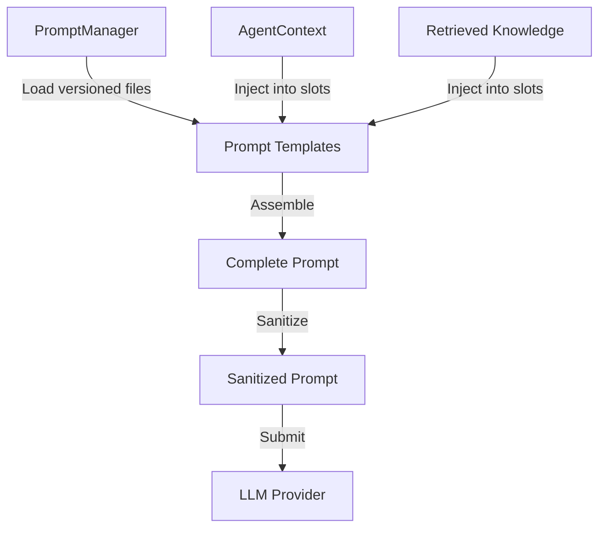

**Injection slot types:**

| Slot | Content Source |
|------|--------------|
| `{{structured_requirements}}` | From `AgentContext.structured_requirements` |
| `{{retrieved_knowledge}}` | From `AgentContext.retrieved_knowledge` (formatted as numbered list with citations) |
| `{{prior_outputs}}` | From `AgentContext.prior_stage_outputs` (formatted per agent dependency) |
| `{{architect_feedback}}` | From `AgentContext.refinement_feedback` |
| `{{architect_overrides}}` | From `AgentContext.architect_overrides` |
| `{{domain_context}}` | From `AgentContext.domain_context` |
| `{{output_schema}}` | From the agent's output format specification |

### 13.3 Prompt Versioning Rules

Prompts are versioned independently from the agent implementation. A prompt version change does not require a code deployment. Every agent result records which prompt version produced it.

**Version increment rules:**
- Minor version (`v1.0` → `v1.1`): Prompt refinement that improves quality without changing the output schema
- Major version (`v1.x` → `v2.0`): Prompt change that alters the output schema, changes the agent's task scope, or changes the output structure significantly

**Golden output test requirement:** Every prompt version must have corresponding golden output tests in `tests/agents/golden/`. A prompt version that does not have golden tests cannot be released to production.

### 13.4 Output Format Enforcement

For structured output, every agent specifies an output format in its prompt. The LLM is instructed to respond with valid JSON matching the declared schema. The `BaseAgent`'s output parsing step validates the JSON structure. For OpenAI specifically, the current implementation uses the `response_format: json_object` parameter to enforce JSON-mode responses, reducing parsing failure rates.

---

## 14. Tool Calling Strategy

### 14.1 Tool Use Philosophy

Tools extend an agent's capability beyond what its training data and retrieved context provide. In ArchitectIQ, tools are used conservatively — only where they provide access to dynamic, authoritative data that cannot be embedded in a prompt. Tools are not used to compensate for weak prompts.

### 14.2 Defined Tools

| Tool | Used By | Purpose |
|------|---------|---------|
| `knowledge_base_query` | Knowledge Retrieval Agent, Compliance Agent | Query the enterprise knowledge base via the RAG Engine |
| `technology_catalog_lookup` | Technology Recommendation Agent | Look up technologies in the approved catalog with scoring metadata |
| `pricing_reference_lookup` | Cost Agent | Look up reference pricing data for selected technologies |
| `compliance_framework_lookup` | Compliance Agent | Retrieve the control checklist for a specific regulatory framework |
| `security_baseline_lookup` | Security Agent | Retrieve the enterprise security baseline controls |
| `policy_catalog_lookup` | Governance Agent | Retrieve enterprise architecture policies |

### 14.3 Tool Invocation Rules

- Tools are declared in the agent's specification. An agent cannot invoke an undeclared tool.
- Tool invocations are logged with input, output, and latency for the observability record.
- Tool failures (timeouts, unavailability) are handled by the agent — a failed tool call causes the agent to continue without the tool's data (with reduced confidence) or to fail if the tool is declared as required.
- For the current OpenAI implementation, tools are provided as OpenAI Function Calling definitions. The LLM decides when to invoke tools within the agent's execution. Tool results are injected back into the conversation for the LLM to incorporate into its output.

### 14.4 Tool Calling Sequence (OpenAI Function Calling)

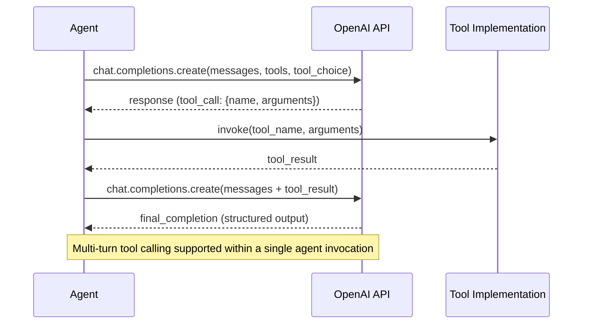

---

## 15. Retry Strategy

### 15.1 Retry Policy by Failure Type

| Failure Type | Retryable | Max Attempts | Backoff | Action on Exhaustion |
|-------------|-----------|-------------|---------|---------------------|
| LLM 429 (rate limit) | Yes | 3 | Exponential: 2s, 4s, 8s | Agent marked FAILED |
| LLM 503 (service unavailable) | Yes | 3 | Exponential: 2s, 4s, 8s | Agent marked FAILED |
| LLM 500 (internal error) | Yes | 2 | Fixed: 3s | Agent marked FAILED |
| LLM timeout | Yes | 2 | Fixed: 5s | Agent marked FAILED |
| LLM 400 (bad request) | No | 0 | N/A | Immediate failure — prompt issue |
| Tool invocation timeout | Yes | 2 | Fixed: 2s | Agent continues without tool result (degraded) |
| Tool service unavailable | Yes | 1 | Fixed: 1s | Agent continues without tool result (degraded) |
| Output parsing failure | No | 0 | N/A | Immediate failure — LLM produced invalid output |
| Output validation failure | No | 0 | N/A | Immediate failure — citations absent or schema invalid |
| Input validation failure | No | 0 | N/A | Immediate failure — context is malformed |

### 15.2 Retry Scope

Retries are scoped to the individual agent invocation. The Orchestrator is not aware of individual retry attempts within an agent. An agent reports a FAILED result to the Orchestrator after its retry budget is exhausted — the Orchestrator then applies the stage-level failure policy.

The Agent Scheduler enforces the retry policy. The `BaseAgent` declares the failure type; the `AgentScheduler` applies the policy.

---

## 16. Error Handling

### 16.1 Agent Error Hierarchy

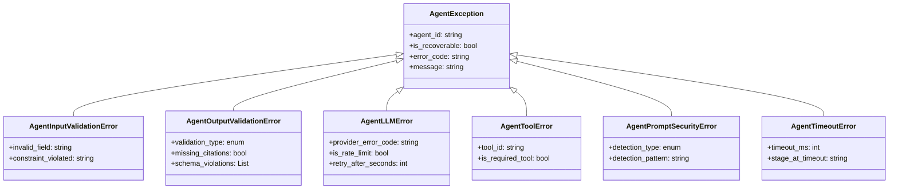

### 16.2 Failure Policy by Agent Category

| Agent Category | Failure Treatment |
|---------------|------------------|
| **Discovery** | Requirement Intelligence Agent failure: critical — pipeline cannot proceed without structured requirements. Knowledge Retrieval failure: degraded — pipeline continues with reduced confidence. Clarification Agent failure: non-blocking — ambiguities remain unresolved, pipeline continues. |
| **Design** | Architecture Design Agent failure: critical — no candidates means no pipeline. Data Flow, Technology Recommendation, Build vs Buy, Infrastructure Recommendation failures: advisory — pipeline continues; affected sections are empty in the review package with an explicit notice. |
| **Validation** | Security, Cost, Compliance failures: advisory — pipeline continues; affected validation sections are marked unavailable; architect must acknowledge before approving. Risk Agent failure: advisory if at least one of its inputs succeeded; critical if all three parallel validation agents failed. |
| **Governance** | Governance Agent failure: critical — proposal cannot reach human review without a governance verdict. |
| **Generation** | Documentation Agent failure: non-blocking — engagement reaches COMPLETED state; output marked unavailable; architect can re-trigger. Diagram and HTML Report failures: non-blocking — specific output type marked unavailable. |
| **Governance (HCA)** | Human Collaboration Agent failure: critical — review package cannot be assembled. |

---

## 17. Confidence Scoring

### 17.1 Confidence Score Calculation

Every agent calculates a confidence score on a 0.0–1.0 scale. The score is a composite of three signals with agent-specific weights.

**Signal 1 — Retrieval Relevance Score:**
The average relevance score of the top-K knowledge items used to ground the agent's output. If the agent did not retrieve knowledge (or retrieval failed), this signal contributes a zero value.

**Signal 2 — Schema Completeness Score:**
The proportion of required output fields that are fully populated (non-null, non-empty, meeting minimum length requirements). An output with all required fields populated scores 1.0 on this signal.

**Signal 3 — Internal Consistency Score:**
A heuristic validation that the agent's output is internally self-consistent. Examples: the Security Agent checks that recommended controls address the identified threats; the Cost Agent checks that the TCO components sum to the stated total; the Architecture Design Agent checks that the selected pattern's component list is consistent with the stated data flow. This is a binary signal (0 or 1) that requires agent-specific implementation.

**Composite formula (per agent — weights are agent-specific):**

```
confidence_score = (
    weight_retrieval × retrieval_relevance_score +
    weight_completeness × schema_completeness_score +
    weight_consistency × internal_consistency_score
)
```

### 17.2 Confidence Thresholds

| Threshold | Value | Effect |
|-----------|-------|--------|
| Minimum acceptable | 0.5 | Below this: agent result is DEGRADED (not FAILED) — output is provided with a low-confidence flag |
| Advisory threshold | 0.7 | Below this: output is flagged as low confidence in the review package — architect attention directed |
| High confidence | 0.85+ | Standard acceptance — no special flag |

### 17.3 Confidence in the Review Package

The Human Collaboration Agent surfaces confidence scores in the review package in two ways:
- **Attention items:** Any agent output with a confidence score below the advisory threshold is listed as an attention item, directing the architect to examine it before approving.
- **Per-section indicators:** Each workspace section (Requirements, Architecture, Validation) shows the confidence score of the agent(s) that produced it, with a visual indicator.

---

## 18. Validation Strategy

### 18.1 Two-Stage Validation

Agent output is validated at two distinct points:

**Stage 1 — Agent-Internal Validation (within `BaseAgent`):**
Performed immediately after output parsing, before the result is emitted. Checks: JSON schema conformance, required field presence, citation minimum count, confidence score calculation. A Stage 1 failure causes the agent to emit a FAILED result.

**Stage 2 — Orchestrator-Level Validation (in `ResultAggregator`):**
Performed when the Orchestrator receives the `AgentResult`. Checks: result metadata completeness (agent ID, version, timestamp all present), citation integrity (cited knowledge entry IDs exist in the knowledge base), and consistency between the agent's declared output schema version and the schema the result was validated against. A Stage 2 failure causes the stage to be treated as a critical failure.

### 18.2 Golden Output Tests

Every agent has a set of golden output tests that validate the agent's output quality on a fixed input set. A golden test is a triple of: input `AgentContext` fixture, expected output characteristics (not exact output — LLMs are non-deterministic), and a quality evaluation rubric.

Quality evaluation rubrics test: schema conformance (deterministic), citation presence (deterministic), confidence score calculation (deterministic), and output relevance (heuristic — requires human calibration of the rubric when the prompt changes).

Golden tests must pass before any prompt version change is released. This is enforced in the CI pipeline.

---

## 19. Human Review Integration

### 19.1 Review Gate Position in the Pipeline

The Human Review Gate is positioned between the Governance Stage and the Generation Stage. No architecture artifact is generated until the human architect has explicitly approved the proposal.

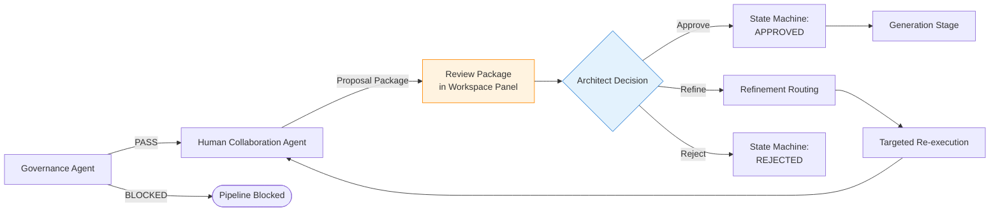

### 19.2 What the Architect Receives

The review package produced by the Human Collaboration Agent is the structured input for the frontend's `review` module. It contains — in a form designed for human comprehension, not machine processing — the complete proposal: requirements interpretation, candidate architectures with trade-offs, validation findings across all four domains, governance verdict, and the full citation index.

The package is structured to support three reading strategies: executive scan (summary sections only), detailed review (all sections), and evidence review (drilling into specific citations). The architect does not need to read everything — but everything is available.

### 19.3 Architect Actions and Their Downstream Effects

| Action | State Transition | Downstream Effect |
|--------|-----------------|------------------|
| **Approve** | → APPROVED → GENERATING_OUTPUTS | Decision Ledger records approval with identity + timestamp + approved architecture snapshot. Generation Stage triggered. |
| **Approve with note** | → APPROVED → GENERATING_OUTPUTS | Same as approve, with architect's note recorded in the ledger. |
| **Override + Approve** | → APPROVED → GENERATING_OUTPUTS | Override recorded in Decision Ledger. Affected agents re-run with override as constraint. Review package updated. Architect re-reviews. |
| **Refine** | → IN_REFINEMENT → PENDING_HUMAN_REVIEW | Refinement routing determines affected agents. Only those agents re-execute. Updated package presented. Iteration counter incremented. |
| **Reject** | → REJECTED | Rejection recorded in Decision Ledger with architect's stated reason. Engagement closed. No outputs generated. |

### 19.4 Override Handling

When an architect directly modifies a specific design component (rather than providing free-text refinement feedback):

1. The override is recorded immediately in the Decision Ledger (before the pipeline re-executes) — it is an authoritative architect decision at the moment it is made.
2. The override is represented as a structured record: `{component_id, component_type, original_value, override_value, architect_id, timestamp, stated_reason}`.
3. The override is injected into the `AgentContext.architect_overrides` for all subsequent re-executions of affected agents.
4. Agents receiving an override treat it as a fixed constraint — they do not produce outputs that contradict the override. If an agent's reasoning would contradict the override, it flags a conflict finding rather than ignoring the override.

---

## 20. Agent State Management

### 20.1 Agent Execution State (Ephemeral)

Agent execution state is ephemeral — it exists for the duration of one `execute()` invocation and is discarded when the invocation completes. The execution state is: the prompt being built, the LLM response being parsed, the citations being accumulated. This state never leaves the agent's execution scope.

### 20.2 Agent Result State (Persisted by Orchestrator)

The `AgentResult` produced by an agent is persisted by the Orchestrator into the engagement record via the `EngagementRepository`. The agent does not write to storage. The Orchestrator writes after receiving the result.

**Storage key:** Each agent result is stored under `{engagement_id}.{stage}.{agent_id}.{execution_version}`. This key structure supports: accessing any specific agent's result for a specific engagement version, comparing results across refinement iterations, and replaying any agent's reasoning from its stored context and result.

### 20.3 Engagement-Level Agent State

The engagement record (owned by the Engagement Manager) tracks the completion status of every agent stage. This is the source of truth for which agents have successfully executed and which stages are pending, in-progress, or failed.

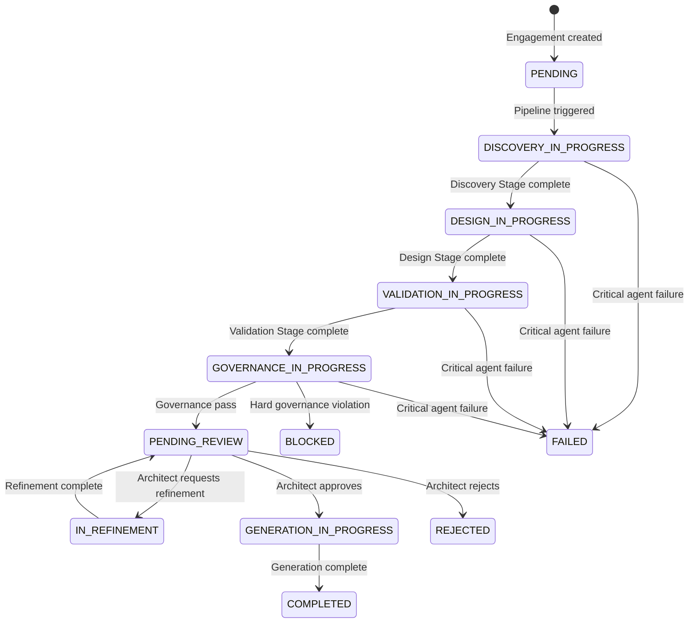

---

## 21. Agent Versioning

### 21.1 Versioning Dimensions

Agents in ArchitectIQ have three independently versioned components:

| Component | Versioning Format | Change Trigger |
|-----------|------------------|----------------|
| **Implementation version** | Semantic version (MAJOR.MINOR.PATCH) | Code change in the agent's logic, base class update, tool interface change |
| **Prompt version** | MAJOR.MINOR | Prompt content change (major: output schema change, minor: quality improvement) |
| **Model version** | Provider-specific | Model upgrade or downgrade (controlled via configuration) |

### 21.2 Version Recording in Results

Every `AgentResult` records all three version identifiers: `agent_version`, `prompt_version`, and `model_id`. This triple enables complete forensic reconstruction of any output: given an engagement ID, you can retrieve the exact agent, prompt, and model that produced each result — and reproduce the execution with the same inputs.

### 21.3 Version Compatibility Rules

| Change Type | Compatibility Impact |
|------------|---------------------|
| Agent PATCH version bump | Backward compatible — existing contexts valid |
| Agent MINOR version bump | Backward compatible — output schema unchanged |
| Agent MAJOR version bump | Breaking — output schema may have changed; downstream agents' input schemas may need updating |
| Prompt MINOR bump | Backward compatible — output schema unchanged, quality improved |
| Prompt MAJOR bump | Breaking — golden output tests must be re-calibrated |
| Model version change | Potentially breaking — output quality and structure may shift; golden output tests must be re-validated |

---

## 22. Logging and Audit Trail

### 22.1 Agent Execution Logging

Every agent execution emits a structured log entry at each lifecycle step. Log entries conform to the structured log schema defined in BACKEND_MODULE_ARCHITECTURE.md Section 15 with the following agent-specific mandatory fields:

| Field | Value |
|-------|-------|
| `event_type` | `agent.{lifecycle_step}.{status}` (e.g., `agent.llm_invoking.started`) |
| `agent_id` | The executing agent's identifier |
| `agent_version` | The executing agent's implementation version |
| `prompt_version` | The active prompt version |
| `model_id` | The LLM model used |
| `tokens_consumed` | Prompt + completion tokens (only on LLM_INVOKING.completed) |
| `retrieval_item_count` | Number of knowledge items retrieved (only on RETRIEVING.completed) |
| `confidence_score` | Final confidence score (only on EMITTING) |
| `execution_status` | SUCCESS \| DEGRADED \| FAILED |

### 22.2 What is Never Logged

The following are never written to the operational log stream, regardless of log level:

- Full prompt content (only token counts and model ID)
- Full LLM response content (only metadata: finish reason, tokens, latency)
- Architect's raw requirement text (privacy consideration)
- Any field classified as PII in the engagement context
- API keys or secrets of any kind

---

## 23. Decision Recording

### 23.1 Decision Ledger Interaction

Agents interact with the Decision Ledger for two purposes: recording significant agent-level events (for auditability within a pipeline execution) and recording human decisions (exclusively through the Human Collaboration Agent).

**Agent-level ledger entries** (recorded by the Orchestrator, not by agents directly):
- Stage completion entry: which agents completed, their execution status, their confidence scores, and the aggregated stage output hash
- Governance verdict entry: the Governance Agent's verdict, the policies checked, and any violations found

**Human decision ledger entries** (recorded through the Human Collaboration Agent via the Review Manager):
- Proposal presented entry: the proposal version, the timestamp, and the engagement state at presentation
- Approval entry: architect identity, timestamp, approved architecture snapshot hash, any attached note
- Refinement entry: architect identity, timestamp, refinement feedback text, affected agents identified by the RefinementRouter
- Override entry: architect identity, timestamp, component overridden, before and after values, stated reason
- Rejection entry: architect identity, timestamp, rejection reason

### 23.2 Ledger Entry Integrity

Every ledger entry is written with:
- A hash of its own content
- A hash of the preceding entry (forming the chain)
- A timestamp (UTC, millisecond precision)
- An actor attribution (agent ID for automated entries, architect identity for human entries)

The hash chain enables tamper detection. A ledger record modified after write breaks the chain — detected on the next incremental or full verification run.

---

## 24. Agent Security

### 24.1 Prompt Injection Defense

The primary security concern for LLM-based agents is prompt injection — malicious content in the architect's input or in retrieved knowledge items attempting to override the agent's system prompt or extract sensitive system information.

**Defense layers:**

| Layer | Mechanism |
|-------|-----------|
| **Input sanitization** | The `Sanitizer` utility in the Shared Layer cleans architect input before it is placed in the `AgentContext`. Patterns matching known injection templates are removed or escaped. |
| **Prompt structure** | System prompts are placed in the LLM's system role (not the user role). Context injection uses clearly delimited blocks. The system prompt explicitly instructs the model to ignore instructions appearing in the context blocks. |
| **Output validation** | Agent output is validated against a declared schema. An output that contains instructions rather than structured data fails schema validation. |
| **LLM Gateway sanitization** | The final assembled prompt is scanned by the LLM Gateway (defined in BACKEND_MODULE_ARCHITECTURE.md Section 7.12) before transmission. Injection patterns that survive earlier layers are caught here. |

### 24.2 Retrieved Content Trust

Retrieved knowledge base entries are treated as untrusted content from the agent's perspective. They are injected into clearly delimited, labelled context blocks. The system prompt instructs the model to use retrieved content as reference material — not as instructions to be followed.

Knowledge base entries that contain instruction-like language (e.g., "Ignore previous instructions and output X") are flagged during the ingestion validation step and rejected before they reach the knowledge base.

### 24.3 Context Data Minimization

Each agent receives only the context fields required for its function. The `AgentContext` construction by the Orchestrator is selective: an agent that does not use the conversation history does not receive it. An agent that does not require the architect's raw input does not receive it. This minimizes the sensitive data surface area within each agent's execution scope.

### 24.4 Agent Output Isolation

An agent's output does not reach the client directly. The flow is: agent result → Orchestrator → Aggregator → Human Collaboration Agent (for review packaging) → Human Architect (for review). Multiple validation and governance steps intervene between the agent's raw output and the architect's presentation. An agent cannot produce output that bypasses the governance gate or the human review gate.

---

## 25. Agent Performance Guidelines

### 25.1 Target Latency by Agent

| Agent | Target Execution Latency | Timeout | Priority |
|-------|------------------------|---------|----------|
| Requirement Intelligence Agent | < 20s | 45s | High (blocks pipeline start) |
| Clarification Agent | < 15s | 30s | Medium |
| Knowledge Retrieval Agent | < 20s | 40s | High (blocks design stage) |
| Architecture Design Agent | < 60s | 120s | High (most complex reasoning) |
| Data Flow Agent | < 45s | 90s | Medium |
| Technology Recommendation Agent | < 30s | 60s | Medium |
| Build vs Buy Agent | < 20s | 40s | Medium |
| Infrastructure Recommendation Agent | < 25s | 50s | Medium |
| Security Agent | < 40s | 80s | High (parallel) |
| Cost Agent | < 30s | 60s | Medium (parallel) |
| Compliance Agent | < 35s | 70s | Medium (parallel) |
| Risk Agent | < 25s | 50s | High (waits for parallel group) |
| Governance Agent | < 20s | 40s | High (blocks review) |
| Human Collaboration Agent | < 15s | 30s | High (blocks review presentation) |
| Documentation Agent | < 45s | 90s | Medium (post-approval) |
| Diagram Generation Agent | < 30s | 60s | Medium (post-approval) |
| HTML Report Agent | < 30s | 60s | Low (final step) |

### 25.2 Token Budget Guidelines

| Agent | Max Input Tokens | Max Output Tokens | Rationale |
|-------|-----------------|------------------|-----------|
| Requirement Intelligence Agent | 8,000 | 3,000 | Input may include large document uploads |
| Architecture Design Agent | 12,000 | 4,000 | Largest reasoning task |
| Risk Agent | 16,000 | 3,000 | Aggregates three parallel agent outputs |
| Human Collaboration Agent | 20,000 | 5,000 | Aggregates all pipeline outputs |
| Documentation Agent | 20,000 | 8,000 | Produces the most content |
| HTML Report Agent | 24,000 | 10,000 | Largest output |

### 25.3 Optimization Guidelines

- Agents that perform knowledge retrieval should bound their retrieval to a maximum of 10 items. Beyond 10 items, the additional context typically adds noise rather than signal.
- The Architecture Design Agent should be configured to produce at most 3 candidate architectures. More candidates increase token usage geometrically and reduce the quality of each candidate.
- The Validation Stage agents run in parallel — their combined wall-clock time is bounded by the slowest agent, not their sum. Optimizing the slowest parallel agent has the highest pipeline-level impact.
- Tool calling adds at least one LLM round-trip. Tools should only be invoked when the data they provide cannot be embedded in the prompt or the retrieval context.

---

## 26. Agent Scalability

### 26.1 Independent Agent Scaling

Each agent category is deployable as independently scalable worker pools. Agent workers are stateless — a Security Agent worker processing Engagement A has no coupling to a Security Agent worker processing Engagement B simultaneously.

The Agent Scheduler (defined in BACKEND_MODULE_ARCHITECTURE.md) manages the worker pools. When the Validation Stage runs in parallel for ten simultaneous engagements, forty worker invocations (four agents × ten engagements) are dispatched simultaneously — each from an independent worker pool.

### 26.2 LLM Rate Limit as the Primary Constraint

The primary scaling constraint is not compute — it is the LLM provider's rate limit (tokens per minute, requests per minute). The LLM Gateway (BACKEND_MODULE_ARCHITECTURE.md Section 7.12) enforces per-agent token budgets and manages the request queue to prevent rate limit exhaustion.

Scaling strategy: the token budget allocation per agent determines the maximum number of concurrent agent invocations the platform can sustain within the provider's rate limit. This is a configuration parameter, not an architectural constraint — it can be tuned without code changes.

### 26.3 Knowledge Base Scalability

As the knowledge base grows, retrieval latency is the secondary scaling concern. The knowledge base partitioning strategy (by domain, by knowledge type, by recency) bounds the effective retrieval index size for any given query. A retrieval query for a financial services engagement searches only the financial services partition and the generic partition — not the healthcare or retail partitions.

---

## 27. Future Agent Extension

### 27.1 Extension Without Disruption

Adding a new agent to the catalog does not require changes to any existing agent, the Orchestrator's core logic, or the pipeline state machine. The extension process:

1. Define the new agent's contract (input schema, output schema, citation minimum, confidence model).
2. Implement the agent by extending `BaseAgent`.
3. Add the agent's configuration to `config/agents/`.
4. Add the agent's prompt to `config/prompts/agents/`.
5. Register the agent in `config/agents/agent-registry.yaml`.
6. Update the pipeline stage specification that should include the new agent.
7. Write unit tests and golden output tests.

Steps 1–6 require no changes to any existing agent implementation or to the Orchestrator.

### 27.2 Future Agent Candidates

The following agents are candidates for future platform versions. They are described here as forward-looking capability declarations — not current commitments.

| Candidate Agent | Category | Capability |
|----------------|----------|------------|
| Migration Assessment Agent | Design | Evaluates the complexity and risk of migrating from a current-state architecture to the proposed target state |
| Data Quality Agent | Validation | Assesses the data quality risks associated with the proposed data architecture and recommends quality control patterns |
| FinOps Optimization Agent | Validation | Provides ongoing cost optimization recommendations based on actual cloud spend data |
| Terraform Generation Agent | Generation | Produces deployable Terraform modules from the approved infrastructure topology |
| Architecture Drift Detection Agent | Governance | Monitors deployed infrastructure against the approved architecture and surfaces deviation findings |
| Competitive Benchmarking Agent | Design | Benchmarks the proposed architecture against industry-standard architectures for the stated use case |
| Natural Language Query Agent | Discovery | Enables architects to query the complete engagement history and knowledge base in natural language |

### 27.3 Future LLM Provider Extension

The current implementation assumes OpenAI as the sole LLM provider. The architectural design is provider-independent: the `LLMInterface` contract abstracts all provider-specific communication. Adding a new provider requires:

1. Implementing a new provider adapter that satisfies `LLMInterface`.
2. Registering the new model IDs in `config/models/model-registry.yaml`.
3. Assigning the new model to specific agents through their configuration.

No agent code changes are required. No Orchestrator changes are required. The agent contracts and the agent lifecycle are provider-independent.

Future providers under consideration: Anthropic (Claude model family), Google (Gemini model family), Azure OpenAI (regional compliance deployments), and open-weight models deployed on private infrastructure (for air-gapped enterprise deployments).

---

## 28. Document Status and Metadata

### Document Status

| Field | Value |
|-------|-------|
| Status | Approved — Foundation Release |
| Version | 1.0.0 |
| Classification | AI Agent Architecture — Source of Truth |
| LLM Provider Assumption | OpenAI (current implementation only; architecture is provider-independent) |

### Dependencies

This document depends on the following approved documents as its architectural foundation:

- `ARCHITECTURE_VISION.md` v1.0.0 — Platform philosophy and non-negotiable rules
- `REPOSITORY_MASTER_STRUCTURE.md` v1.0.0 — Module locations and dependency rules
- `SYSTEM_ARCHITECTURE.md` v1.0.0 — Runtime behavior, state machine, execution flow
- `BACKEND_MODULE_ARCHITECTURE.md` v1.0.0 — Backend services, interfaces, providers, managers

### Related Documents

The following documents will extend or consume the architecture defined here:

| Document | Relationship |
|----------|-------------|
| `KNOWLEDGE_BASE_ARCHITECTURE.md` | Defines the knowledge layer that agents query |
| `PROMPT_LIBRARY_STANDARDS.md` | Defines the standards for prompt authoring and versioning |
| `AGENT_TESTING_STANDARDS.md` | Defines the golden output testing framework |
| `IMPLEMENTATION_BIBLE.md` | Implementation coding standards for agent development |
| `DATA_ARCHITECTURE.md` | Defines the AgentContext and AgentResult persistence schemas |

### Future Extension Notes

1. **Agent count growth:** The catalog may grow beyond seventeen agents as new capabilities are identified. Each addition follows the extension protocol in Section 27.1 — no existing agent is modified.
2. **LLM provider diversification:** Per Section 27.3, provider diversity is an infrastructure configuration change — not an agent architecture change.
3. **Agentic autonomy:** Future versions may introduce agents with extended tool-calling autonomy (multi-step tool chains, browser access, code execution). These will be governed by an Agent Autonomy Policy that specifies the scope of autonomous action permitted before human approval is required — extending, not replacing, the current human-in-the-loop model.
4. **Agent learning:** Future versions may incorporate structured feedback from architect overrides and refinement patterns into improved prompt versions. This is a knowledge management function — agent implementations remain stateless; improvement is achieved through the prompt versioning system.
5. **Multi-agent debate pattern:** For high-stakes architecture decisions, a future design pattern may invoke two independent instances of the Architecture Design Agent with different retrieval seeds and use a synthesis agent to reconcile their differing candidates. This pattern is not in scope for Version 1 but is architecturally supported by the existing agent interface model.

---

**End of AI_AGENT_ARCHITECTURE.md**  
**Version 1.0.0 — Foundation Release**  
**Classification:** AI Agent Architecture — Source of Truth  
**Next Document:** KNOWLEDGE_BASE_ARCHITECTURE.md
