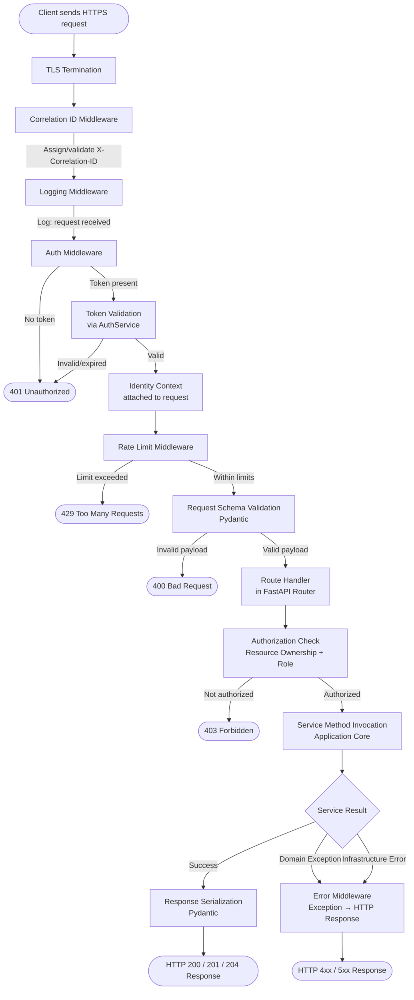
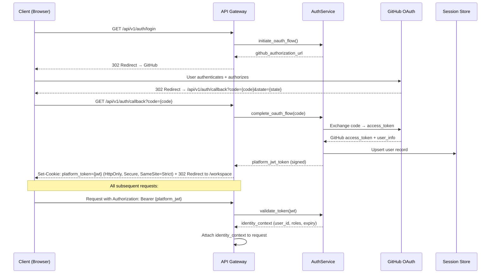

# API_ARCHITECTURE.md

> **Document Classification:** API Architecture — Source of Truth  
> **Parent Documents:** ARCHITECTURE_VISION.md · SYSTEM_ARCHITECTURE.md · BACKEND_MODULE_ARCHITECTURE.md · FRONTEND_MODULE_ARCHITECTURE.md  
> **Status:** Approved — Foundation Release  
> **Version:** 1.0.0  
> **API Framework:** FastAPI  
> **Protocol:** REST over HTTPS  
> **Scope:** API philosophy, versioning, standards, endpoint categories, request lifecycle, response standards, error handling, authentication, authorization, rate limiting, security, and performance

---

## Table of Contents

1. [API Philosophy](#1-api-philosophy)
2. [API Layer Responsibilities](#2-api-layer-responsibilities)
3. [API Versioning](#3-api-versioning)
4. [API Standards](#4-api-standards)
5. [Endpoint Categories](#5-endpoint-categories)
6. [Request Lifecycle](#6-request-lifecycle)
7. [Response Standards](#7-response-standards)
8. [Error Handling](#8-error-handling)
9. [Validation](#9-validation)
10. [Pagination](#10-pagination)
11. [Filtering](#11-filtering)
12. [Authentication Flow](#12-authentication-flow)
13. [Authorization](#13-authorization)
14. [Rate Limiting](#14-rate-limiting)
15. [Logging and Correlation ID](#15-logging-and-correlation-id)
16. [API Security](#16-api-security)
17. [API Performance](#17-api-performance)
18. [Document Status and Metadata](#18-document-status-and-metadata)

---

## 1. API Philosophy

### 1.1 The API Is a Contract

The API is the formal interface between the frontend and the backend. Everything the frontend needs to accomplish must be expressible through the API. Everything the API exposes must correspond to a genuine frontend need. The API is not a leaky implementation detail — it is a deliberate, versioned contract that changes only when the product functionality changes.

### 1.2 REST with Consistent Resource Modeling

The API follows REST principles with resources modeled after the platform's domain entities — sessions, engagements, messages, knowledge entries, outputs, decisions. Resources are nouns, never verbs. Operations on resources use HTTP methods with their standard semantics (GET reads, POST creates, PATCH modifies, DELETE removes or cancels).

### 1.3 The API Layer Is Thin

The API layer does not contain business logic. It validates requests, extracts authenticated identity, routes to the appropriate Application Core service, and serializes the result. Logic that belongs in the Application Core is never duplicated in a router. As established in BACKEND_MODULE_ARCHITECTURE.md Section 2.2, the API layer is forbidden from importing agent implementations or infrastructure adapters directly.

### 1.4 Errors Are Informative

Every error response carries enough information for the client to understand what went wrong and what corrective action is available. Error codes are machine-parseable. Error messages are human-readable. Stack traces never appear in error responses.

---

## 2. API Layer Responsibilities

The API layer owns exclusively:

- HTTP route registration and method dispatch
- Request body deserialization and Pydantic schema validation
- Query parameter parsing and validation
- Authentication token extraction and validation delegation to `AuthService`
- Authorization check delegation to the appropriate service
- Response serialization and HTTP status code assignment
- Middleware chain execution (correlation ID, logging, rate limiting, error handling)
- OpenAPI schema generation (FastAPI automatic from Pydantic models)

The API layer never owns:

- Business rule evaluation
- Database queries (delegated to repositories via services)
- Agent invocation (delegated to the Orchestration Layer)
- Configuration management (delegated to ConfigurationService)
- Direct infrastructure access

---

## 3. API Versioning

### 3.1 Path-Based Versioning

All API endpoints are prefixed with a version path segment: `/api/v1/`. This is path-based versioning — the version is explicit in the URL, not in a header or query parameter.

**Rationale:** Path-based versioning is visible in logs, reproducible in URLs shared across contexts, and compatible with API gateway routing rules without header inspection.

### 3.2 Version Lifecycle

| Version State | Behavior |
|--------------|----------|
| **Current** | Actively maintained; receives new features and bug fixes |
| **Supported** | Still functional; receives only critical bug fixes; deprecated with 6-month notice |
| **Deprecated** | Returns a `Deprecation` response header with the sunset date on every response |
| **Sunset** | Removed; returns HTTP 410 Gone with migration guidance in the response body |

V1 is the current version for all endpoints at launch. V2 will be introduced when breaking changes are required — not for additive changes (new optional fields or new endpoints are non-breaking and do not require a new version).

### 3.3 Breaking vs. Non-Breaking Changes

| Change Type | Classification | Version Requirement |
|------------|---------------|-------------------|
| Add new optional response field | Non-breaking | Same version |
| Add new endpoint | Non-breaking | Same version |
| Add new optional request parameter | Non-breaking | Same version |
| Remove a response field | Breaking | New version |
| Change a field's type | Breaking | New version |
| Remove an endpoint | Breaking | New version |
| Change error code semantics | Breaking | New version |

---

## 4. API Standards

### 4.1 Resource Naming

| Standard | Example |
|----------|---------|
| Resource paths use plural nouns | `/api/v1/sessions`, `/api/v1/engagements` |
| Sub-resources use nested paths | `/api/v1/sessions/{session_id}/messages` |
| Resource IDs are UUIDs | `/api/v1/engagements/550e8400-e29b-41d4-a716-446655440000` |
| No verbs in paths | `/api/v1/engagements/{id}/approve` ← ❌ Wrong — use POST to `/api/v1/engagements/{id}/decisions` |
| Action resources use nouns for the action | `/api/v1/engagements/{id}/decisions`, `/api/v1/engagements/{id}/refinements` |

### 4.2 HTTP Method Semantics

| Method | Semantics | Idempotent |
|--------|-----------|------------|
| `GET` | Read resource(s) | Yes |
| `POST` | Create resource or submit action | No |
| `PATCH` | Partial update of a resource | No (by RFC; modeled idempotently where possible) |
| `DELETE` | Soft-delete or cancel a resource | Yes |

`PUT` (full replacement) is not used in the ArchitectIQ API. All updates use `PATCH` with partial payload. This avoids accidental data loss from clients that omit fields.

### 4.3 Content Type

All request and response bodies are `application/json`. File downloads use `application/octet-stream` or type-specific MIME types (e.g., `text/markdown`, `text/html`, `application/pdf`).

---

## 5. Endpoint Categories

### 5.1 Authentication (`/api/v1/auth`)

Manages the GitHub OAuth flow and platform token lifecycle.

| Method | Path | Purpose |
|--------|------|---------|
| `GET` | `/api/v1/auth/login` | Initiates OAuth flow — returns GitHub authorization URL |
| `GET` | `/api/v1/auth/callback` | OAuth callback handler — exchanges code for platform token |
| `POST` | `/api/v1/auth/logout` | Revokes platform token and clears session |
| `POST` | `/api/v1/auth/refresh` | Refreshes an expiring platform token |
| `GET` | `/api/v1/auth/me` | Returns the authenticated user's identity and roles |

---

### 5.2 Sessions (`/api/v1/sessions`)

Manages architect session lifecycle. All endpoints require authentication.

| Method | Path | Purpose |
|--------|------|---------|
| `GET` | `/api/v1/sessions` | List all sessions for the authenticated user (paginated) |
| `POST` | `/api/v1/sessions` | Create a new session |
| `GET` | `/api/v1/sessions/{session_id}` | Retrieve a session record with full restoration context |
| `PATCH` | `/api/v1/sessions/{session_id}` | Update session display name or preferences |
| `DELETE` | `/api/v1/sessions/{session_id}` | Soft-delete (archive) a session |

---

### 5.3 Chat Messages (`/api/v1/sessions/{session_id}/messages`)

Manages conversation history and message submission.

| Method | Path | Purpose |
|--------|------|---------|
| `GET` | `/api/v1/sessions/{session_id}/messages` | Retrieve conversation history (paginated — newest first by default) |
| `POST` | `/api/v1/sessions/{session_id}/messages` | Submit a new user message (optionally with file attachment) — initiates or continues pipeline execution |

**Note on file attachment:** File submissions (PDF, DOCX) are accepted as `multipart/form-data` on the message POST endpoint. The file is extracted server-side during the Intake Stage (WORKFLOW_ENGINE.md Stage 1) — it is not stored as a separate resource.

---

### 5.4 Engagements (`/api/v1/engagements`)

Manages engagement lifecycle. The primary resource for architecture work.

| Method | Path | Purpose |
|--------|------|---------|
| `GET` | `/api/v1/engagements` | List engagements for the authenticated user (paginated, filterable) |
| `GET` | `/api/v1/engagements/{engagement_id}` | Retrieve full engagement record including current lifecycle state |
| `GET` | `/api/v1/engagements/{engagement_id}/versions` | List all approved architecture versions for an engagement |
| `GET` | `/api/v1/engagements/{engagement_id}/versions/{version_id}` | Retrieve a specific approved architecture version |
| `POST` | `/api/v1/engagements/{engagement_id}/decisions` | Submit a human review decision (approve, refine, reject) |
| `POST` | `/api/v1/engagements/{engagement_id}/overrides` | Record a direct component override from the architect |
| `DELETE` | `/api/v1/engagements/{engagement_id}` | Cancel an in-progress engagement |

---

### 5.5 Workflow (`/api/v1/engagements/{engagement_id}/workflow`)

Provides workflow execution status for in-progress engagements.

| Method | Path | Purpose |
|--------|------|---------|
| `GET` | `/api/v1/engagements/{engagement_id}/workflow/status` | Current workflow state and stage completion summary |
| `GET` | `/api/v1/engagements/{engagement_id}/workflow/stages` | Detailed status of every stage (stage_id, status, timing, agent_id) |
| `POST` | `/api/v1/engagements/{engagement_id}/workflow/retry` | Retry a failed workflow from the last checkpoint (authorized architects only) |

---

### 5.6 Workspace (`/api/v1/engagements/{engagement_id}/workspace`)

Provides workspace panel content — the structured AI outputs displayed in the frontend workspace.

| Method | Path | Purpose |
|--------|------|---------|
| `GET` | `/api/v1/engagements/{engagement_id}/workspace` | Full workspace state — all section contents, statuses, and metadata |
| `GET` | `/api/v1/engagements/{engagement_id}/workspace/requirements` | Structured requirements section content |
| `GET` | `/api/v1/engagements/{engagement_id}/workspace/architecture` | Candidate architecture cards and comparison table |
| `GET` | `/api/v1/engagements/{engagement_id}/workspace/validation` | Security, cost, compliance, and risk findings |
| `GET` | `/api/v1/engagements/{engagement_id}/workspace/review` | Review package (available only in PENDING_HUMAN_REVIEW state) |

---

### 5.7 Knowledge (`/api/v1/knowledge`)

Provides read access to the knowledge base and write access for curators.

| Method | Path | Purpose |
|--------|------|---------|
| `GET` | `/api/v1/knowledge/entries` | List knowledge entries (paginated, filterable by category, domain, status) |
| `GET` | `/api/v1/knowledge/entries/{entry_id}` | Retrieve a specific knowledge entry with full metadata |
| `POST` | `/api/v1/knowledge/entries` | Submit a new knowledge entry for curator review |
| `PATCH` | `/api/v1/knowledge/entries/{entry_id}` | Update metadata on a pending or active entry (curator only) |
| `POST` | `/api/v1/knowledge/entries/{entry_id}/approval` | Approve a pending entry (curator only) |
| `POST` | `/api/v1/knowledge/entries/{entry_id}/rejection` | Reject a pending entry (curator only) |
| `POST` | `/api/v1/knowledge/entries/{entry_id}/deprecation` | Deprecate an active entry (curator only) |
| `GET` | `/api/v1/knowledge/entries/pending` | List entries awaiting curator review (curator only) |

---

### 5.8 Outputs (`/api/v1/engagements/{engagement_id}/outputs`)

Provides access to generated output artifacts.

| Method | Path | Purpose |
|--------|------|---------|
| `GET` | `/api/v1/engagements/{engagement_id}/outputs` | List output bundles for the engagement (one per approved version) |
| `GET` | `/api/v1/engagements/{engagement_id}/outputs/{bundle_id}` | Retrieve the output bundle manifest |
| `GET` | `/api/v1/engagements/{engagement_id}/outputs/{bundle_id}/files/{file_id}` | Download a specific output file |
| `POST` | `/api/v1/engagements/{engagement_id}/outputs/generate` | Trigger output regeneration for the latest approved version |

---

### 5.9 Decision Ledger (`/api/v1/engagements/{engagement_id}/ledger`)

Provides read-only access to the audit trail for an engagement.

| Method | Path | Purpose |
|--------|------|---------|
| `GET` | `/api/v1/engagements/{engagement_id}/ledger` | List all Decision Ledger entries for the engagement (paginated) |
| `GET` | `/api/v1/engagements/{engagement_id}/ledger/{entry_id}` | Retrieve a specific ledger entry with full payload |

---

### 5.10 Health (`/api/v1/health`)

System health endpoints. No authentication required.

| Method | Path | Purpose |
|--------|------|---------|
| `GET` | `/api/v1/health/live` | Liveness probe — returns 200 OK if the process is alive |
| `GET` | `/api/v1/health/ready` | Readiness probe — returns 200 if all critical dependencies are available |
| `GET` | `/api/v1/health/dependencies` | Dependency health status (database, knowledge base, LLM API reachability) |

---

### 5.11 Admin (`/api/v1/admin`)

Administrative operations. Requires `ADMIN` role. Not accessible by standard architects.

| Method | Path | Purpose |
|--------|------|---------|
| `GET` | `/api/v1/admin/users` | List all users with roles |
| `PATCH` | `/api/v1/admin/users/{user_id}/roles` | Update user roles |
| `GET` | `/api/v1/admin/feature-flags` | List all feature flags and their current values |
| `PATCH` | `/api/v1/admin/feature-flags/{flag_name}` | Update a feature flag value |
| `GET` | `/api/v1/admin/engagements` | List all engagements across all users (admin view) |
| `GET` | `/api/v1/admin/audit` | Global audit log query (cross-engagement) |

---

## 6. Request Lifecycle



### 6.1 Middleware Execution Order

Middleware is applied in a fixed order. The order is significant — a middleware cannot depend on a capability provided by a later middleware.

| Order | Middleware | Responsibility |
|-------|-----------|---------------|
| 1 | CORS Middleware | Validate and respond to preflight OPTIONS requests |
| 2 | Correlation ID Middleware | Assign `X-Correlation-ID` to every request |
| 3 | Logging Middleware | Log request arrival with correlation ID |
| 4 | Auth Middleware | Extract and validate the platform token |
| 5 | Rate Limit Middleware | Enforce per-identity rate limits |
| 6 | Route Handler | FastAPI dependency injection + Pydantic validation + service dispatch |
| 7 | Exception Handler Middleware | Catch all unhandled exceptions; translate to structured error responses |
| 8 | Response Logging Middleware | Log response dispatch with status code and duration |

---

## 7. Response Standards

### 7.1 Response Envelope

All API responses use a consistent JSON envelope structure:

**Success response:**
```
{
  "status": "success",
  "data": { ... },          // Resource or collection
  "meta": { ... }           // Pagination, timing, version — present where applicable
}
```

**Error response:**
```
{
  "status": "error",
  "error": {
    "code": "ENGAGEMENT_NOT_FOUND",    // Machine-parseable
    "message": "Engagement with the specified ID was not found.",
    "details": [ ... ],                // Optional: field-level validation details
    "correlation_id": "..."           // For support reference
  }
}
```

### 7.2 HTTP Status Code Usage

| Status Code | When Used |
|------------|-----------|
| `200 OK` | Successful GET, PATCH, DELETE |
| `201 Created` | Successful POST that creates a resource |
| `204 No Content` | Successful DELETE with no response body |
| `400 Bad Request` | Request schema validation failure |
| `401 Unauthorized` | Missing or invalid authentication token |
| `403 Forbidden` | Authenticated but not authorized for the resource |
| `404 Not Found` | Resource not found (or ownership check failed — see Section 13) |
| `409 Conflict` | State conflict — e.g., invalid engagement state transition |
| `410 Gone` | Deprecated endpoint has been sunset |
| `422 Unprocessable Entity` | Schema is valid but semantic validation fails (e.g., invalid review decision for current state) |
| `429 Too Many Requests` | Rate limit exceeded |
| `500 Internal Server Error` | Unhandled server error — generic; detail in logs |
| `503 Service Unavailable` | Dependency unavailable (LLM, knowledge base) — temporary |

### 7.3 Response Headers

| Header | Present On | Value |
|--------|-----------|-------|
| `X-Correlation-ID` | All responses | The request's correlation ID |
| `X-Request-Duration-Ms` | All responses | Server-side processing time in milliseconds |
| `X-API-Version` | All responses | `v1` |
| `Deprecation` | Deprecated endpoint responses | ISO 8601 sunset date |
| `Retry-After` | 429 responses | Seconds until rate limit resets |
| `Content-Type` | All responses with body | `application/json` or file MIME type |

---

## 8. Error Handling

### 8.1 Error Code Registry

Error codes are namespaced by domain. The full error code registry is maintained in `docs/api/error-codes.md`. Key error code namespaces:

| Namespace | Examples |
|-----------|---------|
| `AUTH_*` | `AUTH_TOKEN_INVALID`, `AUTH_TOKEN_EXPIRED`, `AUTH_UNAUTHORIZED` |
| `SESSION_*` | `SESSION_NOT_FOUND`, `SESSION_EXPIRED`, `SESSION_ACCESS_DENIED` |
| `ENGAGEMENT_*` | `ENGAGEMENT_NOT_FOUND`, `ENGAGEMENT_INVALID_STATE_TRANSITION`, `ENGAGEMENT_ACCESS_DENIED` |
| `WORKFLOW_*` | `WORKFLOW_STAGE_FAILED`, `WORKFLOW_CHECKPOINT_NOT_FOUND`, `WORKFLOW_CANCELLED` |
| `REVIEW_*` | `REVIEW_DECISION_INVALID`, `REVIEW_NOT_IN_REVIEW_STATE`, `REVIEW_APPROVAL_INCOMPLETE` |
| `KNOWLEDGE_*` | `KNOWLEDGE_ENTRY_NOT_FOUND`, `KNOWLEDGE_VALIDATION_FAILED`, `KNOWLEDGE_UNAUTHORIZED` |
| `OUTPUT_*` | `OUTPUT_NOT_GENERATED`, `OUTPUT_FILE_NOT_FOUND`, `OUTPUT_GENERATION_FAILED` |
| `RATE_LIMIT_*` | `RATE_LIMIT_EXCEEDED`, `RATE_LIMIT_QUOTA_EXHAUSTED` |
| `VALIDATION_*` | `VALIDATION_REQUIRED_FIELD_MISSING`, `VALIDATION_INVALID_VALUE` |
| `SERVER_*` | `SERVER_INTERNAL_ERROR`, `SERVER_DEPENDENCY_UNAVAILABLE` |

### 8.2 Exception-to-Response Mapping

The global exception handler middleware maps the backend's typed exception hierarchy (BACKEND_MODULE_ARCHITECTURE.md Section 14.1) to HTTP responses:

| Exception Type | HTTP Status | Error Code Prefix |
|---------------|------------|------------------|
| `AgentInputValidationError` | 422 | `VALIDATION_*` |
| `InvalidStateTransitionError` | 409 | `ENGAGEMENT_*` |
| `EngagementNotFoundError` | 404 | `ENGAGEMENT_*` |
| `UnauthorizedEngagementAccessError` | 404 (not 403 — see Section 13.3) | `ENGAGEMENT_*` |
| `SessionExpiredError` | 401 | `AUTH_*` |
| `LLMProviderError` (transient) | 503 | `SERVER_*` |
| `LedgerWriteError` | 500 | `SERVER_*` |
| `PromptSecurityError` | 422 | `SECURITY_*` |
| Unhandled `Exception` | 500 | `SERVER_INTERNAL_ERROR` |

---

## 9. Validation

### 9.1 Pydantic Schema Validation

All request bodies and query parameters are validated by Pydantic models declared in the `api/schemas/` module (REPOSITORY_MASTER_STRUCTURE.md). FastAPI integrates Pydantic directly — validation occurs before the route handler receives the request.

A validation failure produces an HTTP 400 response with a structured error body containing field-level details:

```
{
  "status": "error",
  "error": {
    "code": "VALIDATION_REQUIRED_FIELD_MISSING",
    "message": "Request body validation failed.",
    "details": [
      { "field": "decision_type", "message": "Field required" },
      { "field": "feedback_text", "message": "Must not be empty when decision_type is REFINE" }
    ]
  }
}
```

### 9.2 Business Rule Validation

Business rule validation — which is beyond schema correctness — occurs in the Application Core services, not in the API layer. If a service rejects a request (e.g., attempting to approve an engagement not in PENDING_HUMAN_REVIEW state), the service raises a typed domain exception that the exception handler maps to an HTTP 422 or 409 response.

### 9.3 ID Validation

All path parameters that are UUIDs are validated as valid UUID v4 format by the schema. An invalid UUID format (not a UUID at all) produces a 400 response. A valid UUID that does not correspond to an existing resource produces a 404.

---

## 10. Pagination

### 10.1 Cursor-Based Pagination

All list endpoints that return collections use cursor-based pagination. Offset-based pagination (`?page=3&size=20`) is not used because it produces inconsistent results when the underlying data changes between requests.

**Cursor pagination parameters:**

| Parameter | Description | Default |
|-----------|-------------|---------|
| `cursor` | Opaque cursor string from the prior response's `meta.next_cursor` | null (first page) |
| `limit` | Maximum items per page | 20 |

**Meta object in list responses:**

```
"meta": {
  "limit": 20,
  "has_more": true,
  "next_cursor": "eyJpZCI6IjU1MGU4...",
  "total_count": null   // Not always computed — expensive for large sets
}
```

`total_count` is provided only on endpoints where it is computationally inexpensive (small bounded collections). For large collections (session messages, agent execution logs), `total_count` is omitted.

### 10.2 Default Sort Order

List endpoints return items in descending creation/activity order by default (newest first). Explicit sort parameters are provided on selected endpoints where ordering matters for the use case (e.g., session messages are sorted ascending by `sequence_number`; sessions are sorted descending by `last_active_at`).

---

## 11. Filtering

List endpoints accept filter parameters as query string parameters. Filter parameters are additive (AND logic). Filter parameters are always optional — omitting them returns all results subject to authorization.

### 11.1 Filter Parameter Conventions

| Pattern | Example | Semantics |
|---------|---------|-----------|
| `{field}={value}` | `status=ACTIVE` | Exact match |
| `{field}_in={v1},{v2}` | `category_in=PATTERN,PRECEDENT` | Set membership |
| `{field}_before={datetime}` | `created_before=2025-01-01T00:00:00Z` | Before timestamp (UTC ISO 8601) |
| `{field}_after={datetime}` | `created_after=2024-01-01T00:00:00Z` | After timestamp |
| `search={term}` | `search=oracle+migration` | Full-text search across relevant fields |

### 11.2 Permitted Filters by Endpoint

| Endpoint | Permitted Filters |
|----------|------------------|
| `GET /sessions` | `status`, `created_after`, `created_before`, `search` |
| `GET /engagements` | `lifecycle_state`, `domain`, `created_after`, `created_before` |
| `GET /knowledge/entries` | `category`, `domain`, `status`, `tags_in`, `created_after` |
| `GET /admin/engagements` | All engagement fields + `user_id` |
| `GET /engagements/{id}/ledger` | `event_type`, `actor_type`, `recorded_after` |

---

## 12. Authentication Flow



### 12.1 Token Storage

Platform tokens are stored as HttpOnly, Secure, SameSite=Strict cookies. They are not accessible to JavaScript — preventing XSS-based token theft. The cookie is cleared on logout or explicit token revocation.

### 12.2 Token Expiry and Refresh

Platform tokens have a configurable expiry (default: 8 hours). Tokens within 1 hour of expiry are automatically refreshed by the Auth Middleware on each authenticated request. The refresh extends the token's expiry by the configured duration — the architect does not need to re-authenticate within an active working session.

---

## 13. Authorization

### 13.1 Authorization Model

Authorization is evaluated at two levels, as established in BACKEND_MODULE_ARCHITECTURE.md Section 17.2:

**Capability authorization (API layer):** Does this role have the right to call this endpoint? Enforced by the route-level dependency injection — routes declare the required roles, and the auth dependency validates the identity's roles before the handler executes.

**Resource ownership authorization (service layer):** Does this identity own the resource they are requesting? Enforced by every service method that accesses an engagement, session, or output. The service always includes the authenticated user ID as a mandatory filter when querying user-owned resources.

### 13.2 Role-to-Capability Matrix

| Capability | ARCHITECT | KNOWLEDGE_CURATOR | ADMIN |
|-----------|-----------|-------------------|-------|
| Manage own sessions | ✅ | ✅ | ✅ |
| Create and manage own engagements | ✅ | ✅ | ✅ |
| View own outputs | ✅ | ✅ | ✅ |
| Submit knowledge entries | ✅ | ✅ | ✅ |
| Approve/reject knowledge entries | ❌ | ✅ | ✅ |
| View all users' engagements | ❌ | ❌ | ✅ |
| Manage user roles | ❌ | ❌ | ✅ |
| Manage feature flags | ❌ | ❌ | ✅ |
| View global audit log | ❌ | ❌ | ✅ |

### 13.3 Existence Disclosure Prevention

When an architect attempts to access a resource they do not own, the API returns HTTP 404 Not Found — not 403 Forbidden. This prevents an authenticated user from discovering the existence of another user's engagements by probing IDs. The 404 response for ownership failure is identical to the 404 for a non-existent resource.

---

## 14. Rate Limiting

### 14.1 Rate Limit Tiers

Rate limits are applied per authenticated identity. Different endpoint categories have different limits reflecting their resource cost.

| Endpoint Category | Rate Limit | Window |
|-----------------|-----------|--------|
| Message submission (pipeline trigger) | 10 requests | Per minute |
| Review decisions | 30 requests | Per minute |
| Knowledge entry submission | 20 requests | Per minute |
| Knowledge curator actions | 60 requests | Per minute |
| Read operations (GET) | 300 requests | Per minute |
| Output file downloads | 60 requests | Per minute |
| Admin operations | 100 requests | Per minute |
| Health endpoints | Unlimited | — |

### 14.2 Rate Limit Implementation

Rate limit state is maintained in the Cache Layer (Redis-compatible) using a sliding window algorithm. The key is `rate_limit:{user_id}:{endpoint_category}`. The counter increments on each request and expires after the window duration.

When a rate limit is exceeded, the API returns HTTP 429 with:
- `Retry-After` response header: seconds until the window resets
- `X-RateLimit-Limit`: the limit for this endpoint category
- `X-RateLimit-Remaining`: requests remaining in the current window (0 when exceeded)
- `X-RateLimit-Reset`: Unix timestamp when the window resets

### 14.3 Rate Limit Exemptions

Health endpoint probes (`/api/v1/health/*`) are exempt from rate limiting. They are called by infrastructure health checkers at high frequency and must always respond promptly.

---

## 15. Logging and Correlation ID

### 15.1 Correlation ID Assignment

Every request receives a correlation ID. The Correlation ID Middleware:
- Checks for an `X-Correlation-ID` header in the incoming request
- If present and a valid UUID v4: uses the client-provided ID (enables end-to-end tracing from the client's own correlation ID)
- If absent or invalid: generates a new UUID v4 as the correlation ID
- Attaches the correlation ID to the request context and to the response `X-Correlation-ID` header

The correlation ID is propagated through every downstream call made during the request — to services, to repositories, to the Orchestration Layer, and to the observability layer — as established in BACKEND_MODULE_ARCHITECTURE.md Section 15.2.

### 15.2 Request and Response Logging

Every request and response is logged by the Logging Middleware with:

**Request log fields:** `correlation_id`, `method`, `path`, `query_params` (sanitized — no sensitive values), `user_id` (if authenticated), `ip_address` (hashed — not raw IP), `user_agent`, `content_length`, `timestamp`

**Response log fields:** `correlation_id`, `status_code`, `response_content_length`, `duration_ms`, `timestamp`

**Not logged:** Request body content (may contain requirement text with sensitive content), authentication tokens, file upload content.

### 15.3 Sensitive Field Redaction

The logging middleware redacts the following from request logs:
- `Authorization` header value (token)
- Any field in the request body matching PII patterns (email, phone, SSN formats)
- File attachment content

---

## 16. API Security

### 16.1 HTTPS Only

All API traffic is over HTTPS. HTTP requests are rejected with a 301 redirect to HTTPS (or blocked at the network layer in production). TLS 1.2 is the minimum version; TLS 1.3 is preferred.

### 16.2 CORS Configuration

Cross-Origin Resource Sharing (CORS) is configured to allow only the registered frontend origin(s):
- Allowed origins: explicitly configured list (the production frontend domain and any registered development domains)
- Allowed methods: `GET`, `POST`, `PATCH`, `DELETE`, `OPTIONS`
- Allowed headers: `Authorization`, `Content-Type`, `X-Correlation-ID`
- Credentials: `true` (required for cookie-based auth)
- Max age: 86400 seconds (24 hours) for preflight cache

Wildcard (`*`) CORS is never used in production.

### 16.3 Request Size Limits

| Content Type | Maximum Size |
|-------------|-------------|
| JSON request body | 10 MB |
| File upload (multipart) | 50 MB |
| Query string | 4 KB |

Requests exceeding these limits are rejected with HTTP 413 Payload Too Large before processing.

### 16.4 Security Headers

All responses include the following security headers:

| Header | Value |
|--------|-------|
| `X-Content-Type-Options` | `nosniff` |
| `X-Frame-Options` | `DENY` |
| `X-XSS-Protection` | `1; mode=block` |
| `Strict-Transport-Security` | `max-age=31536000; includeSubDomains` |
| `Content-Security-Policy` | Configured per environment |
| `Referrer-Policy` | `strict-origin-when-cross-origin` |

### 16.5 Input Sanitization at the API Boundary

Before request bodies reach the Application Core, the API layer applies:
- Control character stripping from string fields
- Maximum field length enforcement (beyond Pydantic validation)
- JSON depth limit enforcement (prevents deeply nested JSON DoS)

Content-level sanitization (PII detection, injection detection) occurs deeper in the stack — in the Agent Scheduler for LLM-bound content and in the Knowledge Ingestion Pipeline for knowledge submissions.

---

## 17. API Performance

| Guideline | Target | Mechanism |
|-----------|--------|-----------|
| Synchronous endpoint p95 latency | < 500ms | Established in SYSTEM_ARCHITECTURE.md Section 15 |
| Authentication overhead | < 20ms | Token validation is a local JWT decode + signature check; no network call after initial OAuth |
| Rate limit check | < 5ms | Cache Layer lookup (Redis-compatible); not a database query |
| Schema validation | < 5ms | Pydantic validation is in-process; no I/O |
| Health endpoint response | < 50ms | Lightweight dependency ping; no database query on `/live` |
| API Gateway horizontal scaling | Stateless | Each API instance handles any request; no sticky sessions |
| Connection pooling | PgBouncer | Application connects to PgBouncer; PgBouncer maintains the PostgreSQL connection pool |
| Response compression | gzip for responses > 1KB | FastAPI GZip middleware on large list responses and workspace content |

---

## 18. Document Status and Metadata

### Document Status

| Field | Value |
|-------|-------|
| Status | Approved — Foundation Release |
| Version | 1.0.0 |
| Classification | API Architecture — Source of Truth |
| API Framework | FastAPI |
| Protocol | REST over HTTPS |

### Dependencies

- `SYSTEM_ARCHITECTURE.md` — API Gateway definition, authentication and authorization boundaries
- `BACKEND_MODULE_ARCHITECTURE.md` — API layer responsibilities, service dispatch model, error hierarchy
- `FRONTEND_MODULE_ARCHITECTURE.md` — Service Layer definitions (ApiClient, all service files that consume these endpoints)
- `DATABASE_ARCHITECTURE.md` — Table definitions that back the resources exposed by these endpoints

### Related Documents

- `docs/api/openapi.yaml` — Machine-readable OpenAPI 3.0 specification (generated from Pydantic schemas)
- `docs/api/error-codes.md` — Complete error code registry
- `SECURITY_ARCHITECTURE.md` — Full security model covering API and beyond

### Future Extension

1. **WebSocket for streaming:** The current architecture uses Server-Sent Events (SSE) or WebSocket exclusively for pipeline progress streaming — the real-time connection described in FRONTEND_MODULE_ARCHITECTURE.md Section 11.4. A dedicated WebSocket endpoint at `/api/v1/ws/sessions/{session_id}` is reserved for this purpose and will be formally specified when the streaming service is fully implemented.

2. **GraphQL endpoint:** A read-only GraphQL endpoint may be introduced in a future version for the admin analytics dashboard — enabling flexible cross-resource queries (engagement analytics, knowledge base usage, agent performance metrics) without requiring multiple REST calls. This is not in V1 scope.

3. **gRPC for inter-service communication:** As the platform scales toward a microservices topology, internal service-to-service communication may migrate from direct function calls to gRPC. This is an infrastructure concern — the external REST API remains unchanged.

4. **Webhook support:** Future versions may allow enterprise integrations (JIRA, Confluence, ServiceNow) to subscribe to engagement lifecycle events via webhooks. The webhook notification contract would follow the same structured event format as the internal event bus.

---

**End of API_ARCHITECTURE.md**  
Version 1.0.0 — Foundation Release
