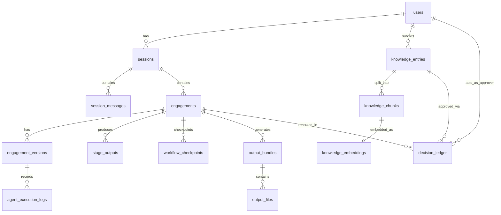
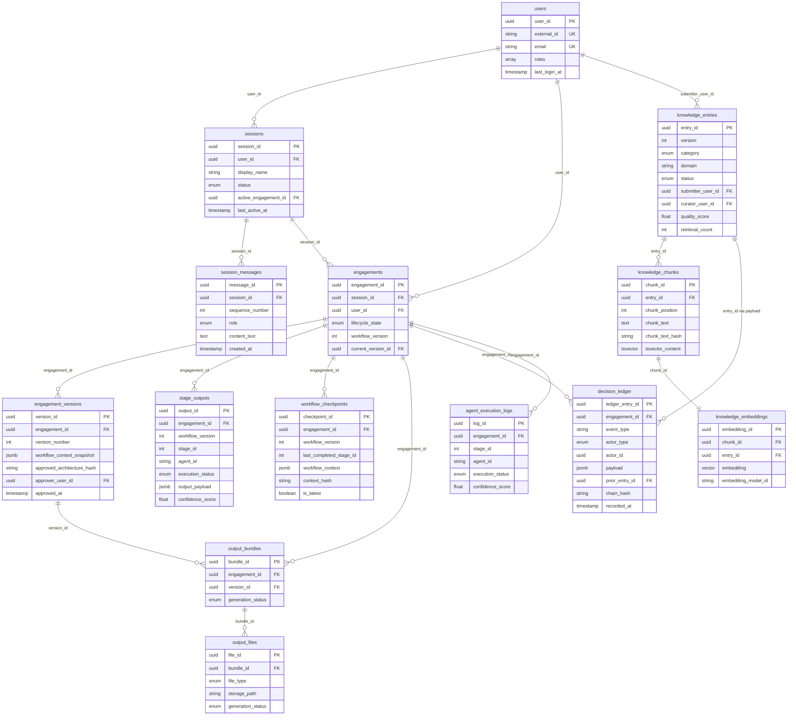

# DATABASE_ARCHITECTURE.md

> **Document Classification:** Database Architecture — Source of Truth  
> **Parent Documents:** ARCHITECTURE_VISION.md · SYSTEM_ARCHITECTURE.md · BACKEND_MODULE_ARCHITECTURE.md · WORKFLOW_ENGINE.md · KNOWLEDGE_ENGINE.md  
> **Status:** Approved — Foundation Release  
> **Version:** 1.0.0  
> **Database:** PostgreSQL (with `pgvector` extension for knowledge embeddings)  
> **Scope:** Logical database design, schema overview, table responsibilities, relationships, indexing, transactions, concurrency, backup, recovery, security, and performance

---

## Table of Contents

1. [Database Philosophy](#1-database-philosophy)
2. [Database Responsibilities](#2-database-responsibilities)
3. [Logical Database Design](#3-logical-database-design)
4. [Schema Overview](#4-schema-overview)
5. [Table Definitions](#5-table-definitions)
6. [Entity Relationships](#6-entity-relationships)
7. [Indexing Strategy](#7-indexing-strategy)
8. [Transaction Strategy](#8-transaction-strategy)
9. [Concurrency](#9-concurrency)
10. [Backup Strategy](#10-backup-strategy)
11. [Recovery Strategy](#11-recovery-strategy)
12. [Security](#12-security)
13. [Performance](#13-performance)
14. [Document Status and Metadata](#14-document-status-and-metadata)

---

## 1. Database Philosophy

### 1.1 Single Database, Clear Schema Ownership

ArchitectIQ V1 uses a single PostgreSQL instance with a structured schema design. Every table has a single owning module (as defined in BACKEND_MODULE_ARCHITECTURE.md). No table is written to by two modules — cross-module data access is read-only, and only through the Repository layer, never through direct table joins in application code.

### 1.2 ACID Above All

The platform's governance model — immutable ledger entries, durable state transitions, checkpoint integrity — requires ACID compliance across all writes. PostgreSQL's transactional guarantees are the foundation of the Recovery Guarantee and the Immutability Guarantee established in SYSTEM_ARCHITECTURE.md Section 1.3.

### 1.3 The Decision Ledger Is Structurally Separate

The `decision_ledger` table is the highest-integrity table in the schema. It has no `UPDATE` or `DELETE` operations — ever. It is append-only by design and enforcement. Its schema is designed for audit-grade durability, not for operational query performance.

### 1.4 Schema Naming Conventions

All tables, columns, and indexes use `snake_case`. Tables are named as plural nouns representing the entity they store. Foreign key columns are named `{referenced_table_singular}_id`. Timestamp columns are always UTC and named with `_at` suffix for events and `_date` suffix for calendar dates.

---

## 2. Database Responsibilities

PostgreSQL in ArchitectIQ owns the persistence of:

- User identity and role assignments
- Session records and conversation history
- Engagement records, lifecycle states, and stage outputs
- Workflow checkpoints
- Knowledge entry metadata and vector embeddings
- Decision Ledger (immutable audit trail)
- Generated output file manifests
- Agent execution logs
- Feature flag definitions and values

PostgreSQL does not own:

- Generated output file content (stored in object/file storage — managed by `OutputStorageService`)
- Real-time streaming event state (ephemeral — managed by the Progress Broadcaster)
- Session cache (managed by the Cache Layer — Redis-compatible)
- Secrets (managed by the Secrets Manager)

---

## 3. Logical Database Design

### 3.1 Schema Groups

The database is logically organized into six schema groups. These are logical groupings for documentation clarity — they are implemented within a single PostgreSQL database schema (`public` in V1; a schema-per-group approach is a future consideration for access isolation).

| Schema Group | Tables | Owner Module |
|-------------|--------|-------------|
| **Identity** | `users`, `user_roles` | `auth` module |
| **Session** | `sessions`, `session_messages` | `session` module |
| **Engagement** | `engagements`, `engagement_versions`, `stage_outputs`, `workflow_checkpoints` | `engagement` module, `orchestration` layer |
| **Knowledge** | `knowledge_entries`, `knowledge_chunks`, `knowledge_embeddings` | `knowledge` module |
| **Governance** | `decision_ledger` | `decision_ledger_service` |
| **Output** | `output_bundles`, `output_files` | `output` module |
| **Observability** | `agent_execution_logs`, `feature_flags` | `observability_service`, `configuration` module |

---

## 4. Schema Overview

---

## 5. Table Definitions

### 5.1 Identity Schema

#### `users`

**Owner module:** `auth`  
**Purpose:** Stores authenticated user identity, platform roles, and preferences.

| Column | Description |
|--------|-------------|
| `user_id` | UUID — primary key |
| `external_id` | String — GitHub user ID (stable OAuth identifier) |
| `display_name` | String — architect's display name |
| `email` | String — architect's email (from OAuth) |
| `avatar_url` | String — profile image URL |
| `roles` | Array — platform roles: ARCHITECT, KNOWLEDGE_CURATOR, ADMIN |
| `preferences` | JSONB — workspace preferences, notification settings |
| `created_at` | Timestamp UTC |
| `last_login_at` | Timestamp UTC |
| `is_active` | Boolean — soft-delete flag |

**Constraints:** `external_id` is unique. `email` is unique. `roles` array values are validated against the permitted role enum.

---

#### `user_roles`

**Owner module:** `auth`  
**Purpose:** Audit trail for role assignment changes. Every role change produces a record here.

| Column | Description |
|--------|-------------|
| `role_change_id` | UUID — primary key |
| `user_id` | UUID — FK to `users` |
| `role` | String — the role granted or revoked |
| `action` | Enum — GRANTED / REVOKED |
| `granted_by_user_id` | UUID — FK to `users` (who made the change) |
| `changed_at` | Timestamp UTC |
| `reason` | String — optional reason |

---

### 5.2 Session Schema

#### `sessions`

**Owner module:** `session`  
**Purpose:** Persistent session records. One row per architect session. Sessions survive browser closes and are restored on next login.

| Column | Description |
|--------|-------------|
| `session_id` | UUID — primary key |
| `user_id` | UUID — FK to `users` |
| `display_name` | String — architect-assigned session name (editable) |
| `status` | Enum — ACTIVE / EXPIRED / DELETED |
| `active_engagement_id` | UUID — FK to `engagements` (nullable — the current engagement in this session) |
| `workspace_state` | JSONB — last known workspace display state for fast restore |
| `conversation_message_count` | Integer — maintained for pagination |
| `created_at` | Timestamp UTC |
| `last_active_at` | Timestamp UTC |
| `expires_at` | Timestamp UTC — nullable; null = no expiry configured |

---

#### `session_messages`

**Owner module:** `session` (via `ConversationHistoryManager`)  
**Purpose:** Complete conversation history for each session. Ordered by sequence number.

| Column | Description |
|--------|-------------|
| `message_id` | UUID — primary key |
| `session_id` | UUID — FK to `sessions` |
| `sequence_number` | Integer — ordered position within the session |
| `role` | Enum — USER / ASSISTANT / SYSTEM |
| `content_text` | Text — the message content |
| `content_type` | Enum — TEXT / STAGE_PROGRESS / REVIEW_NOTICE / ERROR |
| `engagement_id` | UUID — FK to `engagements` (nullable — which engagement this message relates to) |
| `stage_id` | Integer — nullable; which workflow stage this message relates to |
| `token_count` | Integer — estimated token count of content |
| `created_at` | Timestamp UTC |

---

### 5.3 Engagement Schema

#### `engagements`

**Owner module:** `engagement`  
**Purpose:** The master record for each architecture engagement. One row per engagement. The engagement is the primary unit of work.

| Column | Description |
|--------|-------------|
| `engagement_id` | UUID — primary key |
| `session_id` | UUID — FK to `sessions` |
| `user_id` | UUID — FK to `users` |
| `lifecycle_state` | Enum — all states from SYSTEM_ARCHITECTURE.md Section 7.2 |
| `workflow_version` | Integer — incremented with each refinement cycle |
| `current_version_id` | UUID — FK to `engagement_versions` (nullable — the latest approved version) |
| `domain` | String — the architectural domain of this engagement |
| `intake_summary` | Text — brief summary of the requirement input for display |
| `created_at` | Timestamp UTC |
| `updated_at` | Timestamp UTC |
| `completed_at` | Timestamp UTC — nullable |
| `rejected_at` | Timestamp UTC — nullable |
| `cancelled_at` | Timestamp UTC — nullable |

---

#### `engagement_versions`

**Owner module:** `engagement`  
**Purpose:** One row per approved architecture version. An engagement has one version for its initial approval and one additional version per refinement cycle that results in approval.

| Column | Description |
|--------|-------------|
| `version_id` | UUID — primary key |
| `engagement_id` | UUID — FK to `engagements` |
| `version_number` | Integer — sequential within the engagement (1, 2, 3...) |
| `workflow_context_snapshot` | JSONB — complete WorkflowContext at the time of approval |
| `approved_architecture_hash` | String — SHA-256 hash of the approved architecture state |
| `approver_user_id` | UUID — FK to `users` |
| `approved_at` | Timestamp UTC |
| `ledger_entry_id` | UUID — FK to `decision_ledger` (the approval record) |
| `is_current` | Boolean — true for the most recent approved version |

---

#### `stage_outputs`

**Owner module:** `orchestration` layer (written by Orchestrator via EngagementRepository)  
**Purpose:** Stores the structured output of each agent stage for each engagement workflow version.

| Column | Description |
|--------|-------------|
| `output_id` | UUID — primary key |
| `engagement_id` | UUID — FK to `engagements` |
| `workflow_version` | Integer — which refinement cycle this output belongs to |
| `stage_id` | Integer — workflow stage number (1–17) |
| `agent_id` | String — the agent that produced this output |
| `agent_version` | String — the agent implementation version |
| `prompt_version` | String — the prompt version used |
| `execution_status` | Enum — SUCCESS / DEGRADED / FAILED / SKIPPED |
| `output_payload` | JSONB — the agent's structured output |
| `confidence_score` | Float — the agent's confidence score |
| `token_usage` | JSONB — prompt tokens, completion tokens, total |
| `execution_latency_ms` | Integer |
| `produced_at` | Timestamp UTC |

---

#### `workflow_checkpoints`

**Owner module:** `orchestration` layer (Checkpoint Writer)  
**Purpose:** Durable checkpoints of the WorkflowContext after each stage group. The foundation of the Resume Capability (WORKFLOW_ENGINE.md Section 15).

| Column | Description |
|--------|-------------|
| `checkpoint_id` | UUID — primary key |
| `engagement_id` | UUID — FK to `engagements` |
| `workflow_version` | Integer |
| `last_completed_stage_id` | Integer — last successfully completed stage |
| `last_completed_stage_group` | String — stage group identifier |
| `workflow_context` | JSONB — complete WorkflowContext at checkpoint time |
| `context_hash` | String — SHA-256 hash of `workflow_context` for integrity |
| `stage_statuses` | JSONB — map of stage_id to terminal status |
| `created_at` | Timestamp UTC |
| `is_latest` | Boolean — true for the most recent checkpoint per engagement+version |

---

### 5.4 Knowledge Schema

#### `knowledge_entries`

**Owner module:** `knowledge_base`  
**Purpose:** Metadata for every knowledge entry. The structured record that governs retrieval filtering, versioning, and governance.

| Column | Description |
|--------|-------------|
| `entry_id` | UUID — primary key |
| `version` | Integer — version number within the entry lineage |
| `category` | Enum — all categories from KNOWLEDGE_ENGINE.md Section 4 |
| `domain` | String — primary domain |
| `secondary_domains` | Array — additional applicable domains |
| `tags` | Array — free-form tags |
| `title` | String — human-readable title |
| `source_type` | Enum — ENGAGEMENT_OUTCOME / MANUAL / BULK_IMPORT / EXTERNAL |
| `source_reference` | String — engagement ID or external URL |
| `submitter_user_id` | UUID — FK to `users` |
| `curator_user_id` | UUID — FK to `users` (nullable until approved) |
| `status` | Enum — PENDING / ACTIVE / DEPRECATED / ARCHIVED / REJECTED |
| `supersedes_entry_id` | UUID — FK to `knowledge_entries` (self-reference, nullable) |
| `quality_score` | Float — automated quality score |
| `retrieval_count` | Integer — incremented on each retrieval |
| `approval_engagement_count` | Integer — count of approved architectures citing this entry |
| `last_retrieved_at` | Timestamp UTC |
| `chunk_count` | Integer |
| `effective_date` | Date |
| `expiry_date` | Date — nullable |
| `submitted_at` | Timestamp UTC |
| `approved_at` | Timestamp UTC — nullable |
| `deprecated_at` | Timestamp UTC — nullable |
| `ledger_entry_id` | UUID — FK to `decision_ledger` (the approval record) |

---

#### `knowledge_chunks`

**Owner module:** `knowledge_base`  
**Purpose:** The chunked text segments of each knowledge entry. One row per chunk.

| Column | Description |
|--------|-------------|
| `chunk_id` | UUID — primary key |
| `entry_id` | UUID — FK to `knowledge_entries` |
| `chunk_position` | Integer — ordinal position within the parent entry |
| `chunk_text` | Text — the chunk content |
| `chunk_text_hash` | String — SHA-256 of chunk_text for embedding integrity |
| `token_count` | Integer — estimated token count |
| `tsvector_content` | tsvector — PostgreSQL full-text search index column |
| `created_at` | Timestamp UTC |

---

#### `knowledge_embeddings`

**Owner module:** `knowledge_base` (via `embedding_service`)  
**Purpose:** Vector embeddings for each approved knowledge chunk. Stored using the `pgvector` extension.

| Column | Description |
|--------|-------------|
| `embedding_id` | UUID — primary key |
| `chunk_id` | UUID — FK to `knowledge_chunks` (one-to-one) |
| `entry_id` | UUID — FK to `knowledge_entries` (denormalized for query efficiency) |
| `embedding` | vector(3072) — OpenAI `text-embedding-3-large` dimension (configurable) |
| `embedding_model_id` | String — the embedding model used |
| `generated_at` | Timestamp UTC |

**Index:** `hnsw` index on `embedding` column for approximate nearest-neighbor search. `ivfflat` index as alternative for large-scale deployments.

---

### 5.5 Governance Schema

#### `decision_ledger`

**Owner module:** `decision_ledger_service`  
**Purpose:** Immutable, append-only audit trail of all platform decisions. Described fully in SYSTEM_ARCHITECTURE.md Section 10 and BACKEND_MODULE_ARCHITECTURE.md Section 4.13.

| Column | Description |
|--------|-------------|
| `ledger_entry_id` | UUID — primary key |
| `engagement_id` | UUID — FK to `engagements` (nullable — knowledge approval entries are not engagement-scoped) |
| `event_type` | String — machine-parseable event category |
| `actor_type` | Enum — AGENT / ARCHITECT / SYSTEM / CURATOR |
| `actor_id` | UUID — the identity of the actor |
| `payload` | JSONB — event-specific data (structured; schema varies by event type) |
| `prior_entry_id` | UUID — FK to `decision_ledger` (hash chain predecessor, nullable for first entry) |
| `content_hash` | String — SHA-256 of this entry's canonical content |
| `chain_hash` | String — SHA-256 of (this entry's content_hash + prior entry's chain_hash) |
| `recorded_at` | Timestamp UTC — server-generated; not client-provided |

**Constraint:** No `UPDATE` or `DELETE` operations are permitted on this table. Application-level enforcement via Repository pattern. Database-level enforcement via row-level triggers that raise an error on any attempt to modify or delete an existing row.

---

### 5.6 Output Schema

#### `output_bundles`

**Owner module:** `output` module (via `output_packager`)  
**Purpose:** Manifest of every generated output bundle for a completed engagement version.

| Column | Description |
|--------|-------------|
| `bundle_id` | UUID — primary key |
| `engagement_id` | UUID — FK to `engagements` |
| `version_id` | UUID — FK to `engagement_versions` |
| `bundle_version` | Integer — sequential per engagement (1, 2...) |
| `generation_status` | Enum — IN_PROGRESS / COMPLETE / PARTIAL / FAILED |
| `total_file_count` | Integer |
| `available_file_count` | Integer |
| `bundle_hash` | String — SHA-256 of all included file hashes combined |
| `generated_at` | Timestamp UTC |

---

#### `output_files`

**Owner module:** `output` module  
**Purpose:** One row per generated file in an output bundle.

| Column | Description |
|--------|-------------|
| `file_id` | UUID — primary key |
| `bundle_id` | UUID — FK to `output_bundles` |
| `file_type` | Enum — HLD / LLD / EXECUTIVE_SUMMARY / RISK_REGISTER / ASSUMPTIONS_LOG / DIAGRAM_MERMAID / DIAGRAM_DOT / DIAGRAM_SVG / DIAGRAM_PNG / HTML_REPORT / JSON_STATE / IaC_SCAFFOLD |
| `storage_path` | String — path in the object/file storage system |
| `file_size_bytes` | Integer |
| `template_version` | String — the template version used to generate this file |
| `content_hash` | String — SHA-256 for integrity |
| `generation_status` | Enum — SUCCESS / FAILED |
| `generated_at` | Timestamp UTC |

---

### 5.7 Observability Schema

#### `agent_execution_logs`

**Owner module:** `observability_service`  
**Purpose:** Detailed execution record for every agent invocation. Supplements the structured operational log stream with a queryable database record.

| Column | Description |
|--------|-------------|
| `log_id` | UUID — primary key |
| `engagement_id` | UUID — FK to `engagements` |
| `workflow_version` | Integer |
| `stage_id` | Integer |
| `agent_id` | String |
| `agent_version` | String |
| `prompt_version` | String |
| `model_id` | String |
| `correlation_id` | UUID — request trace identifier |
| `execution_status` | Enum — SUCCESS / DEGRADED / FAILED |
| `confidence_score` | Float |
| `retrieval_item_count` | Integer |
| `prompt_tokens` | Integer |
| `completion_tokens` | Integer |
| `execution_latency_ms` | Integer |
| `failure_error_code` | String — nullable |
| `executed_at` | Timestamp UTC |

---

#### `feature_flags`

**Owner module:** `configuration` module  
**Purpose:** Runtime feature flag definitions and their current values.

| Column | Description |
|--------|-------------|
| `flag_id` | UUID — primary key |
| `flag_name` | String — unique; machine-parseable identifier |
| `flag_type` | Enum — BOOLEAN / PERCENTAGE / USER_COHORT |
| `is_enabled` | Boolean — for BOOLEAN type |
| `rollout_percentage` | Float — for PERCENTAGE type (0.0–100.0) |
| `description` | String — human-readable description |
| `updated_by_user_id` | UUID — FK to `users` |
| `updated_at` | Timestamp UTC |

---

## 6. Entity Relationships

---

## 7. Indexing Strategy

### 7.1 Primary Key Indexes

All primary keys use UUID v4. PostgreSQL creates a B-tree index automatically on every primary key column.

### 7.2 Foreign Key Indexes

All foreign key columns have explicit B-tree indexes. PostgreSQL does not create foreign key indexes automatically; unindexed foreign keys cause full table scans on join operations.

### 7.3 Critical Query Indexes

| Table | Index Columns | Index Type | Query Pattern |
|-------|-------------|------------|---------------|
| `sessions` | `user_id, status` | B-tree composite | Session list for user — primary query on login |
| `sessions` | `last_active_at` | B-tree | Session expiry sweep |
| `session_messages` | `session_id, sequence_number` | B-tree composite | Conversation history retrieval ordered by sequence |
| `engagements` | `session_id, lifecycle_state` | B-tree composite | Active engagement lookup per session |
| `engagements` | `user_id, lifecycle_state` | B-tree composite | User's engagement portfolio |
| `stage_outputs` | `engagement_id, workflow_version, stage_id` | B-tree composite | Stage output retrieval for a specific workflow version |
| `workflow_checkpoints` | `engagement_id, workflow_version, is_latest` | B-tree composite | Latest checkpoint retrieval for resume |
| `knowledge_entries` | `status, domain, category` | B-tree composite | Retrieval pre-filter — active entries in domain/category |
| `knowledge_entries` | `last_retrieved_at` | B-tree | Staleness detection sweep |
| `knowledge_chunks` | `entry_id, chunk_position` | B-tree composite | Chunk retrieval for display and context assembly |
| `knowledge_chunks` | `tsvector_content` | GIN | Full-text keyword search |
| `knowledge_embeddings` | `embedding` | HNSW (pgvector) | Approximate nearest-neighbor semantic search |
| `knowledge_embeddings` | `entry_id` | B-tree | Embedding lookup by entry |
| `decision_ledger` | `engagement_id, recorded_at` | B-tree composite | Ledger entries per engagement ordered by time |
| `decision_ledger` | `event_type, recorded_at` | B-tree composite | Event type filtering for audit queries |
| `agent_execution_logs` | `engagement_id, stage_id` | B-tree composite | Execution log lookup per stage |
| `output_files` | `bundle_id, file_type` | B-tree composite | File lookup by type within bundle |

### 7.4 pgvector Index Configuration

The HNSW index on `knowledge_embeddings.embedding` is configured with:
- `m` parameter (maximum connections per layer): 16 (balanced for memory vs. recall)
- `ef_construction` parameter (search width during construction): 64
- These parameters are tuned for the knowledge base sizes expected in V1. Reindexing with adjusted parameters is required if the knowledge base grows significantly beyond initial estimates.

---

## 8. Transaction Strategy

### 8.1 Transactional Boundaries

| Operation | Transactional Scope | Isolation Level |
|-----------|--------------------|-|
| Engagement state transition + stage output write | Single transaction | Read Committed |
| Checkpoint write | Single transaction | Serializable (ensures no concurrent overwrites) |
| Decision Ledger append (with chain hash) | Single transaction | Serializable (enforces append-only ordering) |
| Knowledge entry approval (metadata + embed trigger) | Single transaction for metadata; embedding is async | Read Committed |
| Session message append | Single transaction | Read Committed |
| Output bundle manifest write | Single transaction | Read Committed |

### 8.2 Write-Ahead Log Reliability

All writes use PostgreSQL's Write-Ahead Log (WAL). `synchronous_commit` is set to `on` for critical writes (checkpoint, Decision Ledger). This ensures that acknowledged writes survive a database process crash — not just an OS crash.

For non-critical writes (agent execution logs, session activity timestamps), `synchronous_commit` may be set to `local` to reduce write latency at the cost of potential loss of a few seconds of log data in the event of a crash.

### 8.3 Long-Running Transaction Prevention

Agent pipeline execution is long-running, but database transactions are kept short. The Orchestrator does not hold a database transaction open while an agent is executing. The sequence is: open transaction → read context → commit → (agent executes outside DB transaction) → open transaction → write result → commit. No long-running transactions that could cause lock contention or MVCC bloat.

---

## 9. Concurrency

### 9.1 Optimistic Concurrency for Engagement State

Engagement state transitions use optimistic concurrency. Before writing a new lifecycle state, the application reads the current state and includes it in the `WHERE` clause of the update. If the row has been modified concurrently (the state has already changed), zero rows are updated and the application retries or raises a `WorkflowStateError`.

This prevents two concurrent processes from advancing the same engagement state simultaneously — a critical safety property for the engagement state machine.

### 9.2 Decision Ledger Serialization

Decision Ledger appends use a Serializable isolation level transaction. This ensures that concurrent appends are fully ordered — the chain hash computation (which depends on the prior entry's hash) is always based on the correct predecessor. No two concurrent ledger appends can both compute their chain hash based on the same predecessor entry.

### 9.3 Knowledge Base Concurrent Access

Knowledge base retrieval operations are read-only and use Read Committed isolation. Multiple agents from multiple concurrent engagements may query the knowledge base simultaneously without any write-read conflicts.

Knowledge base writes (new entry indexing, retrieval count updates) use advisory locks at the entry level to prevent concurrent updates to the same entry. Retrieval count updates use `UPDATE ... WHERE chunk_id = ... SET retrieval_count = retrieval_count + 1` — atomic increment, no lock required.

---

## 10. Backup Strategy

### 10.1 Continuous WAL Archiving

PostgreSQL WAL segments are continuously archived to durable object storage. This enables point-in-time recovery (PITR) to any moment within the WAL retention window (configurable; default: 7 days).

### 10.2 Full Base Backups

Full base backups using `pg_basebackup` run on a scheduled cycle (daily in production). Combined with WAL archiving, this provides PITR capability from any daily snapshot plus all subsequent WAL.

### 10.3 Backup Encryption

All backup artifacts (WAL segments and base backups) are encrypted before storage using the organization's key management system. Backup decryption requires the same key management access as production — preventing backup exfiltration from being a security bypass.

### 10.4 Backup Verification

Backup integrity is verified weekly by restoring the most recent backup to a dedicated restore-test environment and running schema and data integrity checks. A backup that cannot be verified is treated as a critical alert.

---

## 11. Recovery Strategy

### 11.1 RTO and RPO Targets

| Scenario | RPO Target | RTO Target |
|----------|-----------|-----------|
| Application failure (database intact) | 0 (no data loss) | < 5 minutes |
| Database process crash (WAL intact) | < 30 seconds | < 10 minutes |
| Primary database failure (streaming replica) | < 5 seconds | < 2 minutes (replica promotion) |
| Data center failure (PITR from backup) | < 1 hour | < 1 hour |

### 11.2 High Availability Topology

Production deployment uses PostgreSQL streaming replication with at least one synchronous standby. The standby receives WAL in real time and can be promoted to primary within 2 minutes of a primary failure. Connection pooling (via PgBouncer or equivalent) routes application connections — promotion is transparent to the application layer.

### 11.3 Decision Ledger Recovery Guarantee

After any recovery event, the Decision Ledger chain integrity is verified before the application is allowed to write new entries. A chain integrity failure after recovery is a critical incident requiring manual investigation — the chain cannot be repaired by automated tools; every entry must be traceable to a confirmed event.

---

## 12. Security

### 12.1 Authentication

The application connects to PostgreSQL using a dedicated service account, not a superuser. The service account's credentials are retrieved from the Secrets Manager at runtime (as established in BACKEND_MODULE_ARCHITECTURE.md Section 17.3). The credentials are not stored in environment variables or configuration files.

### 12.2 Role Separation

Three PostgreSQL roles are defined:

| Role | Permissions | Used By |
|------|------------|---------|
| `app_user` | SELECT, INSERT, UPDATE on all tables except `decision_ledger`; no DELETE | Application service account |
| `ledger_user` | INSERT only on `decision_ledger`; SELECT on `decision_ledger` | Decision Ledger service account |
| `read_user` | SELECT on all tables | Observability queries, reporting |

The `app_user` role does not have permission to delete rows from any table. The only permitted deletion is soft-deletion via status column updates. This is a database-enforced constraint, not an application-level convention.

### 12.3 Encryption at Rest

The PostgreSQL data directory is encrypted at the storage layer (cloud provider disk encryption or filesystem encryption). Column-level encryption for particularly sensitive fields (e.g., session workspace state that may contain architect input) uses PostgreSQL's `pgcrypto` extension with keys managed by the Secrets Manager.

### 12.4 Network Isolation

The PostgreSQL instance is not accessible from the public internet. All connections originate from within the application's private network. Network-level access is restricted to the application service's network security group or VPC security group.

### 12.5 Audit Logging

PostgreSQL `log_statement = 'ddl'` and `log_connections = on` are enabled. All DDL changes and connection events are logged to a separate audit log stream. Query logging at the statement level is disabled in production (privacy concern for requirement text) but enabled for DDL operations.

---

## 13. Performance

| Guideline | Target | Mechanism |
|-----------|--------|-----------|
| Simple primary key lookup | < 5ms | B-tree index on UUID primary keys |
| Session restore (session + messages) | < 50ms | Composite index on session_id + sequence_number |
| Engagement state read | < 10ms | B-tree index on engagement_id |
| Knowledge entry metadata filter | < 100ms | Composite index on status + domain + category |
| Semantic search (top-10 results) | < 500ms | HNSW index on embedding column |
| Hybrid search (semantic + keyword) | < 1 second | HNSW + GIN indexes, parallel query execution |
| Checkpoint write | < 200ms | Targeted write to single row; Serializable isolation |
| Decision Ledger append | < 100ms | Serializable single-row append |
| Connection pool size | 20–50 connections | PgBouncer transaction-mode pooling |
| Maximum query execution time | 30 seconds | `statement_timeout` setting; queries exceeding this are cancelled |

---

## 14. Document Status and Metadata

### Document Status

| Field | Value |
|-------|-------|
| Status | Approved — Foundation Release |
| Version | 1.0.0 |
| Classification | Database Architecture — Source of Truth |
| Database | PostgreSQL with pgvector extension |

### Dependencies

- `SYSTEM_ARCHITECTURE.md` — Persistence boundary definition, Recovery Guarantee, Immutability Guarantee
- `BACKEND_MODULE_ARCHITECTURE.md` — Repository pattern definitions, module ownership of each table group
- `WORKFLOW_ENGINE.md` — WorkflowContext structure (mapped to `workflow_checkpoints.workflow_context`), checkpoint strategy
- `KNOWLEDGE_ENGINE.md` — Knowledge entry lifecycle, chunking and embedding concepts

### Related Documents

- `API_ARCHITECTURE.md` — API endpoints that read from and write to the schemas defined here
- `SECURITY_ARCHITECTURE.md` — Encryption key management, audit log requirements

### Future Extension

1. **Schema-per-domain isolation:** As the platform grows, the logical schema groups defined in Section 3.1 may be implemented as separate PostgreSQL schemas with schema-level access control — providing stronger module boundary enforcement at the database level.

2. **Dedicated vector database:** When the knowledge base grows beyond the performance characteristics of `pgvector` at scale (typically > 10 million embeddings), a dedicated vector database may be introduced. The `VectorStoreProvider` interface in BACKEND_MODULE_ARCHITECTURE.md is designed for this migration.

3. **Read replica for reporting:** High-volume reporting and analytics queries (engagement analytics, knowledge base usage metrics) may be directed to a read replica to avoid contention with the primary database's operational workload.

4. **Time-series partitioning:** The `agent_execution_logs` and `session_messages` tables will grow unboundedly. Table partitioning by month or quarter (PostgreSQL declarative partitioning) will be introduced to enable efficient archival of historical data.

---

**End of DATABASE_ARCHITECTURE.md**  
Version 1.0.0 — Foundation Release
