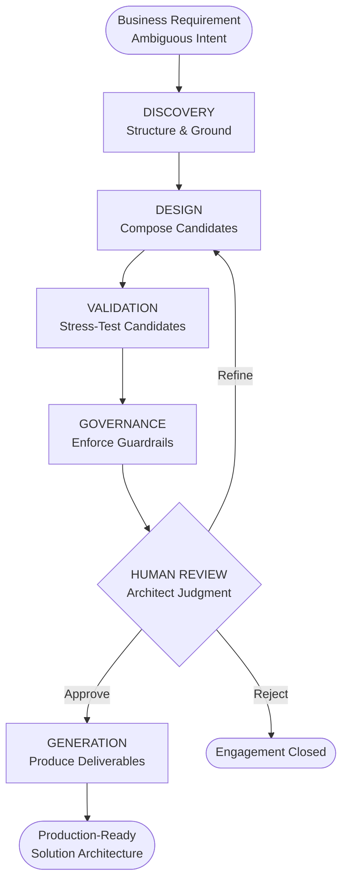
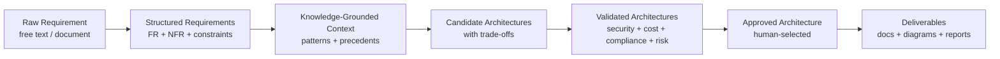
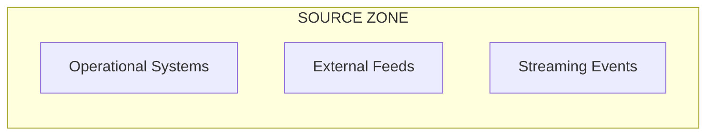
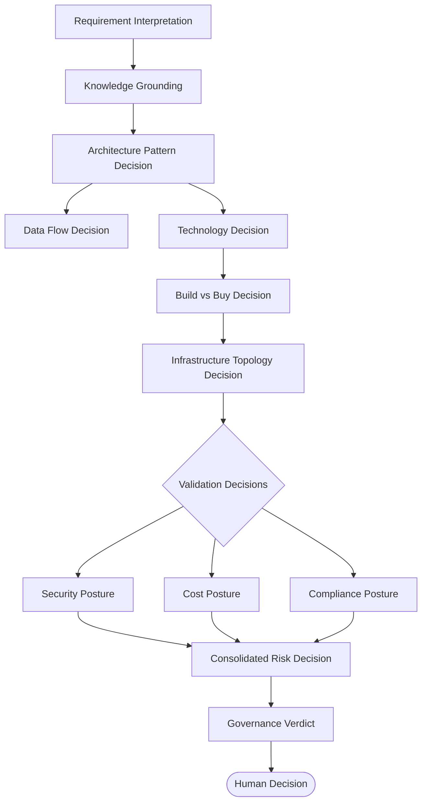
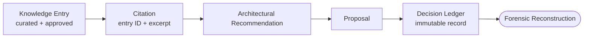

# DATA_SOLUTION_ARCHITECTURE.md
Document Classification: Data Solution Architecture — Source of Truth Parent Documents: ARCHITECTURE_VISION.md · SYSTEM_ARCHITECTURE.md · AI_AGENT_ARCHITECTURE.md · WORKFLOW_ENGINE.md · KNOWLEDGE_ENGINE.md · BACKEND_MODULE_ARCHITECTURE.md Status: Approved — Foundation Release Version: 1.0.0 Scope: The end-to-end data solution engineering discipline of ArchitectIQ — how business requirements become validated, traceable, production-ready architecture recommendations LLM Provider Assumption: OpenAI (current implementation). Architecture is provider-independent.

# Table of Contents
Architecture Philosophy
End-to-End Data Solution Lifecycle
Requirement → Architecture → Output Flow
Enterprise Data Flow
Data Processing Pipeline
AI Decision Pipeline
Data Movement Strategy
Technology Selection Strategy
Architecture Pattern Selection
Build vs Buy Decision Strategy
Cost Optimization Strategy
Scalability Strategy
High Availability
Multi-Cloud Readiness (Concept)
Human Review Integration
Decision Traceability
Architecture Validation
Production Readiness Checklist
Document Status and Metadata
1. Architecture Philosophy
## 1.1 Purpose of This Document
The preceding documents define how the platform is built (backend, frontend, agents, workflow). This document defines what the platform produces as a discipline — the data solution architecture engineering method that ArchitectIQ automates. It is the bridge between the platform's runtime mechanics and the architectural artifacts a Data Solution Architect delivers to a client.

Where SYSTEM_ARCHITECTURE.md describes the state machine and WORKFLOW_ENGINE.md describes the 17 stages, this document describes the architectural reasoning that flows through those stages — the transformation of ambiguous business intent into a defensible, validated, technology-grounded solution architecture.

## 1.2 Foundational Position
ArchitectIQ is a domain-agnostic data solution architecture engine (per ARCHITECTURE_VISION.md Section 12). It does not encode healthcare logic, financial services logic, or retail logic in its reasoning. Domain specificity enters exclusively through the Knowledge Engine (KNOWLEDGE_ENGINE.md Section 5.2 partitioning) and configuration. The architectural method described here is identical regardless of domain.

## 1.3 Core Solution Architecture Principles
Principle	Description
Grounded reasoning over generation	Every architectural decision is grounded in retrieved enterprise knowledge (patterns, precedents, technology evaluations), never in ungrounded model inference. This enforces the Traceability Guarantee (SYSTEM_ARCHITECTURE.md Section 1.3).
Options over prescriptions	The platform produces one to three candidate architectures with explicit trade-offs — never a single dictated answer. The human architect selects.
Trade-offs are first-class	Every candidate architecture carries an explicit trade-off analysis. An architecture without documented trade-offs is an incomplete architecture.
Validation before review	Security, cost, compliance, and risk are evaluated against every candidate before the architect reviews (ARCHITECTURE_VISION.md Section 4.5). Risk is designed in, not discovered late.
Simplicity is preferred	When a simpler architecture satisfies requirements with an acceptable trade-off profile, it is preferred (ARCHITECTURE_VISION.md Section 7). Complexity cost is surfaced explicitly.
The human owns the outcome	The platform proposes; the architect disposes. No architecture reaches Final status without explicit human approval (NR-01).
2. End-to-End Data Solution Lifecycle
The data solution lifecycle is the architectural interpretation of the 17-stage workflow defined in WORKFLOW_ENGINE.md Section 6. This section describes the solution engineering meaning of each phase — not the execution mechanics.

    style A fill:#f5f5f5,stroke:#999999
    style F fill:#ffe8e8,stroke:#cc0000
    style I fill:#e8f9e8,stroke:#006600
## 2.1 Lifecycle Phase Meaning
Phase	Solution Architecture Meaning	Workflow Reference
Discovery	Convert unstructured intent into structured, ground-truthed requirements grounded in enterprise knowledge	WORKFLOW_ENGINE.md Stages 1–4
Design	Compose candidate architectures, select technologies, design data flow, resolve build-vs-buy	WORKFLOW_ENGINE.md Stages 5–8
Validation	Independently stress-test every candidate for security, cost, compliance, and consolidated risk	WORKFLOW_ENGINE.md Stages 9–12
Governance	Enforce enterprise policy guardrails as a hard gate before human attention is spent	WORKFLOW_ENGINE.md Stage 13 (Governance Agent)
Human Review	Apply irreplaceable human judgment; select, refine, or reject	WORKFLOW_ENGINE.md Stage 13 (Human Gate)
Generation	Materialize the approved architecture into client-ready deliverables	WORKFLOW_ENGINE.md Stages 14–17
3. Requirement → Architecture → Output Flow
## 3.1 The Transformation Chain
The platform performs a progressive refinement of information density and structure. Each transformation increases the specificity and defensibility of the architectural content.

    style R fill:#f5f5f5,stroke:#999999
    style AP fill:#fff3cd,stroke:#cc8800
    style DL fill:#e8f9e8,stroke:#006600
## 3.2 Information State Transitions
Transition	Owning Agent(s)	Structural Change
Raw → Structured	Requirement Intelligence Agent, Clarification Agent (AI_AGENT_ARCHITECTURE.md Agents 1–2)	Unstructured text → typed FR/NFR schema with ambiguity flags
Structured → Grounded	Knowledge Retrieval Agent (Agent 3)	Requirements → retrieved patterns/precedents with citations
Grounded → Candidates	Design Agents (Agents 4–8)	Grounded context → 1–3 candidate architectures with technology, data flow, build-vs-buy, and topology
Candidates → Validated	Validation Agents (Agents 9–12)	Candidates → candidates annotated with threat model, TCO, compliance checklist, risk register
Validated → Approved	Human architect via Human Collaboration Agent (Agent 17)	Multiple candidates → single approved, immutable architecture snapshot
Approved → Deliverables	Generation Agents (Agents 13–15)	Approved architecture → Markdown, diagrams, HTML report (see OUTPUT_GENERATION_ARCHITECTURE.md)
The output formats and their generation are governed exclusively by OUTPUT_GENERATION_ARCHITECTURE.md.

4. Enterprise Data Flow
## 4.1 Distinction: Platform Data Flow vs. Designed Data Flow
Two distinct data flows exist and must not be conflated:

Platform Data Flow: How data moves through ArchitectIQ itself during an engagement — governed by SYSTEM_ARCHITECTURE.md (request lifecycle, knowledge flow, state persistence). This document does not re-describe it.
Designed Data Flow: The data architecture the platform designs for the client — the subject of this section and produced by the Data Flow Agent (AI_AGENT_ARCHITECTURE.md Agent 5).
## 4.2 Designed Enterprise Data Flow Model
For every candidate architecture, the platform designs a canonical enterprise data flow spanning five conceptual zones:

    subgraph INGEST["INGESTION ZONE"]
        I1[Batch Ingestion]
        I2[Streaming Ingestion]
        I3[CDC / Event-Driven]
end

    subgraph PROCESS["PROCESSING ZONE"]
        P1[Raw / Bronze]
        P2[Curated / Silver]
        P3[Serving / Gold]
end

    subgraph SERVE["SERVING ZONE"]
        SV1[Analytics APIs]
        SV2[Dashboards]
        SV3[Data Products]
end

    subgraph CONSUME["CONSUMPTION ZONE"]
        C1[Business Users]
        C2[Downstream Systems]
end

    SOURCES --> INGEST --> PROCESS --> SERVE --> CONSUME
## 4.3 Data Flow Design Dimensions
Each designed data path is annotated across dimensions derived from the structured NFRs (Data Flow Agent responsibility, AI_AGENT_ARCHITECTURE.md Section 7.3):

Dimension	Source	Purpose
Volume / Velocity / Variety	Structured requirements	Determines ingestion pattern selection
Latency budget per path	NFRs	Distinguishes real-time vs. batch paths
Throughput target	NFRs	Sizes processing and storage tiers
SLA criticality	NFRs	Classifies critical vs. best-effort paths
Data classification	Requirements + Security Agent	Drives encryption and residency decisions
5. Data Processing Pipeline
## 5.1 Processing Tier Model
The platform designs processing tiers following a medallion-style progression (or an equivalent pattern selected per requirements). Tier selection is a design output, not hardcoded logic — the Architecture Design Agent composes it from retrieved patterns.

Tier	Purpose	Typical Characteristics
Raw / Bronze	Immutable landing of source data as-received	Append-only, schema-on-read, full-fidelity retention
Curated / Silver	Cleansed, conformed, quality-controlled data	Deduplicated, validated, standardized schema
Serving / Gold	Business-ready aggregates and data products	Modeled, performance-optimized, consumption-shaped
## 5.2 Processing Pattern Selection
The platform selects among processing paradigms based on latency and consistency requirements. Pattern candidates are retrieved from the Knowledge Engine, never invented:

Pattern	Selected When
Batch	High volume, latency-tolerant, periodic processing acceptable
Micro-batch	Near-real-time with bounded latency and batch efficiency
Streaming	Continuous low-latency event processing required
Lambda / Kappa	Combined batch + streaming or streaming-unified per consistency needs
Processing pattern selection feeds directly into technology selection (Section 8) and cost modeling (Section 11).

6. AI Decision Pipeline
## 6.1 The Decision Chain
The AI decision pipeline is the ordered application of specialized reasoning agents. Its mechanics are fully defined in AI_AGENT_ARCHITECTURE.md (agent catalog, contracts, lifecycle) and WORKFLOW_ENGINE.md (stage orchestration). This section describes the decision dependency semantics — how each decision constrains the next.

    style HUM fill:#ffe8e8,stroke:#cc0000
## 6.2 Decision Constraint Propagation
Each decision constrains the solution space for subsequent decisions:

Architecture pattern constrains which technologies are compatible.
Technology selection constrains cost modeling and build-vs-buy options.
Infrastructure topology constrains security boundaries and availability posture.
Architect overrides (SYSTEM_ARCHITECTURE.md Section 9.4) constrain all dependent downstream decisions as fixed inputs — never overridden by agents.
## 6.3 Confidence-Weighted Decisions
Every decision carries a confidence score (AI_AGENT_ARCHITECTURE.md Section 17). Low-confidence decisions are surfaced as attention items in the review package, directing human scrutiny to the least certain parts of the architecture — a core amplification-of-judgment mechanism (ARCHITECTURE_VISION.md Section 3).

7. Data Movement Strategy
## 7.1 Movement Pattern Catalog
The platform designs data movement using recognized patterns, selected per source characteristics and latency budgets:

Movement Pattern	Design Intent
Batch transfer	Scheduled bulk movement for high-volume, latency-tolerant sources
Change Data Capture (CDC)	Incremental propagation of source changes with minimal source load
Event streaming	Continuous, ordered event propagation for real-time paths
API-based pull	On-demand retrieval from systems exposing service interfaces
File-based exchange	Structured file drops for partner or legacy integration
## 7.2 Movement Design Principles
Movement patterns are selected to minimize source system impact while meeting the latency budget.
Each movement path inherits the data classification of its payload, driving encryption-in-transit requirements (see SECURITY_ARCHITECTURE.md).
Movement reliability requirements (exactly-once, at-least-once) are derived from SLA criticality and drive technology selection.
Cross-zone and cross-region movement is explicitly flagged for cost (egress) and compliance (residency) implications.
8. Technology Selection Strategy
## 8.1 Selection Governance
Technology selection is performed exclusively by the Technology Recommendation Agent (AI_AGENT_ARCHITECTURE.md Agent 6) against the enterprise-approved technology catalog. The catalog is configuration and knowledge, not code (ARCHITECTURE_VISION.md Section 12; REPOSITORY_MASTER_STRUCTURE.md config/knowledge/catalogs/). No technology outside the approved catalog is selected without an explicit exception flag raised for architect decision.

## 8.2 Standardized Scoring Framework
Every candidate technology is scored across a fixed evaluation framework (AI_AGENT_ARCHITECTURE.md Section 7.3):

Criterion	Evaluation Concern
Maturity	Production stability and ecosystem depth
Licensing cost	Commercial vs. open-source cost implications
Integration compatibility	Fit with adjacent selected technologies
Operational burden	Ongoing operational cost and complexity
Team familiarity	Organizational capability alignment
Vendor support	Support model and community longevity
## 8.3 Selection Principles
Technology selection is governed by the constitutional Technology Selection Principles (ARCHITECTURE_VISION.md Section 28): prefer proven over novel, evaluate for TCO, minimize moving parts, prefer explicit interface contracts, ensure every technology is replaceable, and prefer open source for non-differentiating components. Every selection carries the scoring for all considered alternatives — not only the winner — preserving decision defensibility.

9. Architecture Pattern Selection
## 9.1 Pattern-Grounded Composition
Candidate architectures are composed from architecture patterns retrieved from the Knowledge Engine (KNOWLEDGE_ENGINE.md Section 4, category "Architecture Pattern" and "Approved Precedent"). The Architecture Design Agent (AI_AGENT_ARCHITECTURE.md Agent 4) identifies, adapts, and combines patterns — it does not invent patterns from ungrounded inference.

## 9.2 Pattern Selection Dimensions
Dimension	Selection Influence
Functional fit	Does the pattern satisfy the stated functional requirements?
NFR fit	Does the pattern structurally support availability, latency, and scalability NFRs?
Trade-off profile	What does the pattern sacrifice relative to alternatives?
Precedent strength	Has this pattern been approved in prior organizational engagements?
Complexity cost	What operational and cognitive complexity does the pattern introduce?
## 9.3 Multi-Candidate Rationale
The platform generates one to three candidates (bounded at three per AI_AGENT_ARCHITECTURE.md Section 25.3) to give the architect genuine choice while preserving reasoning quality per candidate. Each candidate presents a distinct trade-off position (e.g., simplicity vs. scalability, cost vs. resilience), with a comparative summary table enabling side-by-side evaluation.

10. Build vs Buy Decision Strategy
## 10.1 Decision Scope
For each major architecture layer, the Build vs Buy Agent (AI_AGENT_ARCHITECTURE.md Agent 7) evaluates three options: build custom, adopt open-source, or procure a managed commercial service. The decision is layer-by-layer — not a single monolithic verdict — producing an overall posture (build-heavy, buy-heavy, or hybrid).

## 10.2 Evaluation Dimensions
Dimension	Concern
Implementation effort	Relative build/integration effort (low/medium/high)
TCO trajectory	Short-term vs. long-term cost implications
Operational burden	Ongoing operational ownership cost
Risk profile	Vendor lock-in, community longevity, operational complexity
Organizational capability	Team maturity and existing vendor relationships
## 10.3 Decision Integration
The build-vs-buy posture feeds cost modeling (Section 11, via the Cost Agent), risk assessment (via the Risk Agent), and infrastructure topology design (via the Infrastructure Recommendation Agent). A build decision increases delivery risk and long-term flexibility; a buy decision increases run-rate cost and lock-in — both surfaced explicitly.

11. Cost Optimization Strategy
## 11.1 Cost Modeling Discipline
The Cost Agent (AI_AGENT_ARCHITECTURE.md Agent 10) models Total Cost of Ownership per candidate architecture at the stated scale, using pricing reference data (not ungrounded estimation). TCO is projected at 1-year and 3-year horizons with a cost scaling curve relating cost growth to data volume and concurrency.

## 11.2 Cost Optimization Levers
Lever	Optimization Concern
Right-sizing	Match compute/storage to actual workload profile
Tiering	Move cold data to lower-cost storage tiers
Reserved / committed capacity	Trade flexibility for cost on predictable baseline load
Egress minimization	Reduce cross-zone/cross-region data movement cost
Licensing optimization	Balance open-source operational cost against commercial licensing
## 11.3 Budget Alignment
When declared budget constraints exist in the structured requirements, the Cost Agent raises a budget risk flag on any candidate whose projected cost exceeds the constraint. This flag becomes a validation finding and, where structural, a governance concern — surfaced to the architect at review.

12. Scalability Strategy
## 12.1 Designed Scalability
The platform designs client architectures for horizontal scalability as the primary mechanism (consistent with ARCHITECTURE_VISION.md Section 13 applied to designed solutions). Every candidate architecture's scaling posture is explicit: which components scale horizontally, which have vertical scaling ceilings, and where stateful bottlenecks exist.

## 12.2 Scalability Design Dimensions
Dimension	Design Concern
Compute scaling	Horizontal scaling of processing tiers under load
Storage scaling	Growth accommodation without re-architecture
Throughput scaling	Ingestion and serving throughput under peak load
Concurrency scaling	Query and consumer concurrency support
Elasticity	Automatic scaling to demand vs. provisioned capacity
Scalability posture is validated against the stated growth NFRs and drives both the cost scaling curve (Section 11) and the infrastructure topology.

13. High Availability
## 13.1 Availability Design
The Infrastructure Recommendation Agent (AI_AGENT_ARCHITECTURE.md Agent 8) designs the high-availability posture from the declared availability SLA and disaster recovery targets (RTO/RPO). Availability is a designed property of the client architecture — distinct from ArchitectIQ's own operational availability (governed by SYSTEM_ARCHITECTURE.md and DATABASE_ARCHITECTURE.md).

## 13.2 Availability Design Dimensions
Dimension	Design Concern
Redundancy	Component-level redundancy to eliminate single points of failure
Multi-zone	Zone-level fault tolerance within a region
Multi-region	Regional fault tolerance and geo-distribution
Disaster recovery	RTO/RPO-driven backup, replication, and failover topology
Degradation posture	Graceful degradation of non-critical paths under partial failure
## 13.3 Availability–Cost Trade-off
Higher availability increases cost (redundant capacity, cross-region replication, egress). The platform surfaces this trade-off explicitly per candidate, enabling the architect to align availability investment with business criticality.

14. Multi-Cloud Readiness (Concept)
## 14.1 Conceptual Position
Multi-cloud readiness is a design concept in Version 1 — the platform designs cloud-agnostic architectures where feasible and flags cloud-specific coupling explicitly. ArchitectIQ itself is cloud-agnostic by architecture (ARCHITECTURE_VISION.md Section 9, G-E-03), and it extends this principle to the solutions it designs.

## 14.2 Cloud-Agnostic Design Principles
Principle	Design Application
Interface-first	Prefer technologies with portable, standard interfaces
Managed-service isolation	Flag cloud-provider-specific managed services as portability constraints
Abstraction where valuable	Recommend abstraction layers only where portability value exceeds complexity cost
Explicit lock-in disclosure	Every cloud-specific selection carries an explicit lock-in and replacement-path note
## 14.3 Version 1 Boundary
Version 1 designs for a single declared target cloud when the architect specifies one, while documenting portability implications. True active-active multi-cloud solution design is a Future Extension concern (aligned with SYSTEM_ARCHITECTURE.md Section 18.1).

15. Human Review Integration
## 15.1 The Structural Gate
Human review is not advisory — it is the only structural path from validated proposal to approved architecture (NR-01, SFR-01). The review integration mechanics are fully defined in SYSTEM_ARCHITECTURE.md Section 9, WORKFLOW_ENGINE.md Section 18, and AI_AGENT_ARCHITECTURE.md Section 19. This section defines the solution-architecture meaning of the review.

## 15.2 What the Architect Evaluates
The architect evaluates the solution architecture across the complete evidence set assembled by the Human Collaboration Agent (Agent 17): requirements interpretation fidelity, candidate architecture soundness, technology selection appropriateness, and validation findings across all four domains. The architect's judgment resolves what the platform cannot — business context, organizational fit, and accountability.

## 15.3 Decision Outcomes and Solution Impact
Decision	Solution Architecture Effect
Approve	Selected candidate becomes the immutable approved architecture; deliverables generated
Refine	Targeted re-design of affected decisions only (SYSTEM_ARCHITECTURE.md Section 8.3); preserved decisions unchanged
Override	Specific design element fixed as authoritative constraint; dependent decisions re-derived
Reject	Solution direction abandoned; no deliverables produced
16. Decision Traceability
## 16.1 Traceability as Architectural Property
Every architectural decision is traceable to its grounding — the retrieved knowledge item, standard, or precedent that justified it (Traceability Guarantee, SYSTEM_ARCHITECTURE.md Section 1.3; NR-03). Citation enforcement is a hard validation gate (AI_AGENT_ARCHITECTURE.md Section 3.2). An uncited architectural recommendation is invalid by construction.

## 16.2 Traceability Chain

    style LED fill:#f0e8ff,stroke:#6600cc
## 16.3 Forensic Reconstruction
Given any approved architecture, the combination of the Decision Ledger (immutable audit trail, SYSTEM_ARCHITECTURE.md Section 4.10) and the versioned agent/prompt/model identifiers (AI_AGENT_ARCHITECTURE.md Section 21) enables complete reconstruction of what was recommended, on what basis, by which agent version, and who approved it. This is the platform's defensibility guarantee — audit-ready by construction (ARCHITECTURE_VISION.md Section 1).

17. Architecture Validation
## 17.1 Multi-Dimensional Validation
Every candidate architecture is independently validated across four dimensions in parallel before human review (SYSTEM_ARCHITECTURE.md Section 8.2; WORKFLOW_ENGINE.md Stages 9–12):

Dimension	Validating Agent	Validation Output
Security	Security Agent (Agent 9)	Threat model, control mapping, baseline deviations
Cost	Cost Agent (Agent 10)	TCO model, budget risk flags
Compliance	Compliance Agent (Agent 11)	Control checklist, blocking failures
Risk	Risk Agent (Agent 12)	Consolidated prioritized risk register
## 17.2 Governance Validation
Beyond the four validation dimensions, the Governance Agent (Agent 16) enforces enterprise policy as a hard gate. A hard policy violation blocks the proposal from reaching human review until resolved or explicitly overridden (WORKFLOW_ENGINE.md Section 10.1, Branch 2).

## 17.3 Validation Completeness Rule
Where a validation agent fails (advisory failure per SYSTEM_ARCHITECTURE.md Section 12.3), the affected validation dimension is marked unavailable, and the architect must explicitly acknowledge the gap before approving. Validation is never silently skipped.

18. Production Readiness Checklist
A solution architecture is production-ready — from the platform's perspective — when the following are satisfied. This is the architectural readiness gate, distinct from the platform's own deployment readiness (IMPLEMENTATION_SPECIFICATION.md).

Requirements Completeness
 All functional requirements structured and confidence-scored.
 All NFR categories addressed or explicitly flagged as under-specified.
 All ambiguities resolved or surfaced to the architect at review.
Design Completeness
 At least one complete candidate architecture with documented trade-offs.
 Technology selections made for all major components, with alternatives scored.
 Data flow designed end-to-end for the approved candidate.
 Build-vs-buy posture resolved per architecture layer.
 Infrastructure topology defined with availability and DR posture.
Validation Completeness
 Security threat model completed; blocking findings resolved or acknowledged.
 TCO model produced; budget alignment confirmed or flagged.
 Compliance checklist evaluated against all applicable frameworks.
 Consolidated risk register produced with mitigations for high-priority risks.
Governance and Traceability
 Governance verdict is PASS, or hard violations explicitly overridden with recorded justification.
 Every architectural recommendation carries a valid citation.
 All decisions recorded in the Decision Ledger.
Human Authority
 Explicit, identity-attributed architect approval recorded (NR-01, SFR-01).
 All validation gaps and low-confidence items acknowledged by the architect.
19. Document Status and Metadata
Document Status
Field	Value
Status	Approved — Foundation Release
Version	1.0.0
Classification	Data Solution Architecture — Source of Truth
LLM Provider Assumption	OpenAI (current implementation only; architecture is provider-independent)
Dependencies
ARCHITECTURE_VISION.md v1.0.0 — Platform philosophy, Non-Negotiable Rules, Technology Selection Principles
SYSTEM_ARCHITECTURE.md v1.0.0 — Runtime guarantees, state machine, human review, knowledge flow
AI_AGENT_ARCHITECTURE.md v1.0.0 — Agent catalog, contracts, confidence scoring, traceability
WORKFLOW_ENGINE.md v1.0.0 — 17-stage lifecycle, phase orchestration, targeted refinement
KNOWLEDGE_ENGINE.md v1.0.0 — Knowledge categories, retrieval, citation grounding
BACKEND_MODULE_ARCHITECTURE.md v1.0.0 — Agent modules, orchestration layer
Related Documents
Document	Relationship
OUTPUT_GENERATION_ARCHITECTURE.md	Defines how the approved architecture becomes deliverables
SECURITY_ARCHITECTURE.md	Defines the security posture applied to designed solutions and the platform
DATABASE_ARCHITECTURE.md	Persists structured requirements, candidate architectures, and approved versions
Future Extension
Active-active multi-cloud solution design — extending Section 14 from concept to full designed multi-cloud topologies.
Migration assessment discipline — current-state to target-state migration complexity scoring (aligned with AI_AGENT_ARCHITECTURE.md Section 27.2 Migration Assessment Agent).
Data quality architecture — dedicated data quality control pattern design (aligned with future Data Quality Agent).
Deployment-aware architecture — drift detection against approved architecture (SYSTEM_ARCHITECTURE.md Section 18, Phase 3).
Version: 1.0.0

End of DATA_SOLUTION_ARCHITECTURE.md