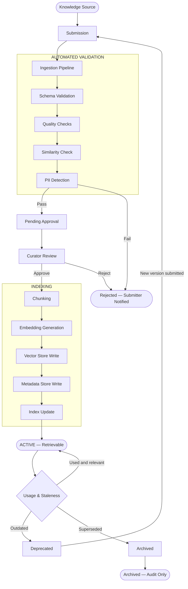
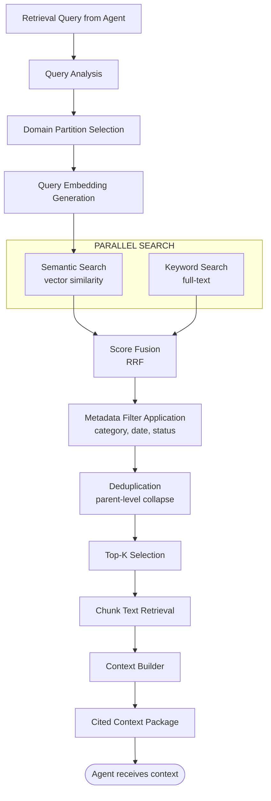

# KNOWLEDGE_ENGINE.md

> **Document Classification:** Knowledge Engine Architecture — Source of Truth  
> **Parent Documents:** ARCHITECTURE_VISION.md · SYSTEM_ARCHITECTURE.md · BACKEND_MODULE_ARCHITECTURE.md · AI_AGENT_ARCHITECTURE.md · WORKFLOW_ENGINE.md  
> **Status:** Approved — Foundation Release  
> **Version:** 1.0.0  
> **Scope:** Enterprise knowledge base — ingestion, validation, storage, retrieval, context assembly, citation, and governance  
> **Embedding Provider:** OpenAI Embeddings API (current implementation). Architecture is provider-independent.

---

## Table of Contents

1. [Knowledge Philosophy](#1-knowledge-philosophy)
2. [Responsibilities](#2-responsibilities)
3. [Knowledge Sources](#3-knowledge-sources)
4. [Knowledge Categories](#4-knowledge-categories)
5. [Knowledge Repository](#5-knowledge-repository)
6. [Knowledge Lifecycle](#6-knowledge-lifecycle)
7. [Document Ingestion](#7-document-ingestion)
8. [Knowledge Validation](#8-knowledge-validation)
9. [Human Approval Gate](#9-human-approval-gate)
10. [Knowledge Versioning](#10-knowledge-versioning)
11. [Metadata Schema](#11-metadata-schema)
12. [Chunking Strategy](#12-chunking-strategy)
13. [Embedding Strategy](#13-embedding-strategy)
14. [Semantic Search](#14-semantic-search)
15. [Hybrid Search](#15-hybrid-search)
16. [Retrieval Strategy](#16-retrieval-strategy)
17. [Context Builder](#17-context-builder)
18. [Context Ranking](#18-context-ranking)
19. [Citation Strategy](#19-citation-strategy)
20. [Confidence Score](#20-confidence-score)
21. [Knowledge Governance](#21-knowledge-governance)
22. [Knowledge Security](#22-knowledge-security)
23. [Performance Guidelines](#23-performance-guidelines)
24. [Document Status and Metadata](#24-document-status-and-metadata)

---

## 1. Knowledge Philosophy

### 1.1 Purpose of the Knowledge Engine

The Knowledge Engine is the organizational memory of ArchitectIQ. Every AI recommendation the platform produces is only as defensible as the knowledge that grounds it. An agent reasoning from its training data alone — without access to the organization's own approved patterns, prior technology decisions, regulatory frameworks, and engagement outcomes — produces generic outputs that cannot be attributed to organizational standards and cannot be improved by organizational experience.

The Knowledge Engine converts the organization's accumulated architectural expertise into a structured, searchable, citable knowledge store that every agent in the pipeline can query, and that grows in value with every approved engagement.

### 1.2 Core Knowledge Principles

| Principle | Description |
|-----------|-------------|
| **Every recommendation must be citable** | An agent output that references the knowledge base must carry a citation to the specific entry that grounded it. An uncited output does not benefit from the knowledge engine — it is pure model inference. |
| **Human approval gates knowledge publication** | No knowledge entry becomes retrievable without explicit approval by a designated Knowledge Curator. Automated ingestion prepares entries; humans authorize them. |
| **Knowledge compounds with every engagement** | Every approved architecture engagement is a candidate knowledge entry. Over time, the knowledge base becomes the organization's living architectural memory. |
| **Knowledge is versioned, not overwritten** | When a knowledge entry becomes outdated, it is deprecated — not deleted. The full history of organizational knowledge decisions is preserved. |
| **Retrieval quality determines recommendation quality** | The knowledge engine's primary performance metric is retrieval relevance — whether the entries it returns are genuinely useful for the query at hand. |

---

## 2. Responsibilities

The Knowledge Engine owns exclusively:

- Accepting knowledge entry submissions from contributors and the automated ingestion pipeline
- Executing automated quality validation on submitted entries
- Managing the human approval gate for all knowledge entries
- Generating and storing vector embeddings for approved entries
- Maintaining the searchable index (semantic and keyword-based)
- Executing retrieval queries from the Knowledge Retrieval Agent
- Assembling and returning cited context packages
- Tracking retrieval usage metrics per entry
- Managing knowledge entry lifecycle (active, deprecated, archived)
- Enforcing access control on knowledge retrieval

The Knowledge Engine does not own:

- Agent logic (how agents use retrieved knowledge is the agent's responsibility)
- Prompt assembly (the agent assembles prompts from retrieved context)
- Engagement state management (owned by the Engagement Manager)
- Output generation (owned by the Output Layer)

---

## 3. Knowledge Sources

Knowledge enters the Knowledge Engine from four sources:

### 3.1 Approved Engagement Outcomes

Every engagement that completes with an architect-approved architecture is a candidate knowledge entry. The approved architecture state — structured requirements, candidate designs, technology selections, validation findings, and the architect's decisions — is processed by the ingestion pipeline and submitted for curator review. This is the primary mechanism by which the knowledge base grows organically.

### 3.2 Manually Submitted Entries

Architects and knowledge managers may submit entries directly: reference architectures they have developed, technology evaluations they have conducted, lessons learned from production deployments, or regulatory framework guidance they have assembled. These entries follow the same ingestion and approval pipeline as automated entries.

### 3.3 Curated Enterprise Standards

Platform administrators may ingest pre-approved organizational standards: enterprise architecture guardrails, approved technology catalogs, security baselines, and compliance control frameworks. These entries are imported in bulk through an administrative ingestion process and receive expedited curator review because they originate from organizational governance functions.

### 3.4 External Reference Material

Reference architectures from cloud providers, industry bodies (TOGAF, DAMA, etc.), and technology vendors may be ingested as external reference entries. External entries are clearly classified as non-organizational — they inform recommendations but carry lower retrieval weight than internal approved precedents.

---

## 4. Knowledge Categories

Every knowledge entry is classified into exactly one category. The category governs its retrieval weight, its validation requirements, and its metadata schema.

| Category | Description | Retrieval Weight | Example |
|----------|-------------|-----------------|---------|
| **Architecture Pattern** | Reusable design patterns applicable to specific problem types | High | Medallion Data Architecture for Data Lake |
| **Approved Precedent** | A prior approved architecture from an organizational engagement | Highest | "Oracle to Snowflake migration for ACME Corp — approved 2024-Q3" |
| **Technology Evaluation** | Scored assessment of a specific technology against evaluation criteria | High | Databricks vs. Synapse — evaluation 2024 |
| **Regulatory Framework** | Compliance control sets for a specific regulatory standard | Highest for compliance queries | GDPR Article 9 controls for data architecture |
| **Security Standard** | Organizational security baseline and control catalog | Highest for security queries | Enterprise Encryption Standard v3 |
| **Technology Catalog** | List of approved, prohibited, and provisionally approved technologies | Medium | Approved Streaming Technologies Catalog Q1 2025 |
| **Lessons Learned** | Post-deployment retrospective findings | Medium | Data platform migration lessons — Phase 2 |
| **External Reference** | Non-organizational reference material | Low | AWS Well-Architected Framework — Data Analytics Lens |

---

## 5. Knowledge Repository

### 5.1 Storage Architecture

The Knowledge Repository uses PostgreSQL as its underlying storage system. Vector embeddings are stored using the `pgvector` extension, which enables cosine similarity search directly within PostgreSQL. This eliminates the need for a separate vector database while providing production-grade vector search capability at the data volumes relevant to an enterprise knowledge base.

The repository has two logical stores within PostgreSQL:

**Structured Metadata Store:** All knowledge entry metadata — category, domain, tags, approval status, version, usage metrics, timestamps — stored in relational tables. Enables filtered search, sorting, and aggregation.

**Vector Embedding Store:** OpenAI-generated embeddings for all approved knowledge chunks stored in a `pgvector`-typed column. Enables semantic similarity search via cosine distance queries. Index: `ivfflat` or `hnsw` index type on the embedding column for scalable approximate nearest-neighbor search.

### 5.2 Knowledge Base Partitioning

The knowledge base is logically partitioned by domain and knowledge category. A retrieval query for a financial services engagement searches:
- The financial services domain partition
- The generic (domain-neutral) partition

It does not search the healthcare or retail partitions. Partitioning bounds the effective search space, maintaining retrieval latency as the total knowledge base grows.

---

## 6. Knowledge Lifecycle



---

## 7. Document Ingestion

### 7.1 Ingestion Pipeline Stages

The ingestion pipeline transforms raw knowledge submissions into structured, indexed knowledge entries ready for retrieval.

**Stage 1 — Intake:** Accept the raw submission (free text, document file, structured JSON from the engagement outcome). Extract text content from document formats. Record the submitter identity, submission timestamp, and source type (automated from engagement / manual submission / bulk import).

**Stage 2 — Normalization:** Normalize text encoding, remove formatting artifacts, standardize whitespace. Extract and validate declared metadata (category, domain, tags) against the permitted taxonomy. Generate a submission hash for duplicate detection.

**Stage 3 — Schema Validation:** Validate that all required metadata fields are present and conform to their permitted value sets. Reject submissions with invalid category, missing domain, or prohibited content.

**Stage 4 — Quality Checks:** Assess content quality on four signals: minimum content length (entries below the configured minimum are rejected as insufficiently informative), readability score (entries that are incoherent or machine-garbled are flagged), structural completeness (entries that lack required sections for their category type are flagged), and citation quality (entries claiming to reference a standard or precedent must identify the reference).

**Stage 5 — Similarity Check:** Compute a preliminary embedding of the submission (before full processing) and query the existing knowledge base for near-duplicate entries. Entries with cosine similarity above the configured deduplication threshold are flagged for the curator: "Similar entry already exists — review before approving."

**Stage 6 — PII Detection:** Scan the submission content for PII patterns (names, email addresses, phone numbers, financial identifiers). Knowledge base entries must not contain PII. Entries with detected PII are rejected; the submitter is notified to re-submit with PII removed.

**Stage 7 — Pending Approval:** Validated entries are placed in the pending-approval queue and presented to a designated Knowledge Curator for review.

### 7.2 Ingestion from Approved Engagements

When an engagement reaches `WORKFLOW_COMPLETE` state (as defined in WORKFLOW_ENGINE.md Section 3.1), the Background Job Manager triggers the knowledge ingestion pipeline with the approved architecture state as input. The ingestion pipeline:

- Extracts the structured requirement set, approved architecture description, technology selections, and key decisions as separate knowledge chunks
- Classifies the engagement outcome as an **Approved Precedent** category entry
- Redacts or anonymizes client-identifying information before submission (engagement ID is retained; client names are removed)
- Submits for curator review with a summary of the architectural decisions captured

---

## 8. Knowledge Validation

### 8.1 Automated Validation Criteria

All automated validation checks are deterministic — they produce pass or fail with an explanatory message. An entry must pass all automated checks before proceeding to curator review.

| Check | Pass Criteria | On Failure |
|-------|--------------|------------|
| Schema completeness | All required metadata fields present and valid | Rejection — submitter notified with field list |
| Content length | Content exceeds minimum character threshold per category | Rejection — submitter notified |
| Duplicate detection | Cosine similarity below deduplication threshold | Flagged for curator — not automatically rejected |
| PII scan | Zero PII pattern matches in content | Rejection — submitter must re-submit with PII removed |
| Category consistency | Content type matches declared category | Advisory flag for curator |
| Citation validity | Declared references resolve to existing knowledge entries | Advisory flag for curator |

### 8.2 Quality Scoring

Every entry that passes automated validation receives an automated quality score — a composite of: content length score, structural completeness score, citation presence score, and domain relevance score (how well the content aligns with its declared domain and category). This score is presented to the curator as a starting point — it does not replace human judgment.

---

## 9. Human Approval Gate

### 9.1 Approval Requirement

No knowledge entry is added to the retrievable index without an explicit curator approval event. This requirement cannot be bypassed by configuration. It applies to all entry sources: automated ingestion from completed engagements, manual submissions, and bulk imports.

### 9.2 Curator Responsibilities

A Knowledge Curator is a designated architect or knowledge manager authorized to approve knowledge entries. On receiving a pending entry, the curator:

- Reviews the entry content for accuracy, relevance, and organizational alignment
- Resolves any advisory flags from automated validation (duplicates, citation issues, category mismatches)
- Optionally enriches the metadata (adds tags, adjusts domain classification, links to related entries)
- Either approves (entry proceeds to indexing), requests revisions (entry returned to submitter with feedback), or rejects (entry permanently rejected with reason)

### 9.3 Approval Event Recording

Every curator decision is recorded in the Decision Ledger (as established in BACKEND_MODULE_ARCHITECTURE.md Section 4.13) with: curator identity, decision (approve/reject/request-revision), timestamp, and optional curator note. The Decision Ledger record for a knowledge entry approval is the authoritative proof that the entry was human-reviewed before it became retrievable.

---

## 10. Knowledge Versioning

### 10.1 Entry Versioning Model

Knowledge entries are versioned. A version is created when:
- A curator updates an approved entry's content (new version; prior version deprecated)
- A curator supersedes an entry with a newer, more comprehensive entry (original archived, superseder linked)
- An entry's regulatory framework or technology catalog is updated (new version with updated effective date)

### 10.2 Version States

| State | Description | Retrievable |
|-------|-------------|-------------|
| **Pending** | Awaiting curator approval | No |
| **Active** | Approved; current version | Yes |
| **Deprecated** | Superseded by a newer version; no longer current | No (except for explicit historical queries) |
| **Archived** | Retained for audit; content no longer relevant | No |
| **Rejected** | Failed validation or curator rejection | No |

### 10.3 Version Lineage

Every non-initial version carries a `supersedes_entry_id` reference to its predecessor. This chain enables full lineage traversal: given any current entry, the complete history of how the knowledge evolved is navigable. Retrieval always returns the highest-version Active entry for a given knowledge topic — not deprecated predecessors.

---

## 11. Metadata Schema

Every knowledge entry carries structured metadata in addition to its content. The metadata governs filtering, ranking, and citation.

| Metadata Field | Description |
|---------------|-------------|
| `entry_id` | UUID — unique identifier |
| `version` | Integer — version number within the entry lineage |
| `category` | Enum — one of the eight categories defined in Section 4 |
| `domain` | String — primary domain (generic, healthcare, financial-services, retail, etc.) |
| `secondary_domains` | List — additional applicable domains |
| `tags` | List — free-form tags for filtering |
| `source_type` | Enum — ENGAGEMENT_OUTCOME / MANUAL / BULK_IMPORT / EXTERNAL |
| `source_reference` | String — engagement ID (if from engagement) or external URL (if external) |
| `submitter_id` | UUID — identity of the submitter |
| `curator_id` | UUID — identity of the approving curator |
| `approved_at` | Timestamp — when the entry was approved |
| `effective_date` | Date — date from which this entry is considered current |
| `expiry_date` | Date — optional; entry auto-deprecated after this date |
| `status` | Enum — PENDING / ACTIVE / DEPRECATED / ARCHIVED / REJECTED |
| `supersedes_entry_id` | UUID — predecessor entry (if this is a revision) |
| `quality_score` | Float — automated quality score from ingestion validation |
| `retrieval_count` | Integer — how many times this entry has been retrieved |
| `approval_engagement_count` | Integer — how many approved architectures cited this entry |
| `last_retrieved_at` | Timestamp — last retrieval timestamp |
| `chunk_count` | Integer — number of chunks this entry was split into |

---

## 12. Chunking Strategy

### 12.1 Purpose

Long-form knowledge documents must be split into chunks for two reasons: embedding models have input token limits, and retrieving a complete 10,000-word document when only a 300-word section is relevant wastes context budget and dilutes precision.

### 12.2 Chunking Principles

**Semantic chunking over fixed-size chunking:** Chunks are split at semantic boundaries — section headings, paragraph breaks, list boundaries — rather than at a fixed character count. A chunk that cuts a sentence mid-way reduces the embedding quality of that chunk.

**Chunk size target:** Each chunk targets approximately 400–600 tokens — sufficient to carry a complete concept with context, small enough for precise semantic matching.

**Chunk overlap:** Adjacent chunks share a 50-token overlap at their boundaries. This prevents retrieval from missing a concept that spans a chunk boundary.

**Minimum chunk size:** Chunks below 100 tokens are merged with their adjacent chunk. A 30-word isolated bullet point is not a useful retrieval unit on its own.

**Metadata inheritance:** Every chunk inherits the parent entry's full metadata. A chunk's `entry_id` and `version` reference the parent entry. The chunk carries its own `chunk_id` and `chunk_position` (its ordinal position within the parent entry).

**Structure preservation:** For structured knowledge (technology evaluation matrices, compliance control checklists), chunks preserve the structure — a control list is chunked by control group, not by character count.

---

## 13. Embedding Strategy

### 13.1 Embedding Model

Current implementation uses the OpenAI Embeddings API (`text-embedding-3-large` or the current best-available model at deployment time). The embedding model produces a fixed-dimension dense vector for each chunk.

The embedding model is configured in `config/models/model-registry.yaml` and is independently versioned from the LLM used for agent inference. A model upgrade for embeddings requires re-embedding all existing knowledge entries — this is managed as a background migration job, not a service disruption.

### 13.2 What Is Embedded

Every approved knowledge chunk is embedded at indexing time. The embedded content is: the chunk text concatenated with a prefix that includes the entry category and domain. The category/domain prefix improves semantic alignment for domain-specific queries.

Example prefix format: `[Category: Architecture Pattern] [Domain: Healthcare]\n{chunk text}`

The query submitted by the Knowledge Retrieval Agent is also prefixed before embedding to match the prefix format of the stored chunks.

### 13.3 Embedding Storage

Embeddings are stored in the `knowledge_embeddings` table in PostgreSQL using the `pgvector` extension. Each row stores: `chunk_id`, `entry_id`, `embedding` (pgvector column), and `chunk_text` (for retrieval — to avoid a join).

The `pgvector` `hnsw` index type is used for approximate nearest-neighbor search, providing sub-100ms retrieval at the knowledge base sizes expected in V1.

### 13.4 Embedding Integrity

After an embedding is generated and stored, a checksum of the chunk text is stored alongside the embedding. A periodic integrity job verifies that the stored embedding was generated from the stored chunk text — detecting any corruption of the chunk text after embedding.

---

## 14. Semantic Search

Semantic search uses vector similarity to find knowledge chunks whose embedded meaning is closest to the embedded query, regardless of keyword overlap.

**Similarity metric:** Cosine similarity (equivalent to dot product of normalized vectors). A cosine similarity of 1.0 indicates identical semantic meaning; 0.0 indicates orthogonal concepts.

**Top-K retrieval:** Every retrieval query specifies a `top_k` parameter (default: 10, configurable per agent as defined in AI_AGENT_ARCHITECTURE.md Section 14.2). The vector index returns the `top_k` chunks with the highest cosine similarity to the query embedding.

**Similarity threshold:** Chunks with cosine similarity below the configured minimum threshold (default: 0.65) are excluded from results, even if they rank in the top-K. This threshold prevents low-relevance results from polluting the context.

**Domain filter pre-application:** Before executing the vector search, the relevant domain partition(s) are identified from the query's domain context. The vector search is executed only against entries in the relevant domain partitions. This is not post-filtering — it is pre-filtering via SQL `WHERE` clause on the metadata table, with the filtered `entry_id` set passed to the vector search.

---

## 15. Hybrid Search

Hybrid search combines semantic search (Section 14) with keyword-based search to improve retrieval for queries that combine conceptual meaning with specific technical terms (technology names, regulatory framework identifiers, standard names).

### 15.1 Why Hybrid Search

Semantic search excels at conceptual similarity. It may under-rank a chunk that contains the exact technology name "Apache Kafka" if the query uses "event streaming platform" — the concepts are aligned but the vocabulary differs in the embedding space.

Keyword search excels at exact term matching. "Kafka" in a query returns chunks containing "Kafka" — but may miss a highly relevant chunk about "event streaming" that does not mention Kafka by name.

Hybrid search combines both signals to capture both dimensions.

### 15.2 Keyword Search Implementation

The keyword component uses PostgreSQL's built-in full-text search (`tsvector`/`tsquery`) against the chunk text. A GIN index on the `tsvector` column provides efficient keyword retrieval.

### 15.3 Score Fusion

Semantic and keyword scores are fused using a weighted Reciprocal Rank Fusion (RRF) approach. Each result set is ranked; the fused score combines the reciprocal ranks from both systems with configurable weights:

```
hybrid_score = α × semantic_rank_score + (1 - α) × keyword_rank_score
```

The default weight `α` is 0.7 (semantic-heavy) for general architectural queries. For compliance framework queries where exact control identifiers matter, the weight is shifted to 0.5 (balanced).

The weight configuration is per-query-type in the retrieval configuration file.

---

## 16. Retrieval Strategy

The retrieval strategy defines the complete sequence of operations the Knowledge Engine executes in response to a query from the Knowledge Retrieval Agent.



### 16.1 Query Analysis

The Knowledge Retrieval Agent submits a structured query specifying: query text, domain, applicable categories, recency preference (prefer entries approved within N days), minimum relevance threshold override (if the agent needs higher precision), and maximum item count.

### 16.2 Category-Weighted Retrieval

Certain agent queries benefit from category-weighted retrieval: the Compliance Agent query weights Regulatory Framework entries highest; the Technology Recommendation Agent weights Technology Catalog and Technology Evaluation entries highest. Category weights are applied as post-search score multipliers before final ranking.

### 16.3 Recency Bias

For rapidly evolving knowledge areas (technology catalogs, regulatory updates), the retrieval strategy applies a recency bias: entries approved within the configured recent window receive a score boost. The boost decays linearly with time: an entry approved 1 month ago receives maximum boost; an entry approved 24 months ago receives no boost.

---

## 17. Context Builder

The Context Builder is the component that transforms a set of retrieved chunks into the structured context package that the agent injects into its prompt.

### 17.1 Assembly Responsibility

The Context Builder:
- Receives the top-K ranked chunks from the retrieval strategy
- Groups chunks from the same parent entry together (partial chunks from the same document are presented as a coherent unit, not as isolated snippets)
- Formats each entry's contribution as a labelled, numbered citation block
- Assembles all blocks into the final context package in relevance order (highest relevance first)
- Calculates the total token count of the context package and trims to the configured maximum context budget

### 17.2 Context Package Structure

The context package is a structured object containing:
- `context_items`: an ordered list of context blocks, each containing: the chunk text, the parent entry metadata (entry ID, category, domain, title, approved date), and the retrieval relevance score
- `citations`: a parallel list of citation objects (defined in AI_AGENT_ARCHITECTURE.md Section 10.3), one per context item
- `total_tokens_estimated`: the estimated token count of the assembled context
- `retrieval_metadata`: query used, item count, average relevance score, domain partitions searched

---

## 18. Context Ranking

Final context ranking applies the following signals in order of application:

| Signal | Weight | Description |
|--------|--------|-------------|
| Hybrid retrieval score | Primary | Combined semantic + keyword relevance |
| Category weight | Multiplier | Based on query type and entry category alignment |
| Recency bias | Additive boost | For time-sensitive categories |
| Approval engagement count | Additive boost | Entries cited in many approved architectures are proven |
| Curator quality score | Additive boost | Entries with high curator quality scores rank higher |

The final ranking determines the order of presentation to the agent. The agent receives the top-K items after ranking — not the original retrieval order.

---

## 19. Citation Strategy

Every knowledge item returned in the context package carries a citation that the agent is required to reference in its output. The citation strategy ensures that every agent recommendation can be traced back to a specific, curated, human-approved knowledge entry.

### 19.1 Citation Object Fields

As defined in AI_AGENT_ARCHITECTURE.md Section 10.3, every citation carries: `citation_id`, `knowledge_entry_id`, `knowledge_entry_type`, `relevance_score`, `cited_claim`, `source_title`, `source_excerpt`.

### 19.2 Citation Enforcement

The agent's output validation step (BaseAgent lifecycle, AI_AGENT_ARCHITECTURE.md Section 3.2) rejects outputs that do not carry citations for their recommendations. The Knowledge Engine's role in citation enforcement is: providing the metadata required to construct valid citation objects (title, excerpt, entry ID) as part of the context package.

### 19.3 Citation Display

Citations are displayed in the workspace Review tab via the `artifacts` module (FRONTEND_MODULE_ARCHITECTURE.md Section 4.5). The architect can expand any citation to view the source knowledge entry's title, category, approval date, and the specific passage that was cited. This enables the architect to evaluate the quality of the knowledge grounding before approving the proposal.

---

## 20. Confidence Score

The Knowledge Engine contributes to agent confidence scores through the retrieval relevance signals it provides. As defined in AI_AGENT_ARCHITECTURE.md Section 17.1:

**Retrieval Relevance Signal:** The average cosine similarity of the top-K returned items contributes to the agent's confidence calculation. High-relevance retrieval (average similarity ≥ 0.85) produces a high retrieval signal. Low-relevance retrieval (average similarity < 0.70) produces a low retrieval signal, indicating that the knowledge base does not have strong coverage for the query domain.

**Coverage Assessment:** The Knowledge Engine also provides a coverage assessment in the retrieval metadata: which of the major requirement categories submitted in the query are well-covered by retrieved entries, and which have weak or absent coverage. This coverage assessment is used by the Knowledge Retrieval Agent to construct its own output — flagging knowledge gaps explicitly for the agent's downstream consumers.

---

## 21. Knowledge Governance

### 21.1 Curator Role and Authorization

Knowledge Curators are designated users with the `KNOWLEDGE_CURATOR` role. Role assignment is managed through the user management capability. Not all architects are curators — curation requires additional authorization.

Curators may:
- Approve pending knowledge entries
- Reject pending entries with a stated reason
- Request revisions from the submitter
- Deprecate active entries when they become outdated
- Edit metadata on approved entries (category, tags, domain) without creating a new version
- Bulk-import curated entry sets (for standards and catalog imports)

Curators may not:
- Edit the content of an approved entry without creating a new version
- Delete entries from the ledger (only deprecate)
- Bypass the automated validation checks

### 21.2 Quality Maintenance Cycle

The knowledge governance process includes a scheduled quality maintenance cycle:
- **Staleness detection:** Entries not retrieved in 180 days are flagged for curator review (may be outdated or may reflect a gap in the knowledge base)
- **Low-performance detection:** Entries with high retrieval count but low approval engagement rate (retrieved frequently but rarely cited in approved architectures) are flagged for curator review
- **Broken citation detection:** Entries that cite other entries that have been deprecated are flagged for curator review

Flags surface in the curator dashboard — they do not automatically deprecate entries.

---

## 22. Knowledge Security

### 22.1 Access Control

Knowledge retrieval is available only to authenticated agents executing within an authorized engagement. The Knowledge Engine validates that the requesting service identity (the Knowledge Retrieval Agent's service credential) is authorized before executing a retrieval query.

Human access to the knowledge base (browsing, submitting, approving entries) requires the `ARCHITECT` or `KNOWLEDGE_CURATOR` role and is mediated through the API Gateway with the full authentication and authorization stack defined in BACKEND_MODULE_ARCHITECTURE.md Section 17.

### 22.2 Data Classification

Knowledge entries are classified by their content sensitivity:

| Classification | Examples | Access |
|---------------|---------|--------|
| **Internal** | Generic architecture patterns, external references | All authenticated architects |
| **Restricted** | Approved precedents from specific client engagements | Architects on the relevant engagement, curators |
| **Confidential** | Proprietary organizational standards | Architects with explicit access grant |

Retrieval queries respect classification boundaries — an agent cannot retrieve a Confidential entry unless the engagement's architect has the required access grant.

### 22.3 Content Sanitization

Before a knowledge entry is indexed, its content is sanitized: PII detection (enforced at ingestion), proprietary client identifier removal (for engagement-sourced entries), and prohibited content pattern checks. Sanitized content only is stored in the retrievable index.

---

## 23. Performance Guidelines

| Guideline | Target | Rationale |
|-----------|--------|-----------|
| Embedding generation latency | < 500ms per chunk via OpenAI API | Ingestion can tolerate batch embedding; individual chunk embedding latency is not on the critical path |
| Retrieval query latency (p95) | < 2 seconds | Established in SYSTEM_ARCHITECTURE.md Section 15.1 |
| Retrieval cache hit | > 40% for repeated queries | Repeated architectural problem types produce similar queries; caching reduces OpenAI API calls |
| Maximum context package size | Configurable per agent (token budget) | Larger context improves recall at the cost of LLM input token cost |
| Knowledge base index rebuild | < 10 minutes for full re-index | Re-indexing triggered by embedding model upgrade; must not block retrieval |
| Parallel retrieval support | 50 concurrent retrieval queries | Validation Phase runs multiple agents simultaneously; each issues a retrieval query |
| Retrieval cache TTL | 4 hours | Invalidated by knowledge base updates; balances freshness with API cost |

---

## 24. Document Status and Metadata

### Document Status

| Field | Value |
|-------|-------|
| Status | Approved — Foundation Release |
| Version | 1.0.0 |
| Classification | Knowledge Engine Architecture — Source of Truth |

### Dependencies

- `SYSTEM_ARCHITECTURE.md` — Knowledge Layer runtime position and Knowledge Service definition
- `BACKEND_MODULE_ARCHITECTURE.md` — KnowledgeRepository, RAGEngine, IngestionPipeline, EmbeddingService, CuratorGateway module definitions
- `AI_AGENT_ARCHITECTURE.md` — Citation object schema, agent confidence scoring model, retrieval query specification
- `WORKFLOW_ENGINE.md` — Stage 4 (Knowledge Retrieval) specification, background enrichment trigger

### Related Documents

- `DATABASE_ARCHITECTURE.md` — PostgreSQL table definitions for knowledge_entries and knowledge_embeddings
- `API_ARCHITECTURE.md` — Knowledge endpoint definitions (curator workflow APIs)

### Future Extension

1. **Dedicated vector database:** As the knowledge base grows to hundreds of thousands of entries, a dedicated vector database (Weaviate, Qdrant, or similar) may be introduced alongside PostgreSQL to offload vector operations. The `VectorStoreProvider` interface (BACKEND_MODULE_ARCHITECTURE.md Section 7.4) is designed for this migration — no Knowledge Engine logic changes are required.

2. **Graph-based knowledge relationships:** Future versions may introduce explicit relationships between knowledge entries (pattern A is an alternative to pattern B; regulation X requires control Y). A graph store (Neo4j or equivalent) could represent these relationships for graph-augmented retrieval.

3. **Multi-organization federation:** Enterprise deployments serving multiple organizations may require federated knowledge bases — each organization's curated knowledge is private, but a shared cross-organizational pattern library is accessible to all. The domain partition model supports this extension.

4. **Automated knowledge quality improvement:** Future versions may use architect feedback signals (which retrieved entries were cited in approved architectures vs. overridden) to automatically adjust retrieval weights, reducing the need for manual curator quality maintenance.

---

**End of KNOWLEDGE_ENGINE.md**  
Version 1.0.0 — Foundation Release
