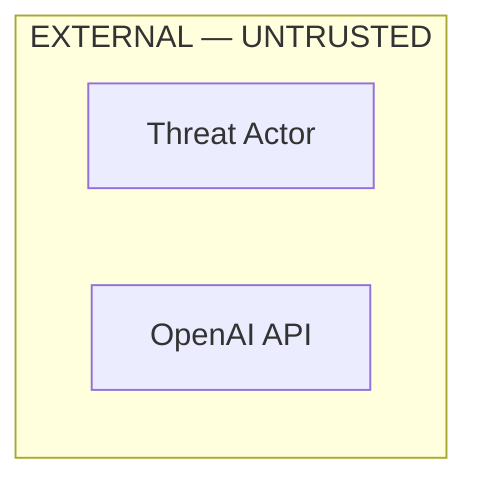
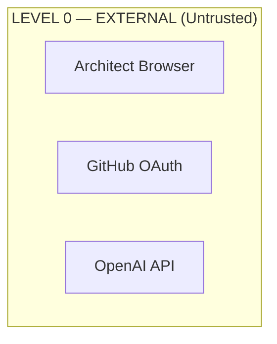

SECURITY_ARCHITECTURE.md
Document Classification: Security Architecture — Source of Truth Parent Documents: ARCHITECTURE_VISION.md · SYSTEM_ARCHITECTURE.md · BACKEND_MODULE_ARCHITECTURE.md · API_ARCHITECTURE.md · DATABASE_ARCHITECTURE.md · KNOWLEDGE_ENGINE.md · AI_AGENT_ARCHITECTURE.md Status: Approved — Foundation Release Version: 1.0.0 Scope: The complete security model of ArchitectIQ — philosophy, zero trust, authentication, authorization, prompt and AI security, encryption, audit, threat model, monitoring, and incident handling LLM Provider Assumption: OpenAI (current implementation). Architecture is provider-independent.

# Table of Contents
Security Philosophy
Zero Trust Principles
Authentication
Authorization
RBAC
Session Security
API Security
Prompt Security
AI Guardrails
Data Encryption
Secret Management
Secure Configuration
Audit Logging
Decision Audit
Input Validation
Output Validation
OWASP Considerations
Compliance Readiness
Threat Model
Risk Mitigation
Security Monitoring
Incident Handling
Security Architecture Diagram
Document Status and Metadata
1. Security Philosophy
## 1.1 Security Is Structure, Not Policy
ArchitectIQ's security model embodies the constitutional principle: security is embedded in the architecture, not applied as a control layer (ARCHITECTURE_VISION.md Section 14). A component that would be insecure without a policy is a component with a design defect. Every security property described here is enforced structurally — in code, interfaces, and the state machine — not by operational discipline alone.

## 1.2 Consolidation, Not Duplication
The security foundations already established across the source-of-truth documents are authoritative and not restated here in mechanism. This document consolidates the complete security model, references the established enforcement points, and defines the security concerns not yet fully specified elsewhere (threat model, monitoring, incident handling). Established references:

Security Concern	Authoritative Source
Trust hierarchy	BACKEND_MODULE_ARCHITECTURE.md Section 17.5; SYSTEM_ARCHITECTURE.md Section 3.3
Authentication/authorization boundaries	BACKEND_MODULE_ARCHITECTURE.md Section 17; SYSTEM_ARCHITECTURE.md Section 14
API security controls	API_ARCHITECTURE.md Section 16
Prompt content checks	BACKEND_MODULE_ARCHITECTURE.md Section 17.4; SYSTEM_ARCHITECTURE.md Section 14.5
Database security	DATABASE_ARCHITECTURE.md Section 12
Decision Ledger integrity	SYSTEM_ARCHITECTURE.md Section 14.6; DATABASE_ARCHITECTURE.md Section 5.5
## 1.3 Core Security Principles
Principle	Description
Least privilege everywhere	Every component accesses exactly the data and operations its function requires (ARCHITECTURE_VISION.md Section 14).
Data minimization in AI context	Sensitive data never enters the model context unnecessarily (NR-08).
Structural human authority	No AI component can approve, publish, or bypass the human gate (NR-01, NR-02, SFR-01).
Immutable accountability	Every decision is signed, attributed, and tamper-evident (SFR-04, SFR-05).
Single enforcement points	Authentication at the gateway, secrets at the SecretsService, LLM egress at the single OpenAI boundary — no scattered enforcement.
## 1.4 Version 1 LLM Security Scope
Version 1 uses the OpenAI API as the sole LLM provider. There is no multi-provider LLM Gateway in Version 1; the prompt security enforcement point is the single OpenAI egress boundary. All prompt security controls described here apply at this single boundary. Multi-provider egress security is a Future Extension concern.

2. Zero Trust Principles
## 2.1 Zero Trust Posture
ArchitectIQ applies zero trust: no request, actor, or component is trusted by default — trust is established per-request through verification. This operationalizes the trust hierarchy (BACKEND_MODULE_ARCHITECTURE.md Section 17.5) as a runtime discipline.

## 2.2 Zero Trust Tenets Applied
Tenet	Application
Never trust, always verify	Every request re-validates identity and authorization at the gateway (SFR-08)
Assume breach	Data isolation, encryption, and audit assume a compromised boundary
Least-privilege access	Role and resource-ownership checks on every operation (API_ARCHITECTURE.md Section 13)
Explicit verification	mTLS for service-to-service (SYSTEM_ARCHITECTURE.md Section 14.1)
Micro-segmentation	Layer boundaries enforced by dependency rules (REPOSITORY_MASTER_STRUCTURE.md Section 8)
LLM as untrusted	The LLM provider is at the same trust level as an external actor (BACKEND_MODULE_ARCHITECTURE.md Section 17.5, Level 5)
## 2.3 Trust Never Persists Across Boundaries
A component's trust is scoped to its immediate operation. The API layer does not trust the frontend's claims; the Application Core does not trust the API layer beyond validated identity context; agents do not trust LLM output without validation. Each boundary re-verifies.

3. Authentication
## 3.1 Authentication Model
Authentication uses GitHub OAuth 2.0 / OIDC as the identity provider, with platform-internal signed session tokens (JWT). The complete flow is defined in API_ARCHITECTURE.md Section 12 and SYSTEM_ARCHITECTURE.md Section 14.1 and owned by the auth module (BACKEND_MODULE_ARCHITECTURE.md Section 4.1). This section defines the security guarantees of that model.

## 3.2 Authentication Guarantees
Guarantee	Enforcement
No unauthenticated request reaches a backend service	API Gateway auth middleware (SFR-08)
No custom authentication implementation	Standard OAuth 2.0 / OIDC only (ARCHITECTURE_VISION.md Section 21.1)
Platform tokens are signed and validated on every request	JWT signature + expiry + issuer verification
Service-to-service authentication uses mTLS	Service identity certificates, not user tokens
Token theft is mitigated	HttpOnly, Secure, SameSite=Strict cookies (API_ARCHITECTURE.md Section 12.1)
## 3.3 Authentication Boundaries
Two authentication boundaries exist (BACKEND_MODULE_ARCHITECTURE.md Section 17.1): the API Gateway boundary (user authentication) and the service-to-service boundary (mTLS). No backend service accepts a request that has not crossed the appropriate boundary.

4. Authorization
## 4.1 Two-Level Authorization
Authorization is evaluated at two independent levels (BACKEND_MODULE_ARCHITECTURE.md Section 17.2; API_ARCHITECTURE.md Section 13):

Capability authorization — role-based, enforced at the API Gateway: does this role have the right to invoke this action?
Resource ownership authorization — enforced at the service layer: does this identity own this specific resource?
## 4.2 Ownership Enforcement as a Structural Property
Resource ownership is not an optional check — it is embedded in the repository query interface. The authenticated user ID is a mandatory filter parameter on all user-owned resource queries (SFR-09; DATABASE_ARCHITECTURE.md Section 12.2 via app_user role constraints). A query that omits the ownership filter cannot be constructed through the defined interface.

## 4.3 Existence Disclosure Prevention
Unauthorized access to another user's resource returns 404, not 403 (API_ARCHITECTURE.md Section 13.3), preventing enumeration-based discovery of other users' engagements.

5. RBAC
## 5.1 Role Model
The platform defines three roles (DATABASE_ARCHITECTURE.md Section 5.1 users.roles; API_ARCHITECTURE.md Section 13.2):

Role	Purpose
ARCHITECT	Base role: create and manage own sessions, engagements, and outputs; submit knowledge entries
KNOWLEDGE_CURATOR	Additionally: approve, reject, and deprecate knowledge entries (KNOWLEDGE_ENGINE.md Section 21.1)
ADMIN	Additionally: manage users/roles, feature flags, and view global audit
## 5.2 Role Governance
Role assignments are auditable — every role change is recorded in user_roles (DATABASE_ARCHITECTURE.md Section 5.1) with grantor identity and reason.
Roles are additive in capability; a higher role does not remove lower-role capabilities.
Curation authority is deliberately separated from architect authority — not all architects are curators (KNOWLEDGE_ENGINE.md Section 21.1), enforcing separation of duties for knowledge publication.
## 5.3 Capability Matrix Authority
The definitive role-to-capability matrix is maintained in API_ARCHITECTURE.md Section 13.2. This document does not duplicate it; it affirms that the matrix is the single authorization contract.

6. Session Security
## 6.1 Session Security Properties
Property	Enforcement
Session tokens are non-exfiltratable via XSS	HttpOnly cookies (API_ARCHITECTURE.md Section 12.1)
Sessions expire on inactivity	Configurable expiry; token TTL default 8 hours (API_ARCHITECTURE.md Section 12.2)
Session data is user-isolated	Session records partitioned by identity (SFR-09)
Session restoration re-authenticates	Token validated on restore; session context is server-authoritative (FRONTEND_MODULE_ARCHITECTURE.md Section 7.3)
Sensitive session content is protected at rest	Column-level encryption for workspace state (DATABASE_ARCHITECTURE.md Section 12.3)
## 6.2 Session–Engagement Isolation
A session belongs to exactly one identity, and engagements are scoped to their parent session and owner (DATABASE_ARCHITECTURE.md Section 5.2–5.3). Cross-session data leakage is structurally prevented by the mandatory ownership filter (SFR-09).

7. API Security
The complete API security control set — HTTPS enforcement, CORS, request size limits, security headers, and boundary input sanitization — is defined authoritatively in API_ARCHITECTURE.md Section 16. This document affirms those controls as the API security contract and adds the following security posture statements:

All external traffic is HTTPS with TLS 1.2 minimum, TLS 1.3 preferred (ARCHITECTURE_VISION.md Section 21.1).
CORS is restricted to registered origins; wildcard CORS is never used in production.
Rate limiting (API_ARCHITECTURE.md Section 14) is a denial-of-service mitigation control, applied per identity.
Security response headers enforce browser-level protections (X-Frame-Options, HSTS, CSP, nosniff).
8. Prompt Security
## 8.1 The Single Egress Enforcement Point
In Version 1, all prompts destined for the OpenAI API pass through a single sanitization enforcement point before transmission. The three mandatory content checks are defined in BACKEND_MODULE_ARCHITECTURE.md Section 17.4 and SYSTEM_ARCHITECTURE.md Section 14.5, and enforced as an agent lifecycle step (AI_AGENT_ARCHITECTURE.md Section 3.1 SANITIZING; BFR-10).

## 8.2 Mandatory Prompt Checks
Check	Concern	On Detection
PII detection	Email, phone, SSN, financial identifiers	Block invocation; security event logged
Secret detection	API key, connection string, credential patterns	Block invocation; critical alert
Injection detection	System-prompt override / extraction attempts	Sanitize or reject by severity
## 8.3 Prompt Security Invariants
No prompt containing PII, credentials, or client secrets is ever transmitted (SFR-03). A failing prompt is blocked and logged — never sanitized-and-sent for secrets.
Prompt checks are not bypassable by agent configuration (BFR-10).
Data minimization: agents receive only the context fields their contract declares (AI_AGENT_ARCHITECTURE.md Section 24.3), minimizing the sensitive surface reaching any prompt.
## 8.4 Retrieved Content Trust
Retrieved knowledge is treated as untrusted content, injected into clearly delimited context blocks with system-prompt instructions to treat it as reference, not instruction (AI_AGENT_ARCHITECTURE.md Section 24.2). Instruction-like content in knowledge entries is rejected at ingestion (KNOWLEDGE_ENGINE.md Section 7.1 Stage 6).

9. AI Guardrails
## 9.1 Guardrail Categories
AI guardrails prevent the AI layer from producing harmful, ungrounded, or unauthorized outcomes. They operate at three points:

Guardrail	Enforcement Point	Purpose
Grounding guardrail	Agent output validation (citation enforcement)	No uncited recommendation propagates (NR-03; AI_AGENT_ARCHITECTURE.md Section 3.2)
Schema guardrail	Agent output parsing/validation	No malformed output reaches downstream (AI_AGENT_ARCHITECTURE.md Section 18)
Authority guardrail	State machine	No AI component reaches an approval state (NR-02; SFR-01)
Governance guardrail	Governance Agent hard gate	No policy-violating design reaches human review unremediated (WORKFLOW_ENGINE.md Section 10.1)
Isolation guardrail	LLM egress boundary	LLM cannot call back, access storage, or take action (SFR-06)
## 9.2 The Untrusted-Output Principle
LLM output is parsed and validated by the agent framework before use — it is never trusted as-is and never executed without an intervening validation step (BACKEND_MODULE_ARCHITECTURE.md Section 17.5). Output that contains instructions rather than structured data fails schema validation (AI_AGENT_ARCHITECTURE.md Section 24.1).

## 9.3 No Autonomous Action
Version 1 agents have no autonomous tool-calling beyond the defined, read-only reference tools (AI_AGENT_ARCHITECTURE.md Section 14). Agents cannot write to storage, cannot invoke external systems, and cannot chain autonomous multi-step actions. Extended autonomy is a Future Extension governed by an Agent Autonomy Policy (AI_AGENT_ARCHITECTURE.md Section 27, Future Notes).

10. Data Encryption
## 10.1 Encryption Standards
State	Standard	Reference
In transit (external)	TLS 1.2 minimum, TLS 1.3 preferred	ARCHITECTURE_VISION.md Section 21.1
In transit (internal)	mTLS between services	SYSTEM_ARCHITECTURE.md Section 14.1
At rest (storage)	AES-256 or equivalent; disk/filesystem encryption	ARCHITECTURE_VISION.md Section 21.1; DATABASE_ARCHITECTURE.md Section 12.3
At rest (sensitive columns)	Column-level encryption (pgcrypto) with Secrets-Manager-held keys	DATABASE_ARCHITECTURE.md Section 12.3
Backups	Encrypted before storage with KMS-managed keys	DATABASE_ARCHITECTURE.md Section 10.3
## 10.2 Encryption Principles
Encryption keys are never co-located with encrypted data.
Backup decryption requires the same key management access as production, preventing backup exfiltration as a security bypass (DATABASE_ARCHITECTURE.md Section 10.3).
Generated output files are stored with the same at-rest protections as their source data (see OUTPUT_GENERATION_ARCHITECTURE.md Output Security).
11. Secret Management
## 11.1 Secret Governance
No secret is stored in code, source-controlled configuration, or environment-variable definitions in the repository (NR-04, BFR-05, FR-06). All secrets are retrieved at runtime through the SecretsService / SecretsProvider (BACKEND_MODULE_ARCHITECTURE.md Section 4.14 concept, Section 7.5).

## 11.2 Runtime Secret Handling
Runtime secret handling follows the established discipline (BACKEND_MODULE_ARCHITECTURE.md Section 17.3; SYSTEM_ARCHITECTURE.md Section 14.4):

Secrets retrieved at service startup via service identity certificate.
Held in memory only for immediate use; not stored as broadly accessible attributes.
Never logged, never in exception messages, never in stack traces (BACKEND_MODULE_ARCHITECTURE.md Section 15.4).
Rotation-aware: rotation triggers a refresh without service restart.
## 11.3 Version 1 Secret Scope
Version 1 secrets include the OpenAI API key, database credentials, the platform token signing key, and OAuth client secrets. The OpenAI API key is retrieved exclusively through the SecretsService and used only at the single LLM egress boundary.

12. Secure Configuration
## 12.1 Configuration Security Principles
Configuration security derives from the configuration architecture (BACKEND_MODULE_ARCHITECTURE.md Section 16; REPOSITORY_MASTER_STRUCTURE.md Section 9):

Configuration contains no secrets — only references resolved at runtime by the SecretsService.
Environment-specific values are layered (base → environment → environment variables → secrets), never hardcoded.
Configuration is validated on startup; invalid or missing required configuration terminates startup (a configuration defect, not a runtime error).
Feature flags control capability availability without code deployment (BACKEND_MODULE_ARCHITECTURE.md Section 16.4).
## 12.2 Secure Defaults
The platform ships secure-by-default: authentication required, HTTPS enforced, minimal CORS, least-privilege database roles (DATABASE_ARCHITECTURE.md Section 12.2), and prompt security checks non-bypassable.

13. Audit Logging
## 13.1 Two-Stream Audit Model
The platform maintains two distinct audit streams (BACKEND_MODULE_ARCHITECTURE.md Section 15.3):

Stream	Purpose	Tamper-Evidence
Operational log stream	Real-time monitoring and troubleshooting	Standard structured logs
Decision Ledger	Immutable record of significant decisions	Hash-chained, tamper-evident
## 13.2 Structured Logging Discipline
Every log entry is structured with mandatory fields including correlation ID, engagement/session/user context, and event type (BACKEND_MODULE_ARCHITECTURE.md Section 15.1; SYSTEM_ARCHITECTURE.md Section 15.1). Correlation IDs enable complete request reconstruction.

## 13.3 Sensitive Data Exclusion from Logs
The following are never logged at any level (BACKEND_MODULE_ARCHITECTURE.md Section 15.4; AI_AGENT_ARCHITECTURE.md Section 22.2; API_ARCHITECTURE.md Section 15.3): secrets/tokens, full prompt content, full LLM responses, PII from requirement inputs, and proprietary client content. Where debugging requires such content, a content hash is logged instead.

14. Decision Audit
## 14.1 The Decision Ledger as Security Control
The Decision Ledger is a first-class security control, not a logging afterthought (ARCHITECTURE_VISION.md Section 9). Its integrity is a platform guarantee (Immutability Guarantee, SYSTEM_ARCHITECTURE.md Section 1.3).

## 14.2 Ledger Security Properties
Property	Enforcement
Append-only	No UPDATE/DELETE operation exists on the ledger (SFR-04, BFR-07); database-level triggers block modification (DATABASE_ARCHITECTURE.md Section 5.5)
Tamper-evident	Hash chain: each entry hashes the prior entry's chain hash (SYSTEM_ARCHITECTURE.md Section 14.6)
Attributed	Every human decision is signed with authenticated identity and timestamp (SFR-05)
Serialized	Concurrent appends are fully ordered via Serializable isolation (DATABASE_ARCHITECTURE.md Section 9.2)
Verified	Integrity verified on read and on scheduled full-chain verification (SYSTEM_ARCHITECTURE.md Section 14.6)
## 14.3 Recovery Integrity
After any recovery event, ledger chain integrity is verified before new writes are permitted (DATABASE_ARCHITECTURE.md Section 11.3). A chain break is a critical incident requiring manual investigation.

15. Input Validation
## 15.1 Layered Input Validation
Input is validated at successive layers, each with a distinct concern:

Layer	Validation Concern	Reference
API boundary	Schema conformance, size limits, control-character stripping, JSON depth	API_ARCHITECTURE.md Sections 9, 16.5
Application Core	Business rule validation (state legality, semantic correctness)	API_ARCHITECTURE.md Section 9.2
Agent input	AgentContext schema validation	AI_AGENT_ARCHITECTURE.md Section 3.1 INITIALIZING
Prompt sanitization	PII / secret / injection detection	Section 8 above
Knowledge ingestion	Schema, quality, PII, instruction-like content	KNOWLEDGE_ENGINE.md Section 8
## 15.2 Defensive Validation Principle
Every module validates its inputs at its boundary (P-09, ARCHITECTURE_VISION.md Section 22). Inputs are assumed potentially malformed; external systems are assumed potentially failing.

16. Output Validation
## 16.1 AI Output Validation
Agent output undergoes two-stage validation (AI_AGENT_ARCHITECTURE.md Section 18):

Stage 1 (agent-internal): schema conformance, citation minimum, confidence calculation.
Stage 2 (orchestrator-level): metadata completeness, citation integrity (cited entry IDs must exist), schema version consistency.
## 16.2 Generated Output Validation
Generated deliverables are validated before packaging — diagram syntax validity, self-containment of HTML, and integrity checksums. This is governed by OUTPUT_GENERATION_ARCHITECTURE.md (Output Validation and Output Quality Validation sections).

## 16.3 Output Isolation
Agent output cannot reach the client directly — it flows through orchestrator, aggregator, governance, and human review (AI_AGENT_ARCHITECTURE.md Section 24.4). No output bypasses the governance gate or the human review gate.

17. OWASP Considerations
## 17.1 OWASP Top 10 (Web) Alignment
OWASP Risk	Mitigation
Broken Access Control	Two-level authorization; mandatory ownership filter (SFR-09); 404-on-unauthorized
Cryptographic Failures	TLS 1.2+, AES-256 at rest, KMS-managed keys (Section 10)
Injection	Schema validation, parameterized data access via repositories, prompt injection detection
Insecure Design	Security-by-structure philosophy; state machine enforcement
Security Misconfiguration	Secure defaults; startup config validation; no wildcard CORS
Vulnerable Components	Dependency vulnerability audit pipeline (REPOSITORY_MASTER_STRUCTURE.md CI)
Authentication Failures	Standard OAuth 2.0/OIDC; no custom auth; HttpOnly tokens
Data Integrity Failures	Hash-chained Decision Ledger; content checksums
Logging/Monitoring Failures	Two-stream audit; structured logs; security event alerting
SSRF	LLM egress isolation; no callback capability (SFR-06)
## 17.2 OWASP LLM Top 10 Alignment
OWASP LLM Risk	Mitigation
Prompt Injection	Injection detection at egress; delimited untrusted content blocks (Section 8)
Insecure Output Handling	Two-stage output validation; output never executed (Section 16)
Training Data Poisoning	N/A (no training); knowledge poisoning mitigated by curator approval gate (KNOWLEDGE_ENGINE.md Section 9)
Sensitive Information Disclosure	Data minimization; PII/secret detection at egress (NR-08)
Excessive Agency	No autonomous action; human gate mandatory (Section 9.3)
Overreliance	Confidence scoring surfaces uncertainty; human review mandatory
18. Compliance Readiness
## 18.1 Audit-Ready by Construction
The platform is audit-ready by construction (ARCHITECTURE_VISION.md Section 1): every recommendation is traceable, every decision is attributed, and the complete engagement history is reconstructable from the Decision Ledger and observability stack (SYSTEM_ARCHITECTURE.md Section 15.4).

## 18.2 Compliance Support Properties
Compliance Concern	Supporting Property
Accountability	Identity-attributed, signed approvals (SFR-05)
Traceability	Citation grounding for every recommendation (NR-03)
Data protection	Encryption at rest/transit; data minimization; PII exclusion from logs and prompts
Access control	RBAC with separation of duties; least privilege
Audit trail	Immutable, tamper-evident Decision Ledger
Data residency (designed)	Compliance Agent evaluates residency for designed solutions (AI_AGENT_ARCHITECTURE.md Agent 11)
## 18.3 Distinction: Platform Compliance vs. Designed Compliance
The platform's own compliance posture (this document) is distinct from the compliance validation the platform performs on designed solutions (Compliance Agent, DATA_SOLUTION_ARCHITECTURE.md Section 17). Both are supported; neither is conflated.

19. Threat Model
## 19.1 Threat Actors and Assets
Asset	Primary Threats
Architect engagement data	Unauthorized cross-user access, exfiltration
Decision Ledger	Tampering, deletion, forgery of approval
LLM prompt context	PII/secret leakage to external provider
Platform secrets	Credential theft, key exfiltration
Knowledge base	Poisoning with malicious/instruction-like content
Session tokens	Theft via XSS, session hijacking
## 19.2 Threat Model Summary
Threat	Vector	Mitigation
Human approval bypass	Organizational pressure or code manipulation	State-machine enforcement in code; not configurable (SFR-01, NR-01)
Prompt injection	Malicious content in requirement/knowledge	Injection detection at egress; delimited untrusted blocks; ingestion rejection
Data leakage to LLM	PII/secrets in prompt	PII/secret detection at egress; data minimization (SFR-03, NR-08)
Cross-tenant access	ID probing across users	Mandatory ownership filter; 404-on-unauthorized (SFR-09)
Ledger tampering	Post-write modification	Hash chain + DB-level immutability triggers (SFR-04)
Knowledge poisoning	Malicious entry submission	Automated validation + mandatory curator approval (SP-09, KNOWLEDGE_ENGINE.md Section 9)
Secret exposure	Secrets in code/logs	SecretsService only; log exclusion; CI secret scanning (NR-04, FR-06)
Token theft	XSS extracting token	HttpOnly/Secure/SameSite cookies
LLM callback attack	Provider-initiated inbound call	One-directional egress; no callback permitted (SFR-06)
DoS	Request flooding	Per-identity rate limiting; request size limits
## 19.3 Threat Model Diagram

    subgraph EDGE["EDGE ENFORCEMENT"]
        GW[API Gateway Auth · AuthZ · Rate Limit · Input Sanitize]
    end

    subgraph CORE["TRUSTED CORE"]
        SVC[Application Services Ownership Filter]
        SM[State Machine Human Gate]
    end

    subgraph AISEC["AI EGRESS ENFORCEMENT"]
        SAN[Prompt Sanitization PII · Secret · Injection]
    end

    subgraph DATA["PROTECTED DATA"]
        DB[(Encrypted Storage)]
        DL[(Immutable Ledger)]
        SEC[Secrets Manager]
    end

    ATK -->|blocked at edge| GW
    GW --> SVC --> SM
    SVC --> DB
    SM --> DL
    SVC --> SAN
    SAN -->|sanitized only| LLM
    LLM -.->|no callback SFR-06| CORE
    SVC --> SEC

    style EXT fill:#ffe8e8,stroke:#cc0000
    style AISEC fill:#fff9e6,stroke:#cc8800
    style DATA fill:#e8f4fd,stroke:#0066cc
20. Risk Mitigation
## 20.1 Platform Risk Register (Security Subset)
Building on the platform risks in ARCHITECTURE_VISION.md Section 26, the security-specific mitigations are:

Risk	Impact	Mitigation
Human approval bypass	Critical	Structural state-machine gate; requires code change under full review to alter (SFR-01)
Prompt injection	High	Multi-layer sanitization; untrusted-content delimiting
Knowledge base contamination	High	Curator approval gate; ingestion validation
Data leakage	High	Data minimization; egress PII/secret detection
Model data leakage blast radius	High	Minimized context surface; no PII in prompts (NR-08)
Audit tampering	Critical	Hash chain; append-only enforcement; scheduled verification
## 20.2 Defense in Depth
No single control is relied upon. Prompt security has four layers (input sanitization, prompt structure, output validation, egress scanning — AI_AGENT_ARCHITECTURE.md Section 24.1). Data isolation combines authorization checks, ownership filters, and storage partitioning. Ledger integrity combines application-level and database-level enforcement.

21. Security Monitoring
## 21.1 Security Event Sources
Security monitoring consumes the operational log stream and observability metrics (SYSTEM_ARCHITECTURE.md Section 15). Security-relevant events are emitted as structured log entries at WARN, ERROR, or CRITICAL level.

## 21.2 Monitored Security Events
Event	Level	Source
Prompt PII/secret detection block	CRITICAL	LLM egress boundary
Prompt injection detection	WARN/CRITICAL by severity	LLM egress boundary
Authentication failure spike	WARN	API Gateway
Authorization failure (403/404-on-unauthorized) pattern	WARN	Application Core
Rate limit exhaustion	WARN	API Gateway
Ledger integrity verification failure	CRITICAL	Decision Ledger service
Knowledge entry rejection (malicious content)	WARN	Ingestion pipeline
Secret rotation failure	ERROR	SecretsService
## 21.3 Monitoring Principles
Security events carry correlation IDs for full-chain reconstruction.
Observability failure never degrades core security enforcement (SP-10; enforcement is inline, monitoring is asynchronous).
Audit integrity is never sacrificed for monitoring performance (SP-10).
22. Incident Handling
## 22.1 Incident Classification
Classification	Examples	Response Posture
Critical	Ledger integrity break, confirmed data exfiltration, secret exposure	Immediate escalation; affected engagement frozen
High	Repeated prompt injection, cross-tenant access attempt	Investigation; enhanced monitoring
Medium	Authentication anomaly, rate-limit abuse	Automated mitigation; review
Low	Isolated validation failures	Logged; trend analysis
## 22.2 Security Response Behaviors
Established automated responses (drawn from the source documents):

Prompt security violation: invocation blocked, security event logged, engagement flagged for review (BACKEND_MODULE_ARCHITECTURE.md Section 14.3).
Confirmed injection/exfiltration attempt: immediate workflow cancellation, security event escalated, engagement frozen (WORKFLOW_ENGINE.md Section 21.2 system-initiated cancellation).
Ledger chain break: critical alert; new writes blocked pending manual investigation (DATABASE_ARCHITECTURE.md Section 11.3).
Secret rotation failure: ERROR alert; affected service re-fetches on next use.
## 22.3 Incident Handling Principles
Every incident is reconstructable via correlation ID and the Decision Ledger.
Engagement data is preserved during incident handling (Recovery Guarantee, SFR-10) — incidents do not cause data loss.
Post-incident, the immutable ledger provides authoritative forensic evidence.
## 22.4 Operational Runbook Reference
Detailed operational incident procedures reside in the runbooks (docs/runbooks/incident-response.md, REPOSITORY_MASTER_STRUCTURE.md Section 3). This document defines the security handling posture; the runbook defines the operational procedure.

23. Security Architecture Diagram

    subgraph L1["LEVEL 1–2 — AUTHENTICATED & AUTHORIZED"]
        GW["API Gateway TLS · OAuth Validation RBAC · Rate Limit · Input Sanitize"]
    end

    subgraph L3["LEVEL 3 — SERVICE MESH (mTLS)"]
        APP["Application Core Ownership Filter · State Machine"]
        ORCH[Orchestration Layer]
        AG[Agent Layer]
    end

    subgraph L4["LEVEL 4 — INFRASTRUCTURE"]
        DB[(Encrypted Storage AES-256)]
        DL[(Decision Ledger Hash-Chained · Append-Only)]
        KB[(Knowledge Base Curator-Gated)]
        SM[Secrets Manager]
    end

    subgraph L5["LEVEL 5 — LLM (Untrusted Output)"]
        SAN[Prompt Sanitization Boundary PII · Secret · Injection]
    end

    USER -->|HTTPS| GW
    GH -->|OIDC| GW
    GW -->|validated identity + correlation ID| APP
    APP --> ORCH --> AG
    APP -->|ownership-filtered| DB
    APP -->|append-only| DL
    AG -->|read-only + curator-gated| KB
    AG --> SAN
    SAN -->|sanitized prompt only| OAI
    OAI -->|text response, validated| AG
    APP -->|runtime retrieval| SM
    OAI -.->|NO callback SFR-06| L3

    style L0 fill:#ffe8e8,stroke:#cc0000
    style L5 fill:#fff9e6,stroke:#cc8800
    style L4 fill:#e8f4fd,stroke:#0066cc
24. Document Status and Metadata
Document Status
Field	Value
Status	Approved — Foundation Release
Version	1.0.0
Classification	Security Architecture — Source of Truth
LLM Provider Assumption	OpenAI (current implementation only; architecture is provider-independent)
Dependencies
ARCHITECTURE_VISION.md v1.0.0 — Security philosophy, Non-Negotiable Rules, enterprise standards
SYSTEM_ARCHITECTURE.md v1.0.0 — Trust boundaries, runtime security, ledger integrity, guarantees
BACKEND_MODULE_ARCHITECTURE.md v1.0.0 — Auth module, secrets, prompt checks, exception hierarchy, trust hierarchy
API_ARCHITECTURE.md v1.0.0 — API security controls, authentication flow, authorization, rate limiting
DATABASE_ARCHITECTURE.md v1.0.0 — Encryption at rest, role separation, ledger immutability enforcement
KNOWLEDGE_ENGINE.md v1.0.0 — Ingestion validation, curator approval gate, content sanitization
AI_AGENT_ARCHITECTURE.md v1.0.0 — Agent security, prompt injection defense, output validation
Related Documents
Document	Relationship
DATA_SOLUTION_ARCHITECTURE.md	Defines compliance/security validation performed on designed solutions
OUTPUT_GENERATION_ARCHITECTURE.md	Defines output security for generated deliverables
docs/runbooks/incident-response.md	Operational incident procedures
Future Extension
Multi-provider LLM egress security — extending the single OpenAI egress enforcement point to a provider-agnostic LLM Gateway with per-provider sanitization.
Agent Autonomy Policy — security governance for extended agentic autonomy (AI_AGENT_ARCHITECTURE.md Section 27, Future Notes).
Federated knowledge security — cross-organizational retrieval governance for multi-organization deployments (KNOWLEDGE_ENGINE.md Future Extension).
Advanced threat detection — behavioral anomaly detection over the observability stream.
Version: 1.0.0

End of SECURITY_ARCHITECTURE.md
