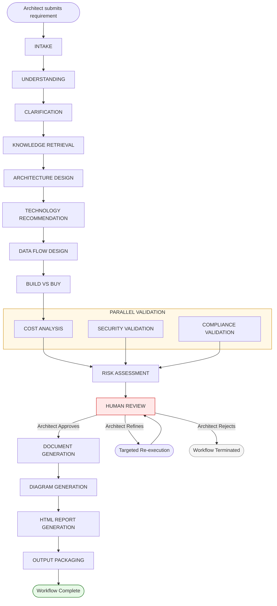
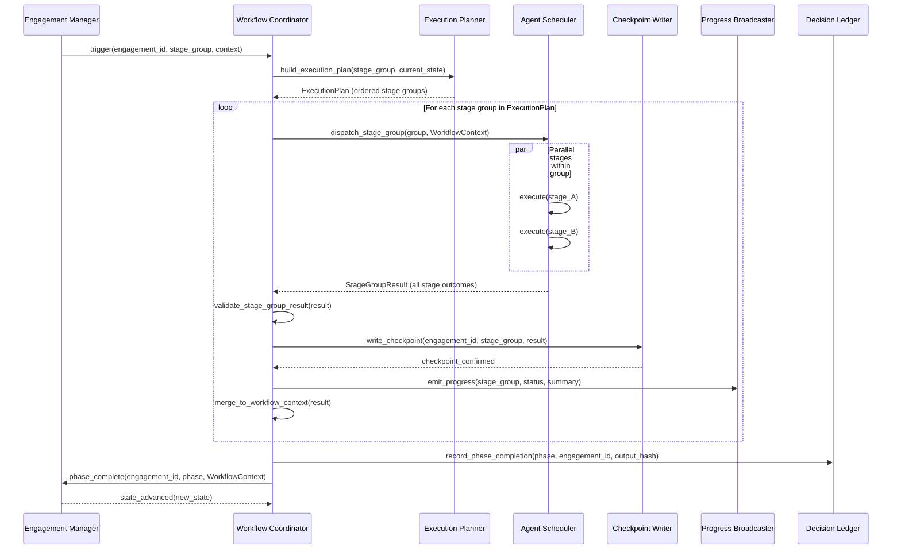
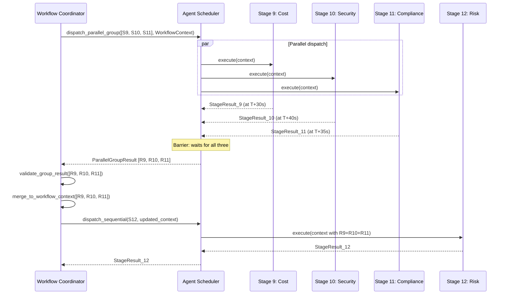
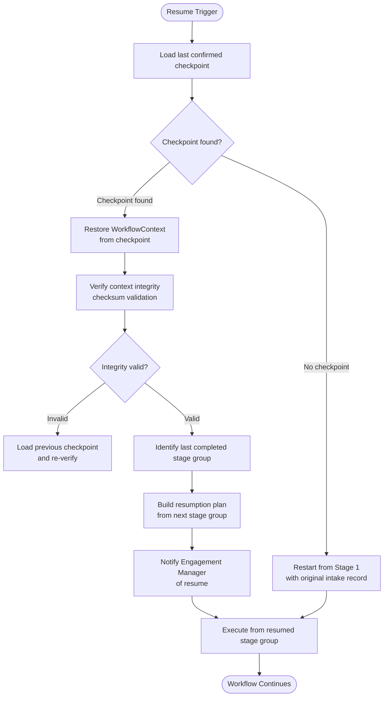
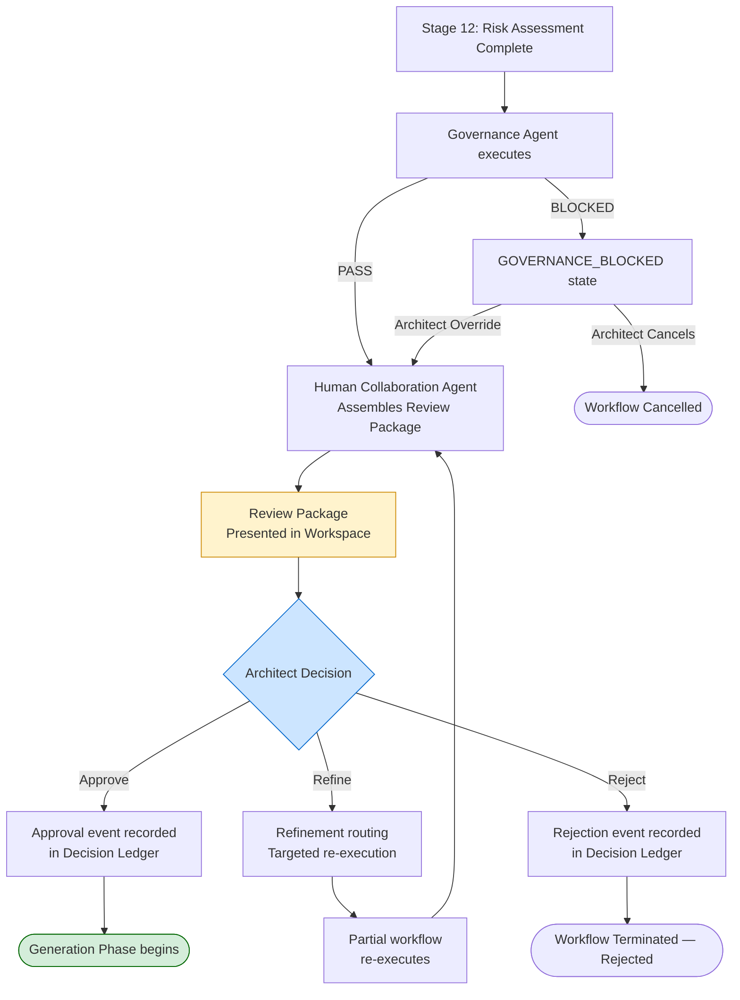
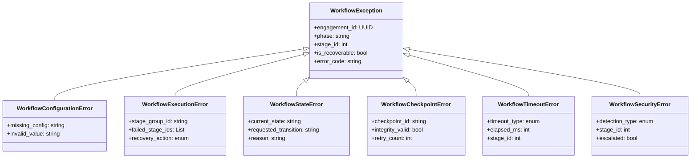

# WORKFLOW_ENGINE.md

> **Document Classification:** Workflow Engine Architecture — Source of Truth  
> **Parent Documents:** ARCHITECTURE_VISION.md · REPOSITORY_MASTER_STRUCTURE.md · SYSTEM_ARCHITECTURE.md · BACKEND_MODULE_ARCHITECTURE.md · FRONTEND_MODULE_ARCHITECTURE.md · AI_AGENT_ARCHITECTURE.md  
> **Status:** Approved — Foundation Release  
> **Version:** 1.0.0  
> **Scope:** Complete workflow engine architecture — lifecycle, states, execution model, stage orchestration, context propagation, checkpointing, human review integration, fault recovery, and extension strategy  
> **LLM Provider Assumption:** OpenAI (current implementation). Architecture is provider-independent.

---

## Table of Contents

1. [Workflow Engine Philosophy](#1-workflow-engine-philosophy)
2. [Workflow Lifecycle](#2-workflow-lifecycle)
3. [Workflow State Machine](#3-workflow-state-machine)
4. [Workflow Execution Model](#4-workflow-execution-model)
5. [Workflow Coordinator](#5-workflow-coordinator)
6. [Stage Catalog — All 17 Stages](#6-stage-catalog--all-17-stages)
7. [Stage Orchestration](#7-stage-orchestration)
8. [Sequential Execution](#8-sequential-execution)
9. [Parallel Execution](#9-parallel-execution)
10. [Conditional Execution](#10-conditional-execution)
11. [Context Propagation](#11-context-propagation)
12. [State Management](#12-state-management)
13. [Execution Queue](#13-execution-queue)
14. [Checkpoint Strategy](#14-checkpoint-strategy)
15. [Resume Capability](#15-resume-capability)
16. [Retry Strategy](#16-retry-strategy)
17. [Failure Recovery](#17-failure-recovery)
18. [Human Approval Workflow](#18-human-approval-workflow)
19. [Workflow Validation](#19-workflow-validation)
20. [Timeout Strategy](#20-timeout-strategy)
21. [Cancellation Strategy](#21-cancellation-strategy)
22. [Workflow Logging](#22-workflow-logging)
23. [Decision Recording](#23-decision-recording)
24. [Event Handling](#24-event-handling)
25. [Error Handling](#25-error-handling)
26. [Performance Rules](#26-performance-rules)
27. [Future Workflow Extension](#27-future-workflow-extension)
28. [Document Status and Metadata](#28-document-status-and-metadata)

---

## 1. Workflow Engine Philosophy

### 1.1 What the Workflow Engine Is

The Workflow Engine is the execution coordinator of the ArchitectIQ platform. Its sole purpose is to control the sequence, parallelism, and lifecycle of pipeline stages — from requirement intake through final output packaging — without containing any business logic, any agent logic, or any domain knowledge.

The Workflow Engine answers three questions at every point in an engagement's execution:

- **What runs next?** — Based on the current workflow state and the completion status of prior stages.
- **What does it receive?** — Based on the context propagation rules for the current stage.
- **What happens when it fails?** — Based on the failure policy for the current stage type.

These three questions have deterministic answers for every stage in the pipeline. The Workflow Engine is not an intelligent decision-maker — it is a precise execution coordinator that applies well-defined rules.

### 1.2 Core Boundaries

The Workflow Engine operates within strict boundaries established by the architecture:

**What the Workflow Engine owns exclusively:**
- Execution sequencing and parallelization decisions
- Stage dispatch and result collection
- Context assembly and propagation between stages
- Checkpoint creation and management
- Stage-level timeout enforcement
- Failure classification and recovery routing
- Workflow state transitions (in coordination with the Engagement Manager)
- Execution progress event emission

**What the Workflow Engine never owns:**
- Business logic (which architecture pattern is better — that is an agent's job)
- Human decisions (approve, refine, reject — that is the architect's job)
- Agent implementation (how an agent produces its output — that is the agent's job)
- Persistence of agent outputs (the EngagementRepository owns this — the Workflow Engine instructs persistence)
- Presentation concerns (how results are displayed — the Frontend owns this)

### 1.3 Relationship to Established Components

The Workflow Engine is the operational name for the coordination layer composed of the `MasterOrchestrator`, `PipelineManager`, `AgentScheduler`, `ResultAggregator`, and `ProgressBroadcaster` defined in BACKEND_MODULE_ARCHITECTURE.md and SYSTEM_ARCHITECTURE.md. This document defines their collective behavior as a coordinated workflow execution system.

The Workflow Engine receives pipeline triggers from the Engagement Manager and reports pipeline outcomes back to it. The Engagement Manager owns the authoritative engagement state machine. The Workflow Engine owns the execution plan within each triggered pipeline stage.

### 1.4 Foundational Principles

| Principle | Description |
|-----------|-------------|
| **Workflow controls agents; agents never control workflow** | An agent returns a result. The Workflow Engine decides what happens next. An agent has no visibility into the pipeline beyond its own execution context. |
| **Every stage produces structured output** | A stage that cannot produce structured output produces a typed failure result. It never produces unstructured text or partial output that the next stage must interpret defensively. |
| **Failed stages never corrupt completed stages** | A stage failure is isolated. The checkpoint preceding the failed stage is preserved intact. Completed stages' outputs are immutable — they are never overwritten by a retry or a failure event. |
| **Workflow state is always recoverable** | The Workflow Engine writes a checkpoint after every successful stage completion. Any workflow interrupted at any point — by a process crash, a timeout, or an infrastructure failure — can be resumed from the last written checkpoint. |
| **The human review gate is structurally enforced** | The workflow has no execution path from the Governance Check stage to the Document Generation stage that does not pass through the Human Review stage and an explicit architect approval event. This is enforced by the stage dependency rules, not by policy. |

---

## 2. Workflow Lifecycle

### 2.1 Lifecycle Overview

### 2.2 Lifecycle Phase Groups

| Phase | Stages | Character |
|-------|--------|-----------|
| **Intake Phase** | 1 (Requirement Intake) | System-level; no AI agent |
| **Discovery Phase** | 2–4 (Understanding, Clarification, Knowledge Retrieval) | Sequential; foundation for all subsequent stages |
| **Design Phase** | 5–8 (Architecture Design, Technology Recommendation, Data Flow Design, Build vs Buy) | Sequential; each stage depends on all prior design outputs |
| **Validation Phase** | 9–12 (Cost, Security, Compliance, Risk Assessment) | Stages 9–11 parallel; Stage 12 aggregates all three |
| **Governance Phase** | Embedded in Human Review (Stage 13) | Sequential; hard gate before human review |
| **Human Review Gate** | 13 | Mandatory human decision; unbounded iterations |
| **Generation Phase** | 14–16 (Document, Diagram, HTML Report) | Sequential; post-approval only |
| **Packaging Phase** | 17 (Final Output Packaging) | System-level; no AI agent |

---

## 3. Workflow State Machine

### 3.1 Complete Workflow State Machine

```mermaid
stateDiagram-v2
    [*] --> INITIATED : Engagement created

    INITIATED --> INTAKE_IN_PROGRESS : Workflow triggered

    INTAKE_IN_PROGRESS --> DISCOVERY_IN_PROGRESS : Intake complete
    INTAKE_IN_PROGRESS --> INTAKE_FAILED : Validation failure

    DISCOVERY_IN_PROGRESS --> CLARIFICATION_PENDING : Understanding complete; ambiguities found
    DISCOVERY_IN_PROGRESS --> KNOWLEDGE_RETRIEVING : Understanding complete; no ambiguities
    CLARIFICATION_PENDING --> ARCHITECT_RESPONDING : Clarification questions presented
    ARCHITECT_RESPONDING --> KNOWLEDGE_RETRIEVING : Architect responds
    ARCHITECT_RESPONDING --> KNOWLEDGE_RETRIEVING : Architect skips clarification
    KNOWLEDGE_RETRIEVING --> DESIGN_IN_PROGRESS : Retrieval complete
    DISCOVERY_IN_PROGRESS --> DISCOVERY_FAILED : Critical agent failure

    DESIGN_IN_PROGRESS --> VALIDATION_IN_PROGRESS : Design stage complete
    DESIGN_IN_PROGRESS --> DESIGN_FAILED : Critical agent failure

    VALIDATION_IN_PROGRESS --> GOVERNANCE_CHECKING : Validation complete
    VALIDATION_IN_PROGRESS --> VALIDATION_FAILED : Critical agent failure

    GOVERNANCE_CHECKING --> PENDING_HUMAN_REVIEW : Governance pass
    GOVERNANCE_CHECKING --> GOVERNANCE_BLOCKED : Hard policy violation
    GOVERNANCE_BLOCKED --> PENDING_HUMAN_REVIEW : Architect acknowledges and overrides
    GOVERNANCE_BLOCKED --> WORKFLOW_CANCELLED : Architect accepts block

    PENDING_HUMAN_REVIEW --> IN_REFINEMENT : Architect requests refinement
    PENDING_HUMAN_REVIEW --> WORKFLOW_APPROVED : Architect approves
    PENDING_HUMAN_REVIEW --> WORKFLOW_REJECTED : Architect rejects

    IN_REFINEMENT --> PENDING_HUMAN_REVIEW : Refinement stages complete

    WORKFLOW_APPROVED --> GENERATION_IN_PROGRESS : Generation triggered
    GENERATION_IN_PROGRESS --> PACKAGING_IN_PROGRESS : Generation complete
    PACKAGING_IN_PROGRESS --> WORKFLOW_COMPLETE : Packaging complete
    GENERATION_IN_PROGRESS --> GENERATION_FAILED : Generation agent failure

    INTAKE_FAILED --> [*]
    DISCOVERY_FAILED --> [*]
    DESIGN_FAILED --> [*]
    VALIDATION_FAILED --> [*]
    GENERATION_FAILED --> [*]
    WORKFLOW_CANCELLED --> [*]
    WORKFLOW_REJECTED --> [*]
    WORKFLOW_COMPLETE --> [*]
```

### 3.2 State Definitions

| State | Category | Description |
|-------|----------|-------------|
| `INITIATED` | Start | Engagement record created; workflow not yet triggered |
| `INTAKE_IN_PROGRESS` | Execution | Requirement intake stage executing |
| `DISCOVERY_IN_PROGRESS` | Execution | Understanding + Retrieval executing |
| `CLARIFICATION_PENDING` | Awaiting Input | Questions generated; awaiting architect response |
| `ARCHITECT_RESPONDING` | Awaiting Input | Architect has been presented with clarification questions |
| `KNOWLEDGE_RETRIEVING` | Execution | Knowledge Retrieval Agent executing |
| `DESIGN_IN_PROGRESS` | Execution | All four design stages executing sequentially |
| `VALIDATION_IN_PROGRESS` | Execution | Parallel validation stages executing |
| `GOVERNANCE_CHECKING` | Execution | Governance Agent executing |
| `GOVERNANCE_BLOCKED` | Awaiting Input | Hard policy violation; architect must acknowledge |
| `PENDING_HUMAN_REVIEW` | Human Gate | Human review gate open; awaiting architect decision |
| `IN_REFINEMENT` | Execution | Targeted re-execution of selected stages |
| `WORKFLOW_APPROVED` | Terminal-to-Generation | Architect has approved; generation triggered |
| `GENERATION_IN_PROGRESS` | Execution | Document, Diagram, HTML Report stages executing |
| `PACKAGING_IN_PROGRESS` | Execution | Output packaging executing |
| `WORKFLOW_COMPLETE` | Terminal (Success) | All stages complete; outputs available |
| `WORKFLOW_REJECTED` | Terminal (Rejected) | Architect rejected the proposal |
| `WORKFLOW_CANCELLED` | Terminal (Cancelled) | Architect or system cancelled the workflow |
| `*_FAILED` | Terminal (Failure) | Unrecoverable failure in the named phase |

### 3.3 State Ownership

The workflow states in Section 3.1 correspond to the engagement lifecycle states defined in SYSTEM_ARCHITECTURE.md Section 7.4. The Engagement Manager is the owner of the authoritative state record. The Workflow Engine reads the current state, executes the current stage, and notifies the Engagement Manager of the outcome. The Engagement Manager then writes the new state. The Workflow Engine never writes state directly — it requests state transitions through the Engagement Manager.

---

## 4. Workflow Execution Model

### 4.1 Execution Sequence

### 4.2 Execution Contract

The Workflow Engine executes against a fixed execution contract:

1. **Receive** a workflow trigger from the Engagement Manager. The trigger specifies the engagement ID, the phase to execute, and the current `WorkflowContext`.
2. **Plan** the execution by loading the phase's stage sequence from the workflow configuration.
3. **Execute** each stage group in order. Within a stage group, stages may be parallel or sequential per the group's declared execution mode.
4. **Validate** each stage group's result before proceeding. A stage group with a critical failure halts execution and notifies the Engagement Manager.
5. **Checkpoint** after each successful stage group. The checkpoint is written to durable storage and confirmed before the next stage group begins.
6. **Propagate** stage outputs into the cumulative `WorkflowContext` for the next stage group.
7. **Emit** progress events after each stage group completion for the Progress Broadcaster to stream to the client.
8. **Report** phase completion (or failure) to the Engagement Manager.

---

## 5. Workflow Coordinator

### 5.1 Purpose

The Workflow Coordinator is the runtime controller of the Workflow Engine. It is the component that receives execution triggers, coordinates the Execution Planner, Agent Scheduler, Checkpoint Writer, and Progress Broadcaster, and manages the flow of control through the workflow. In BACKEND_MODULE_ARCHITECTURE.md, the Workflow Coordinator corresponds to the `MasterOrchestrator` component.

### 5.2 Coordinator Responsibilities

| Responsibility | Description |
|---------------|-------------|
| **Trigger reception** | Accepts workflow execution triggers from the Engagement Manager. Validates the trigger (engagement exists, state is consistent, context is complete). |
| **Execution plan loading** | Loads the execution plan for the requested phase from the workflow configuration. The execution plan is static configuration — it is not computed dynamically based on agent outputs. |
| **Stage group dispatch** | Dispatches each stage group to the Agent Scheduler in order. Blocks on the result of each group before proceeding to the next. |
| **Result validation** | Validates the structural completeness of each stage group result. Does not validate the content quality — that is the agent's responsibility. |
| **Context accumulation** | Accumulates stage group outputs into the cumulative `WorkflowContext`. Each stage group's outputs are merged into the context before the next group receives it. |
| **Checkpoint coordination** | Instructs the Checkpoint Writer after each successful stage group. Does not proceed to the next group until the checkpoint is confirmed. |
| **Phase completion reporting** | Reports the outcome (success, critical failure, or human-gate-ready) to the Engagement Manager. |
| **Refinement coordination** | On receiving a refinement trigger from the Engagement Manager, builds a partial execution plan covering only the stages affected by the architect's feedback. |

### 5.3 Coordinator Statelessness

The Workflow Coordinator is stateless between executions. All state is externalized — to the `WorkflowContext` (passed in on each trigger), the checkpoint store (from which context is reconstructed on resume), and the Engagement Manager (which owns the authoritative state record). A Coordinator instance that crashes mid-execution is replaced by a new instance that resumes from the last confirmed checkpoint.

---

## 6. Stage Catalog — All 17 Stages

### Stage 1 — Requirement Intake

**Purpose:** Accept and structurally validate the architect's raw input before it enters the AI pipeline. This is a system-level stage — no AI agent is invoked.

**Input:** Raw architect submission: free-text requirement description, optionally accompanied by uploaded document files (PDF, DOCX). File content is extracted and attached as structured text.

**Output:** Validated intake record containing: sanitized requirement text, extracted document content (if applicable), metadata (submission timestamp, architect identity, session ID, engagement ID).

**Success Criteria:** Input is not empty. File content (if present) is successfully extracted. Input passes content sanitization (PII and secret pattern checks as defined in AI_AGENT_ARCHITECTURE.md Section 24). Intake record is written to the engagement record.

**Failure Handling:** Empty input → rejected with validation error returned to the architect immediately. File extraction failure → architect notified; intake proceeds with the text submission only. Sanitization failure → intake blocked; security event logged; architect notified.

**Dependencies:** None. This is the first stage in every workflow. No prior stage output is required.

---

### Stage 2 — Requirement Understanding

**Purpose:** Convert the sanitized intake record into a structured, schema-validated requirement set. Invokes the Requirement Intelligence Agent as defined in AI_AGENT_ARCHITECTURE.md Section 7.2.

**Input:** Sanitized intake record from Stage 1. Conversation history (for refinement scenarios where prior context is relevant).

**Output:** Structured requirement set: functional requirements list, non-functional requirements by category, compliance obligations, constraints, ambiguity flag list, extraction confidence score.

**Success Criteria:** At least one functional requirement is extracted. NFR categories are populated to the extent determinable from the input. Output schema is valid. At least one citation is present (knowledge base grounding for interpretation patterns used). Confidence score ≥ 0.5.

**Failure Handling:** Agent failure (FAILED status) → critical failure; workflow halts; architect notified. Agent degraded output (DEGRADED status) → workflow continues with low-confidence flag; architect attention item added to the review package. Zero functional requirements extracted → treated as DEGRADED; clarification questions generated immediately.

**Dependencies:** Stage 1 must be complete with SUCCESS status.

---

### Stage 3 — Clarification

**Purpose:** Resolve ambiguities in the structured requirement set by generating targeted questions for the architect and, after the architect responds, incorporating the clarifications into the requirement set. Invokes the Clarification Agent as defined in AI_AGENT_ARCHITECTURE.md Section 7.2.

**Input (question generation invocation):** Structured requirement set from Stage 2, including the ambiguity flag list.

**Output (question generation invocation):** Ordered clarification question set (maximum 5 questions, prioritized by architectural impact).

**Input (clarification incorporation invocation):** Structured requirement set from Stage 2, clarification questions, architect's responses.

**Output (clarification incorporation invocation):** Updated structured requirement set with resolved ambiguities incorporated; remaining unresolved ambiguity list.

**Success Criteria:** Clarification questions are presented to the architect via the chat interface. On response incorporation: at least one ambiguity is resolved (if the architect provided responses). Output schema is valid. Skip path (architect chooses not to answer): the original ambiguity list is preserved unchanged and flagged for the review package.

**Failure Handling:** Question generation failure → workflow continues with the original ambiguity list preserved; architect informed that clarification generation was unavailable. Clarification incorporation failure → workflow continues with the pre-clarification requirement set; architect informed.

**Dependencies:** Stage 2 must be complete. This stage is conditional: if Stage 2 produces zero ambiguity flags, Stage 3 is skipped and the workflow proceeds directly to Stage 4.

**Conditional skip rule:** The Workflow Coordinator checks the ambiguity flag count from Stage 2's output. If zero, Stage 3 is marked as SKIPPED (not FAILED) and the workflow advances. The `CLARIFICATION_PENDING` state is only entered if the ambiguity count is ≥ 1.

---

### Stage 4 — Knowledge Retrieval

**Purpose:** Query the enterprise knowledge base to surface patterns, precedents, regulatory frameworks, and technology evaluations that will ground the Design Phase. Invokes the Knowledge Retrieval Agent as defined in AI_AGENT_ARCHITECTURE.md Section 7.2.

**Input:** Finalized structured requirement set from Stage 3 (or Stage 2 if Stage 3 was skipped). Domain context. Compliance obligation list.

**Output:** Ranked retrieved context package: architecture pattern items, technology evaluation items, approved precedent items, regulatory framework items — all with source citations and relevance scores. Retrieval coverage assessment.

**Success Criteria:** At least 3 knowledge items retrieved with relevance score ≥ 0.6. All items carry source citations. Retrieval coverage assessment covers the major requirement categories. Confidence score ≥ 0.5.

**Failure Handling:** Retrieval service unavailable → DEGRADED result; workflow continues without knowledge grounding; all downstream agents receive zero retrieved context; confidence scores will be low; architect notified of degraded knowledge availability. Zero items retrieved (empty knowledge base for this domain) → DEGRADED; workflow continues; architect informed.

**Dependencies:** Stage 3 must be complete (or SKIPPED). Stage 4 is the gateway to the Design Phase.

---

### Stage 5 — Architecture Design

**Purpose:** Generate one to three candidate architecture options grounded in retrieved patterns and the structured requirements. Invokes the Architecture Design Agent as defined in AI_AGENT_ARCHITECTURE.md Section 7.3.

**Input:** Finalized structured requirements (from Stage 3/4). Retrieved knowledge context with citations (from Stage 4). Architect-declared constraints.

**Output:** Candidate architecture list (one to three candidates). For each: pattern name, component list, rationale, trade-off analysis, risks, confidence score. Recommended candidate with reasoning. Comparative summary table.

**Success Criteria:** At least one candidate architecture is produced. All candidates have at least one citation. Trade-off analysis is present for each candidate. Overall confidence ≥ 0.5. Output schema is valid.

**Failure Handling:** FAILED status → critical failure; Design Phase halts; architect notified. Zero candidates produced → critical failure; identical to FAILED. DEGRADED status (e.g., one candidate instead of three, with missing trade-off detail) → workflow continues; architect attention item flagged for the review package.

**Dependencies:** Stage 4 must be complete with SUCCESS or DEGRADED status. Stage 5 is the first stage of the Design Phase.

---

### Stage 6 — Technology Recommendation

**Purpose:** Select specific technologies for each component of each candidate architecture against the approved technology catalog and a standardized scoring framework. Invokes the Technology Recommendation Agent and the Infrastructure Recommendation Agent as defined in AI_AGENT_ARCHITECTURE.md Section 7.3.

**Input:** Candidate architectures from Stage 5. Structured requirements (cost sensitivity, cloud constraints). Approved technology catalog. Architect-declared technology constraints.

**Output:** Technology selection matrix (per component, per candidate). Technology justification narrative per selection. Licensing cost implications. Integration compatibility map. Infrastructure topology description per candidate (deployment, network, compute, HA configuration). IaC guidance description.

**Success Criteria:** Every major component in every candidate architecture has a technology selection with justification. Citations present for each selection from the catalog. Confidence ≥ 0.5.

**Failure Handling:** FAILED status → critical failure; Design Phase halts. DEGRADED (missing selections for some components) → workflow continues; architect attention item created for the incomplete selections.

**Dependencies:** Stage 5 must be complete with SUCCESS or DEGRADED status.

---

### Stage 7 — Data Flow Design

**Purpose:** Design the end-to-end data movement for each candidate architecture — from data sources through ingestion, processing, storage, and serving — with latency, throughput, and SLA characteristics. Invokes the Data Flow Agent as defined in AI_AGENT_ARCHITECTURE.md Section 7.3.

**Input:** Candidate architectures with technology selections (from Stage 6). Structured requirements (data volume, velocity, latency NFRs).

**Output:** Data flow specification per candidate: source inventory, ingestion patterns, processing stage sequence, storage tier mapping, serving layer, latency estimates per path, SLA mapping. Data flow diagram description (structured for Stage 15).

**Success Criteria:** Every candidate architecture has a complete data flow specification covering all declared data sources. End-to-end latency estimates are present for at least the critical data paths. Output schema is valid.

**Failure Handling:** FAILED status → advisory failure; Design Phase continues with data flow section marked unavailable; architect notified. The Design Phase is not halted by a Data Flow Agent failure because candidate architectures remain usable without this enrichment. Architect must acknowledge the gap before approving.

**Dependencies:** Stage 6 must be complete with SUCCESS or DEGRADED status.

---

### Stage 8 — Build vs Buy

**Purpose:** For each architecture layer, recommend whether to build a custom solution, adopt open-source, or procure a managed service — with explicit effort, cost, and risk trade-offs. Invokes the Build vs Buy Agent as defined in AI_AGENT_ARCHITECTURE.md Section 7.3.

**Input:** Candidate architectures with technology selections (from Stage 6). Structured requirements (budget, team capability, organizational constraints). Build vs Buy Agent configuration.

**Output:** Build vs Buy assessment per architecture layer: evaluated options, effort estimates, TCO trajectory, risk profile per option, recommendation with justification. Summary recommendation table. Overall posture (build-heavy, buy-heavy, hybrid).

**Success Criteria:** Every major architecture layer has a recommendation. Justification is present for each recommendation. Citations present from the knowledge base or catalog. Confidence ≥ 0.5.

**Failure Handling:** FAILED or DEGRADED status → advisory failure; Validation Phase proceeds; Build vs Buy section marked as unavailable or incomplete in the review package; architect notified.

**Dependencies:** Stage 6 must be complete. Stage 8 is the last stage of the Design Phase. Completion of Stage 8 (regardless of individual outcome) triggers the transition to the Validation Phase.

---

### Stages 9, 10, 11 — Validation Phase (Parallel)

#### Stage 9 — Cost Analysis

**Purpose:** Model infrastructure cost and total cost of ownership for each candidate architecture. Invokes the Cost Agent as defined in AI_AGENT_ARCHITECTURE.md Section 7.4.

**Input:** Candidate architectures with technology selections and Build vs Buy recommendations (from Stages 6–8). Infrastructure topology description. Workload profile from structured requirements.

**Output:** TCO model per candidate: component-level monthly estimate, total run-rate, 1-year and 3-year projections, cost scaling curve, top three optimization recommendations, licensing cost breakdown. Cost comparison across candidates. Budget risk flags.

**Success Criteria:** TCO model produced for at least one candidate. Cost estimates present for major components. Confidence ≥ 0.5.

**Failure Handling:** FAILED or DEGRADED → advisory failure; Cost section marked unavailable; architect must acknowledge before approving.

**Dependencies:** Stage 8 must be complete. Stages 9, 10, and 11 begin simultaneously as soon as Stage 8 is confirmed.

---

#### Stage 10 — Security Validation

**Purpose:** Perform threat modelling on each candidate architecture and validate the security design. Invokes the Security Agent as defined in AI_AGENT_ARCHITECTURE.md Section 7.4.

**Input:** Candidate architectures with technology selections and infrastructure topology. Data flow specifications. Enterprise security baseline. Data classification from structured requirements.

**Output:** Threat model summary per candidate: threat list with severity, control mapping, uncontrolled threats, security baseline deviation list. Security posture score per candidate.

**Success Criteria:** Threat model produced for at least one candidate. All identified threats are classified by severity. Security posture score calculated. Confidence ≥ 0.5.

**Failure Handling:** FAILED or DEGRADED → advisory failure; Security section marked unavailable; architect must acknowledge before approving.

**Dependencies:** Stage 8 complete. Runs in parallel with Stages 9 and 11.

---

#### Stage 11 — Compliance Validation

**Purpose:** Evaluate each candidate architecture against applicable regulatory frameworks. Invokes the Compliance Agent as defined in AI_AGENT_ARCHITECTURE.md Section 7.4.

**Input:** Candidate architectures with technology selections and infrastructure topology. Compliance obligations from structured requirements. Applicable regulatory frameworks from the knowledge base.

**Output:** Compliance checklist per candidate per framework: control-level pass/fail/needs-review. Compliance coverage percentage. Blocking and advisory findings. Compliance risk narrative.

**Success Criteria:** Compliance assessment produced for all declared regulatory frameworks. Control checklist complete. Confidence ≥ 0.5.

**Failure Handling:** FAILED or DEGRADED → advisory failure; Compliance section marked unavailable; architect must acknowledge before approving.

**Dependencies:** Stage 8 complete. Runs in parallel with Stages 9 and 10.

---

### Stage 12 — Risk Assessment

**Purpose:** Aggregate the outputs of the three parallel Validation stages (Cost, Security, Compliance) into a unified, prioritized risk register. Invokes the Risk Agent as defined in AI_AGENT_ARCHITECTURE.md Section 7.4.

**Input:** Security Agent output (Stage 10). Cost Agent output (Stage 9). Compliance Agent output (Stage 11). The Risk Agent waits until all three parallel stages complete before executing.

**Output:** Unified risk register: risk ID, category, description, probability, impact, risk score, affected candidate(s), suggested mitigation. Risk priority ranking. Risk dependency map. Risk posture summary per candidate.

**Success Criteria:** Risk register produced with at least the inputs from any successful parallel validation stage (even if one or two are FAILED/DEGRADED). Risk posture classification present for each candidate. Confidence ≥ 0.4 (lower threshold than other agents due to potential degraded inputs).

**Failure Handling:** If all three parallel stages produced FAILED results → Risk Agent itself fails critically; Validation Phase fails; architect notified; workflow blocked. If at least one parallel stage succeeded → Risk Agent executes on available inputs; result may be DEGRADED; workflow continues.

**Dependencies:** All three of Stages 9, 10, and 11 must be in terminal state (SUCCESS, DEGRADED, or FAILED) before Stage 12 begins. This is a synchronization barrier: Stage 12 does not begin until the last of the three parallel stages completes.

---

### Stage 13 — Human Review

**Purpose:** Present the complete proposal to the human architect for review, governance checking, and decision. This stage encompasses both the Governance Agent execution and the human review gate. The Governance Agent is invoked first; the Human Collaboration Agent packages the complete review proposal; the architect then makes their decision.

**Input (Governance Agent):** Complete Design Phase output (Stages 5–8). Complete Validation Phase output (Stages 9–12). Enterprise architecture policy catalog.

**Output (Governance Agent):** Governance verdict (PASS or BLOCKED), hard violation list, advisory finding list, policy coverage summary.

**Input (Human Collaboration Agent):** All Design and Validation stage outputs. Governance verdict. Engagement version number.

**Output (Human Collaboration Agent):** Structured review package presented in the workspace Review tab. On architect approval: approval record. On architect refinement: refinement routing specification for targeted re-execution. On architect rejection: rejection record.

**Success Criteria (Governance):** Governance verdict produced. Policy catalog fully checked against the architecture.

**Success Criteria (Human Review):** Architect makes an explicit decision — approve, refine, or reject. Decision is recorded in the Decision Ledger with identity attribution and timestamp.

**Failure Handling (Governance BLOCKED):** Workflow enters `GOVERNANCE_BLOCKED` state. Architect is notified. Architect may acknowledge the block and provide an override justification (which is recorded in the Decision Ledger) to allow the proposal to proceed to human review with the block annotated. Or the architect cancels the engagement.

**Failure Handling (Human Collaboration Agent FAILED):** Critical failure; workflow halts; architect notified; review package cannot be assembled; engagement remains in `PENDING_HUMAN_REVIEW` state pending investigation.

**Dependencies:** Stage 12 must be complete. Stage 13 is the Human Review Gate and the only mandatory human decision point in the workflow.

**Iteration:** If the architect selects Refine, Stage 13 re-enters `IN_REFINEMENT` state. The Workflow Coordinator executes a targeted re-execution plan (a subset of Stages 2–12 determined by the refinement routing specification). On completion of the re-executed stages, Stage 13 re-executes (Governance Agent and Human Collaboration Agent re-run on the updated outputs). Each iteration increments the review cycle counter and creates a new versioned proposal entry in the Decision Ledger.

---

### Stage 14 — Document Generation

**Purpose:** Produce all structured written deliverables from the approved architecture state. Invokes the Documentation Agent as defined in AI_AGENT_ARCHITECTURE.md Section 7.5.

**Input:** Approved architecture state (the single candidate approved by the architect, with all agent outputs, overrides, and refinements incorporated). Document template specifications (versioned templates from the configuration layer). Audience declaration.

**Output:** HLD document, LLD document, Executive Summary, Assumptions and Constraints Log, Risk Register narrative — all as structured content ready for rendering by Stage 16.

**Success Criteria:** All five document types produced with valid schema. Documents are internally consistent (same component names, same technology selections, same risk findings across all documents). Confidence ≥ 0.5.

**Failure Handling:** FAILED status → advisory failure; affected document types marked unavailable in the output bundle; architect notified; remaining document types are still packaged. This is a post-approval failure — the engagement is not reverted to `PENDING_HUMAN_REVIEW`. The architect may re-trigger generation.

**Dependencies:** Stage 13 must be complete with an architect approval event recorded in the Decision Ledger. Stage 14 is the first stage of the Generation Phase and is only reachable through the approval path.

---

### Stage 15 — Diagram Generation

**Purpose:** Produce all architecture diagram source code in Mermaid and Graphviz DOT formats. Invokes the Diagram Generation Agent as defined in AI_AGENT_ARCHITECTURE.md Section 7.5.

**Input:** Approved architecture state. Data flow specification (from Stage 7). Deployment topology (from Stage 6). Diagram type specifications and style configuration from the configuration layer.

**Output:** Architecture overview diagram (Mermaid), Data flow diagram (Mermaid), Deployment topology diagram (Graphviz DOT), Security boundary diagram (Mermaid), Component interaction diagram (Mermaid). Each diagram provided as source text with title, description, and legend.

**Success Criteria:** At least the architecture overview and data flow diagrams are produced with valid syntax. All produced diagrams are syntactically valid (validated by a Mermaid/Graphviz syntax checker, not rendered). Confidence ≥ 0.5.

**Failure Handling:** FAILED or individual diagram failures → advisory failure; affected diagram types marked unavailable; remaining diagrams are packaged; architect notified. Stage 16 (HTML Report) proceeds with whatever diagrams are available.

**Dependencies:** Stage 14 must be complete (SUCCESS or DEGRADED). Stage 15 uses the Documentation Agent's outputs as narrative context for the diagrams.

---

### Stage 16 — HTML Report Generation

**Purpose:** Produce a self-contained, interactive HTML architecture report for stakeholder delivery. Invokes the HTML Report Agent as defined in AI_AGENT_ARCHITECTURE.md Section 7.5.

**Input:** All Documentation Agent outputs (from Stage 14). All Diagram Generation Agent outputs (from Stage 15). Cost Agent TCO model data. Compliance assessment summary. HTML report template (versioned).

**Output:** Single self-contained HTML file with all architecture content, interactive navigation, embedded diagrams (Mermaid rendered in-browser), and print-optimized layout.

**Success Criteria:** HTML file produced. File is self-contained (no external CDN dependencies for core functionality). Embedded diagrams resolve correctly against the provided diagram source. File size within the configured limit. Confidence ≥ 0.5.

**Failure Handling:** FAILED → advisory failure; HTML report marked unavailable; other output formats (Markdown documents, individual diagram files) are still packaged; architect notified.

**Dependencies:** Stages 14 and 15 must be in terminal state (SUCCESS or DEGRADED). Stage 16 works with whatever content is available from both stages.

---

### Stage 17 — Final Output Packaging

**Purpose:** Assemble all generated artifacts into a versioned, complete output bundle. This is a system-level stage — no AI agent is invoked.

**Input:** All Generation Phase outputs (from Stages 14, 15, 16). Approved architecture state metadata. Engagement version number.

**Output:** Output bundle manifest: file paths, formats, generation timestamps, template versions, integrity checksums. Bundle stored in Output Storage with engagement-ID-scoped paths. Output availability notification to the Engagement Manager.

**Success Criteria:** At least one output format is included in the bundle. Manifest is complete and valid. All files in the manifest pass checksum verification. Output bundle is durably stored and confirmed.

**Failure Handling:** If no Generation Phase stage produced any output → packaging fails; architect notified; entire Generation Phase may need to be re-triggered. If partial outputs exist → bundle assembled from available outputs; manifest documents which types are missing; architect notified.

**Dependencies:** Stage 16 must be in terminal state. This is the last stage in the workflow.

---

## 7. Stage Orchestration

### 7.1 Execution Plan Structure

The Workflow Coordinator loads a static execution plan at the start of each phase. The execution plan is a configuration-driven specification — not computed from agent outputs — that defines:

- The ordered sequence of stage groups for the phase
- Whether each stage group executes sequentially or in parallel
- The inter-group dependencies (which groups must complete before the next begins)
- The failure policy for each stage (critical or advisory)
- The timeout for each stage

An execution plan is not modified during execution. A refinement changes which stages are re-executed — it does not change the execution plan's structure.

### 7.2 Stage Group Dependency Rules

| Rule | Description |
|------|-------------|
| **Linear dependency** | A stage group begins only after its declared predecessor stage group completes. The predecessor's terminal state must be either SUCCESS or DEGRADED (a FAILED predecessor halts the workflow unless the stage is declared advisory). |
| **Synchronization barrier** | Stage groups that converge from multiple parallel predecessors wait for all predecessors to reach terminal state before beginning. Stage 12 (Risk Assessment) is the primary synchronization barrier — it waits for Stages 9, 10, and 11. |
| **Conditional skip** | A stage group is marked SKIPPED when its execution condition is not met (e.g., Stage 3 is skipped when ambiguity count is zero). A SKIPPED stage is treated as SUCCESS for dependency purposes — downstream stages do not need to handle the absence of SKIPPED stage outputs. |
| **Failure isolation** | A stage group failure (when declared advisory) does not block subsequent stage groups. The failed group's outputs are absent from the `WorkflowContext`. Downstream agents receive null for those inputs and adapt their confidence scores accordingly. |

---

## 8. Sequential Execution

Sequential execution is the default execution mode. A stage group in sequential mode contains exactly one stage. The Workflow Coordinator dispatches the stage, waits for its completion, validates the result, writes the checkpoint, and proceeds.

**Stages that are always sequential:**
- Stage 1 (Intake) — no agent; system-level operation
- Stage 2 (Requirement Understanding) — foundation; nothing can run until requirements are structured
- Stage 3 (Clarification) — requires sequential interaction with the architect
- Stage 4 (Knowledge Retrieval) — grounds all design reasoning; must complete before any design
- Stage 5 (Architecture Design) — foundation of the design phase; no parallelism possible
- Stage 6 (Technology Recommendation) — depends on Stage 5
- Stage 7 (Data Flow Design) — depends on Stage 6
- Stage 8 (Build vs Buy) — depends on Stage 6
- Stage 12 (Risk Assessment) — aggregates parallel results; sequential by nature
- Stage 13 (Human Review) — requires human decision; inherently sequential
- Stages 14, 15, 16, 17 — generation and packaging; sequential for content consistency

**Sequential execution guarantee:** Within a sequential execution, no downstream stage begins execution until the upstream stage's checkpoint is written and confirmed. There is no optimistic pre-fetch or speculative execution.

---

## 9. Parallel Execution

Stages 9 (Cost Analysis), 10 (Security Validation), and 11 (Compliance Validation) form the Validation Phase parallel group. They execute simultaneously because they are independent — none depends on the output of another, and all three consume the same Design Phase output.

### 9.1 Parallel Execution Rules

| Rule | Description |
|------|-------------|
| **Independence requirement** | Stages within a parallel group must be provably independent — no stage may depend on another stage within the same group. If a dependency is identified, the dependent stage must be moved to a subsequent sequential stage group. |
| **Common input** | All parallel stages within a group receive the same `WorkflowContext` snapshot assembled before the group begins. They receive identical contexts — not sequential enrichment. |
| **Result isolation** | A parallel stage's result is held by the Agent Scheduler until all stages in the group have reached terminal state. The Workflow Coordinator processes results collectively after the group barrier clears. |
| **Partial failure handling** | If one stage in a parallel group fails (FAILED), the other stages continue executing. The failed stage's result is a typed failure record — not a crash that affects other stages. |
| **Barrier release condition** | The parallel group barrier releases when all stages have reached terminal state (SUCCESS, DEGRADED, or FAILED). The barrier never times out while stages are still executing — individual stage timeouts handle runaway execution within the group. |

### 9.2 Parallel Execution Flow

---

## 10. Conditional Execution

### 10.1 Conditional Execution Triggers

The workflow has three conditional execution branches:

**Branch 1 — Clarification Skip (Stage 3):**
Condition: Stage 2 output contains zero ambiguity flags.
Action: Stage 3 is marked SKIPPED. Workflow advances directly to Stage 4 with the Stage 2 requirement set used as Stage 3's output substitute.

**Branch 2 — Governance Block (within Stage 13):**
Condition: Governance Agent returns BLOCKED verdict.
Action: Workflow enters `GOVERNANCE_BLOCKED` state. Two sub-branches:
- Sub-branch A: Architect provides override justification → override recorded in Decision Ledger; workflow advances to Human Collaboration Agent with the block annotated in the review package.
- Sub-branch B: Architect accepts block → engagement cancelled; `WORKFLOW_CANCELLED` state recorded.

**Branch 3 — Human Review Decision (Stage 13):**
Condition: Architect makes a decision at the Human Review Gate.
Actions:
- Approve → `WORKFLOW_APPROVED`; Generation Phase triggered
- Refine → `IN_REFINEMENT`; Targeted re-execution executed; returns to Stage 13
- Reject → `WORKFLOW_REJECTED`; engagement closed; no Generation Phase

### 10.2 Targeted Re-execution (Refinement Branch)

When the architect selects Refine, the Workflow Coordinator executes a partial workflow:

1. The Human Collaboration Agent's feedback routing output (from AI_AGENT_ARCHITECTURE.md Section 7.6) provides a `RefinementPlan` — an ordered list of stage IDs that must re-execute.
2. The Workflow Coordinator builds a partial execution plan containing only the stages in the `RefinementPlan`.
3. The partial plan is executed against the current `WorkflowContext`, which retains all outputs from stages not in the `RefinementPlan`.
4. Only the re-executed stages update the `WorkflowContext`. Non-re-executed stage outputs are preserved unchanged.
5. On completion of the partial plan, Stage 13 re-executes (Governance Agent + Human Collaboration Agent) against the updated context.

**Refinement iteration limit:** The workflow does not enforce a hard limit on the number of refinement iterations. Each iteration is tracked in the engagement version counter. Operationally, the maximum iteration depth is a configurable limit that, when reached, surfaces a notification to the architect suggesting that the engagement be restarted with a revised requirement input.

---

## 11. Context Propagation

### 11.1 WorkflowContext — Concept

The `WorkflowContext` is the cumulative state of the workflow — the growing collection of structured outputs from all completed stages, available to every subsequent stage. It is the data backbone of the pipeline. The Workflow Coordinator assembles, enriches, and propagates the context; agents read from it but do not modify it; the Checkpoint Writer persists it.

### 11.2 WorkflowContext Composition

| Field | Type | Updated By |
|-------|------|------------|
| `engagement_id` | UUID | Set at workflow initiation; immutable |
| `session_id` | UUID | Set at workflow initiation; immutable |
| `workflow_version` | Integer | Incremented on each refinement cycle |
| `domain_context` | Object | Set at workflow initiation from configuration |
| `intake_record` | Object | Stage 1 completion |
| `structured_requirements` | Object | Stage 2 or 3 completion (whichever is last) |
| `retrieved_knowledge` | Object | Stage 4 completion |
| `candidate_architectures` | List | Stage 5 completion |
| `technology_selections` | Object | Stage 6 completion |
| `data_flow_specifications` | Object | Stage 7 completion |
| `build_vs_buy_assessments` | Object | Stage 8 completion |
| `cost_analysis` | Object | Stage 9 completion |
| `security_findings` | Object | Stage 10 completion |
| `compliance_assessment` | Object | Stage 11 completion |
| `risk_register` | Object | Stage 12 completion |
| `governance_verdict` | Object | Stage 13 (Governance Agent) completion |
| `approved_architecture` | Object | Set on architect approval; immutable thereafter |
| `architect_overrides` | List | Updated on each architect override in Stage 13 |
| `refinement_feedback` | String | Updated on each refinement cycle in Stage 13 |
| `generated_documents` | Object | Stage 14 completion |
| `generated_diagrams` | Object | Stage 15 completion |
| `generated_html_report` | Object | Stage 16 completion |
| `output_bundle_manifest` | Object | Stage 17 completion |
| `stage_completion_log` | Map | Updated after each stage with status and timestamp |
| `checkpoint_references` | List | Updated after each confirmed checkpoint |

### 11.3 Context Propagation Rules

- The `WorkflowContext` is passed to the Workflow Coordinator at the start of each phase trigger. The Coordinator passes the relevant subset of the context to each stage via the `AgentContext` assembly step.
- Each agent receives only the context fields declared in its input contract (AI_AGENT_ARCHITECTURE.md Section 9.3). The Coordinator enforces selective context exposure — an agent does not receive fields it is not declared to use.
- After each stage completes, the Coordinator merges the stage's output into the `WorkflowContext` for the relevant field. No other mechanism updates the context fields — only the Coordinator performs merges.
- Immutable fields (`engagement_id`, `session_id`, `approved_architecture`) are set once and cannot be overwritten by any subsequent stage. Any attempt by a stage to overwrite an immutable field is treated as a validation error.

---

## 12. State Management

### 12.1 Durable State

The `WorkflowContext` is persisted after every stage group completion via the Checkpoint Writer. Durable persistence uses the `EngagementRepository` as defined in BACKEND_MODULE_ARCHITECTURE.md Section 8.2. The context is serialized and written under a stable key: `{engagement_id}.workflow_context.v{workflow_version}`.

The workflow state (the current state machine state) is owned by the Engagement Manager, not by the Workflow Engine. The Workflow Coordinator reads the current state from the Engagement Manager and reports outcomes to it. The Engagement Manager writes the new state.

### 12.2 Ephemeral State

The following are ephemeral — they exist for the duration of a Workflow Coordinator execution session and are not persisted:

- The execution plan (loaded from configuration at trigger time)
- The in-progress parallel group result collection (held in memory until the barrier clears)
- The streaming buffer for the Progress Broadcaster
- The retry counter for an in-flight stage

If the Coordinator crashes with ephemeral state in progress, the state is reconstructed from the last confirmed checkpoint on resume.

### 12.3 State Immutability After Approval

Once the architect approves the proposal and the `approved_architecture` field is set in the `WorkflowContext`, that field is immutable for the lifetime of the engagement version. The Generation Phase reads from it; it does not modify it. A new architect approval for a revised proposal creates a new workflow version, which increments the `workflow_version` counter and creates a new `WorkflowContext` snapshot under the new version.

---

## 13. Execution Queue

### 13.1 Stage Dispatch Queue

The Agent Scheduler maintains a stage dispatch queue — an ordered list of pending stage executions. The Workflow Coordinator enqueues stage groups; the Agent Scheduler dequeues and dispatches them.

**Queue properties:**
- Ordered: stages are dequeued in the order they are enqueued
- Bounded: the queue has a maximum depth to prevent unbounded backlog accumulation
- Persistent: for long-running engagements, the queue is backed by durable storage to survive process restarts
- Per-engagement: each engagement has its own queue; cross-engagement queue contamination is not possible

**Queue priorities:**
- Human Review stage (Stage 13) items are high priority — they affect an architect waiting for a response
- Generation Phase stages are normal priority
- Background knowledge enrichment (post-completion) is low priority

### 13.2 Concurrency Control

The Workflow Coordinator enforces that no two stage groups execute simultaneously for the same engagement, except the declared parallel groups (Stages 9, 10, 11). This is enforced through the sequential dispatch logic — the Coordinator waits for each stage group's result before enqueuing the next.

Across different engagements, the Agent Scheduler can execute stage groups concurrently. The per-engagement `WorkflowContext` ensures complete isolation between engagements.

---

## 14. Checkpoint Strategy

### 14.1 Checkpoint Placement

A checkpoint is written after every stage group that reaches terminal state — regardless of whether the terminal state is SUCCESS, DEGRADED, or FAILED.

**Checkpoint write order:**
1. Stage group reaches terminal state
2. Workflow Coordinator validates the result structure
3. Coordinator instructs Checkpoint Writer to persist the updated `WorkflowContext`
4. Checkpoint Writer confirms the write (durable, acknowledged write)
5. Coordinator proceeds to the next stage group

**The Coordinator never proceeds to the next stage group before receiving checkpoint confirmation.** This invariant ensures that the Resume Capability (Section 15) can always restore from the last confirmed checkpoint.

### 14.2 Checkpoint Content

Each checkpoint contains:
- The complete `WorkflowContext` at the time of checkpoint (all fields populated up to this point)
- The identity of the last completed stage group
- The terminal state of each stage in the completed group (SUCCESS, DEGRADED, FAILED, SKIPPED)
- A hash of the `WorkflowContext` content for integrity verification
- The checkpoint timestamp (UTC)
- The workflow version at checkpoint time

### 14.3 Checkpoint Retention

Checkpoints for a given engagement version are retained for the lifetime of the engagement. On engagement completion (`WORKFLOW_COMPLETE`), checkpoints are archived to cold storage. On engagement rejection or cancellation, checkpoints are retained for audit purposes but marked as terminal-rejected.

---

## 15. Resume Capability

### 15.1 Resume Trigger

A workflow resume is triggered when:
- A Workflow Coordinator process restarts (crash recovery)
- A stage-level timeout causes the workflow to enter a recoverable failure state
- An infrastructure interruption is resolved
- An architect requests a re-run of a failed stage group

### 15.2 Resume Procedure

### 15.3 Resume Guarantees

- No successfully completed stage is re-executed during a resume. The checkpoint preserves all completed stage outputs intact.
- The stage that was interrupted at the time of failure is re-executed from the beginning of that stage (not from mid-execution). Agents are stateless and idempotent by design — re-execution of the same agent with the same `AgentContext` is safe.
- The architect is notified of the resume event through the workflow progress channel.

---

## 16. Retry Strategy

### 16.1 Stage-Level Retry Policy

Stage-level retry is distinct from agent-internal retry (defined in AI_AGENT_ARCHITECTURE.md Section 15). Stage-level retry is invoked by the Workflow Coordinator when an entire stage group reaches FAILED terminal state due to a retryable condition.

| Failure Condition | Retryable at Stage Level | Max Stage Retries | Retry Delay |
|------------------|-------------------------|-------------------|-------------|
| Agent FAILED due to LLM unavailability | Yes | 2 | 30s, 60s |
| Agent FAILED due to infrastructure outage | Yes | 2 | 60s, 120s |
| Agent FAILED due to output validation failure | No | 0 | — |
| Agent FAILED due to input validation failure | No | 0 | — |
| Stage timeout exceeded | Yes | 1 | 0s (immediate) |
| Checkpoint write failure | Yes | 3 | 5s, 10s, 20s |

### 16.2 Retry vs. Resume Distinction

**Retry:** Re-executes a stage within the same Coordinator session, without writing a checkpoint between retries. Retry is for transient failures within an executing session.

**Resume:** Restores from the last confirmed checkpoint after a session boundary (process restart, extended outage). Resume is for cross-session recovery.

---

## 17. Failure Recovery

### 17.1 Failure Classification

| Classification | Definition | Workflow Response |
|---------------|------------|------------------|
| **Transient** | Stage fails due to a temporary external condition (LLM rate limit, network timeout, infrastructure blip) | Retry per the retry policy; if retries exhausted → Persistent failure |
| **Persistent** | Stage fails after retry exhaustion due to an unresolved infrastructure or provider issue | Workflow halts; checkpoint preserved; architect and platform ops notified; resume possible when issue is resolved |
| **Critical** | Stage fails for a reason that makes the workflow semantically invalid (required output cannot be produced — e.g., zero requirements extracted) | Workflow halts; engagement enters FAILED state; architect must re-initiate the engagement |
| **Advisory** | Stage fails but the workflow can proceed without the stage's output (architect must acknowledge the gap at review) | Workflow continues; failure recorded in context; affected section marked unavailable in the review package |
| **Security** | Stage is blocked by a security check (prompt injection detected, PII in prompt) | Stage FAILED with security classification; security event logged; pipeline blocked; platform ops alerted |

### 17.2 Failure Isolation Invariant

A stage failure never propagates backward — it never corrupts or modifies the outputs of stages that completed successfully before the failure. The checkpoint written before the failed stage contains all prior outputs in their confirmed state. This invariant is maintained by the Checkpoint Strategy: checkpoints are written before each stage group begins, and completed stage outputs within the `WorkflowContext` are immutable once written.

### 17.3 Partial Validation Phase Recovery

If some (but not all) of the three parallel Validation stages fail:

- The Risk Assessment Agent (Stage 12) executes on the available inputs only
- Its confidence score is reduced proportionally to the number of missing inputs
- The review package annotates which validation types are unavailable
- The architect must acknowledge the validation gaps before approving
- The acknowledgment is recorded in the Decision Ledger as an informed-acceptance record

---

## 18. Human Approval Workflow

### 18.1 Human Review Gate Architecture

The Human Review Gate is the mandatory decision point between the Validation/Governance Phase and the Generation Phase. It is structurally enforced: there is no execution path in the workflow from Stage 12 to Stage 14 that does not pass through Stage 13 and an architect approval event.

### 18.2 Approval Event Requirements

An approval event is only valid if it contains all of the following:

| Field | Requirement |
|-------|-------------|
| `architect_identity_id` | The authenticated user ID of the approving architect — cannot be null |
| `approval_timestamp` | UTC timestamp — server-generated, not client-provided |
| `approved_architecture_version` | The specific version of the proposal being approved |
| `approved_architecture_hash` | A hash of the approved architecture state at the time of approval |
| `governance_verdict_acknowledged` | Boolean confirming the architect has reviewed the governance verdict |
| `validation_gaps_acknowledged` | Boolean confirming the architect has acknowledged any advisory validation failures |

An approval event missing any of these fields is rejected by the Decision Ledger and does not advance the workflow state. This validation is enforced by the `ReviewManager` (BACKEND_MODULE_ARCHITECTURE.md Section 4.4) — not by the Workflow Engine.

### 18.3 Review Cycle Tracking

Each iteration of the Human Review Gate increments the `workflow_version` counter in the `WorkflowContext`. The version counter is recorded in:

- The `WorkflowContext` (for downstream stage context)
- The Decision Ledger (for the proposal and approval event entries)
- The review package (for architect visibility: "Review cycle 3 of N")

There is no maximum review cycle enforced by the workflow — but each cycle is fully versioned and auditable.

---

## 19. Workflow Validation

### 19.1 Pre-execution Validation

Before the Workflow Coordinator begins executing any phase, it validates the trigger:

| Validation | Check |
|-----------|-------|
| Engagement exists | The engagement ID is present in the EngagementRepository |
| State is consistent | The current engagement state permits the requested phase execution |
| Context is present | A `WorkflowContext` is available (from checkpoint or initiation) |
| Context integrity | The checkpoint's content hash matches the stored context |
| Phase specification is valid | The requested phase exists in the workflow configuration |
| Execution plan is valid | The phase's execution plan references only registered agents (AgentRegistry) |

A pre-execution validation failure results in an immediate error returned to the Engagement Manager — no stage is executed.

### 19.2 Inter-stage Result Validation

After each stage group completes, the Workflow Coordinator validates the result structure:

| Validation | Check |
|-----------|-------|
| Result present | The stage group result is not null |
| Result count | The number of results matches the number of dispatched stages |
| Result schema | Each `AgentResult` contains all mandatory fields as defined in AI_AGENT_ARCHITECTURE.md Section 10.2 |
| Status is terminal | Each stage's `execution_status` is SUCCESS, DEGRADED, or FAILED — not a non-terminal state |
| Citations present | For SUCCESS results: citations are present (as validated within the agent) |

A result validation failure (malformed result from the scheduler) is treated as a critical failure at the Coordinator level — distinct from an agent FAILED result. It indicates an infrastructure issue, not an agent quality issue.

---

## 20. Timeout Strategy

### 20.1 Timeout Hierarchy

The workflow uses a three-level timeout hierarchy:

| Level | Scope | Configured By |
|-------|-------|--------------|
| **Agent-level timeout** | Individual agent invocation | Agent configuration (see AI_AGENT_ARCHITECTURE.md Section 25.1) |
| **Stage group timeout** | Total execution time of a stage group (includes all parallel stages) | Workflow configuration |
| **Phase timeout** | Total execution time of an entire phase | Workflow configuration |

### 20.2 Stage Group Timeout Values

| Stage Group | Default Timeout | Timeout Behavior |
|-------------|----------------|-----------------|
| Stage 1 — Intake | 30s | Critical: workflow fails; architect notified immediately |
| Stage 2 — Understanding | 60s | Critical: workflow halts |
| Stage 3 — Clarification | 45s | Advisory: skip clarification; proceed with ambiguities |
| Stage 4 — Knowledge Retrieval | 60s | Advisory: proceed with empty retrieval; confidence degraded |
| Stage 5 — Architecture Design | 180s | Critical: workflow halts |
| Stage 6 — Technology Recommendation | 120s | Advisory: proceed without tech selections |
| Stage 7 — Data Flow Design | 120s | Advisory: proceed without data flow |
| Stage 8 — Build vs Buy | 90s | Advisory: proceed without B vs B assessment |
| Stages 9–11 — Parallel Validation | 150s (wall clock) | Advisory per stage; barrier releases when all timeout |
| Stage 12 — Risk Assessment | 90s | Advisory: proceed with available findings |
| Stage 13 — Governance Agent | 60s | Critical: workflow halts |
| Stage 13 — Human Review | 72 hours | Configurable; produces a reminder notification at 24-hour intervals |
| Stage 14 — Document Generation | 150s | Advisory: generation marked unavailable |
| Stage 15 — Diagram Generation | 90s | Advisory: diagram types marked unavailable |
| Stage 16 — HTML Report Generation | 90s | Advisory: report marked unavailable |
| Stage 17 — Packaging | 60s | Retried; critical if all retries exhausted |

### 20.3 Human Review Gate Timeout

The Human Review Gate does not have a hard operational timeout — an architect may take hours or days to review a complex proposal. A configurable reminder is emitted via the notification system at the configured interval (default: 24 hours). After a maximum inactivity period (configurable, default: 30 days), the engagement is moved to a `REVIEW_STALE` advisory state, but the workflow is not terminated — the architect retains the ability to resume.

---

## 21. Cancellation Strategy

### 21.1 Architect-Initiated Cancellation

An architect may cancel an engagement at any point. Cancellation is an explicit action — not a timeout. The Engagement Manager receives the cancellation signal and instructs the Workflow Coordinator to abort the current phase.

**Cancellation during pipeline execution:**
1. Workflow Coordinator receives the abort instruction
2. Any in-progress stage group is allowed to complete its current operation (agents are not killed mid-invocation; they complete and their results are discarded)
3. No new stage groups are dispatched
4. The current checkpoint is preserved
5. The engagement state transitions to `WORKFLOW_CANCELLED`
6. Cancellation is recorded in the Decision Ledger

**Cancellation during Human Review:** The architect selects Reject (not Cancel) to decline the proposal while retaining the engagement history. Cancel terminates the engagement entirely. Both actions are recorded in the Decision Ledger with the architect's identity and timestamp.

### 21.2 System-Initiated Cancellation

The platform may cancel an engagement in the following system conditions:

| Condition | Action |
|-----------|--------|
| Phase timeout exceeded with no recoverable path | Engagement moved to `WORKFLOW_CANCELLED`; architect and ops notified |
| Security violation (confirmed prompt injection or data exfiltration attempt) | Immediate cancellation; security event escalated; engagement frozen |
| Governance hard block with architect inactivity timeout | Advisory cancellation notification to architect |

System-initiated cancellations are flagged with `cancellation_type: SYSTEM` in the Decision Ledger entry, distinct from architect-initiated cancellations (`cancellation_type: ARCHITECT`).

---

## 22. Workflow Logging

### 22.1 Log Entry Schema for Workflow Events

All workflow events are logged as structured entries conforming to the schema defined in BACKEND_MODULE_ARCHITECTURE.md Section 15.1, with the following workflow-specific mandatory fields:

| Field | Value |
|-------|-------|
| `event_type` | `workflow.{phase}.{event}` (e.g., `workflow.design.stage_complete`) |
| `workflow_version` | Current workflow version |
| `stage_id` | Stage number (1–17) |
| `stage_group_id` | Stage group identifier within the phase |
| `stage_status` | SUCCESS \| DEGRADED \| FAILED \| SKIPPED \| TIMEOUT \| CANCELLED |
| `checkpoint_id` | Reference to the checkpoint written after this stage (if applicable) |
| `duration_ms` | Total elapsed time for the stage group |

### 22.2 Events Requiring Log Entries

| Event | Log Level | Fields |
|-------|-----------|--------|
| Workflow phase triggered | INFO | Phase, trigger source, engagement state |
| Stage group dispatched | INFO | Stage IDs, execution mode (sequential/parallel) |
| Stage group completed | INFO | Stage IDs, outcomes, durations |
| Checkpoint written and confirmed | INFO | Checkpoint ID, context hash |
| Stage group failed (advisory) | WARN | Stage ID, failure reason, recovery action |
| Stage group failed (critical) | ERROR | Stage ID, failure reason, next action |
| Human review gate opened | INFO | Proposal version, governance verdict |
| Human review gate decision | INFO | Decision type (approve/refine/reject), iteration count |
| Workflow phase completed | INFO | Phase, duration, outcome |
| Workflow cancelled | WARN | Cancellation type (architect/system), reason |
| Workflow completed | INFO | Total duration, output bundle reference |
| Security event | CRITICAL | Detection type, stage ID, prompt hash |

---

## 23. Decision Recording

### 23.1 Decision Ledger Integration

The Workflow Engine records the following events to the Decision Ledger (defined in BACKEND_MODULE_ARCHITECTURE.md Section 4.13). All ledger writes occur through the `LedgerInterface` — the Workflow Engine never writes to the ledger's storage directly.

| Workflow Event | Ledger Entry Type | Recorded By |
|---------------|------------------|-------------|
| Phase completion | `workflow.phase_complete` | Workflow Coordinator via LedgerInterface |
| Governance verdict | `governance.verdict` | Workflow Coordinator via LedgerInterface |
| Proposal presented to architect | `review.proposal_presented` | Human Collaboration Agent via LedgerInterface |
| Architect approval | `review.approved` | Review Manager via LedgerInterface |
| Architect refinement request | `review.refinement_requested` | Review Manager via LedgerInterface |
| Architect override | `review.override_recorded` | Review Manager via LedgerInterface |
| Architect rejection | `review.rejected` | Review Manager via LedgerInterface |
| Governance override (architect bypasses block) | `governance.override_accepted` | Review Manager via LedgerInterface |
| Workflow cancellation | `workflow.cancelled` | Engagement Manager via LedgerInterface |
| Workflow completion | `workflow.completed` | Workflow Coordinator via LedgerInterface |

### 23.2 Ledger Write Timing

Ledger writes for human decisions are synchronous on the critical path: the decision is not acknowledged to the architect and the state machine does not advance until the ledger write is confirmed. This is the same guarantee established in SYSTEM_ARCHITECTURE.md Section 11.1 and enforced through the `LedgerInterface.append()` contract.

Ledger writes for non-human events (phase completion, governance verdict) are synchronous before the next phase begins — but they do not block the checkpoint write. Both checkpoint and ledger writes occur after stage group completion; the next stage group does not begin until both are confirmed.

---

## 24. Event Handling

### 24.1 Workflow Events

The Workflow Engine publishes internal events to the event bus (defined in BACKEND_MODULE_ARCHITECTURE.md Section 13.1) that trigger downstream reactions:

| Event Published | Trigger | Subscribers |
|----------------|---------|------------|
| `WorkflowStageGroupCompleted` | Stage group reaches terminal state | Progress Broadcaster (streams to client), Engagement Manager (state advance candidate) |
| `WorkflowHumanReviewReady` | Human Review Gate opens | Progress Broadcaster (high-priority notification), Frontend Notification Manager |
| `WorkflowPhaseCompleted` | Entire phase completes | Engagement Manager (advance state), Decision Ledger (record entry) |
| `WorkflowCompleted` | Stage 17 packaging complete | Engagement Manager (final state), Background Job Manager (trigger knowledge enrichment) |
| `WorkflowFailed` | Critical failure in any phase | Engagement Manager (fail state), Observability (alert), Progress Broadcaster (error notification) |
| `WorkflowCancelled` | Cancellation confirmed | Engagement Manager (cancel state), Progress Broadcaster (cancellation notice) |

### 24.2 Event Ordering Guarantee

The Workflow Engine publishes events in the order they occur. The event bus delivers events to subscribers in publication order per engagement. Cross-engagement events may be interleaved — the engagement ID in every event ensures subscriber-side routing to the correct engagement context.

---

## 25. Error Handling

### 25.1 Workflow-Level Error Taxonomy

### 25.2 Error Handling at the Workflow Coordinator

The Workflow Coordinator is the top-level error handler for all workflow-scoped errors. It never allows an unhandled exception to propagate to the Engagement Manager. All errors are caught, classified, and reported as typed `WorkflowException` subclasses. The Engagement Manager receives a typed outcome — not a raw exception.

### 25.3 Error Response by Type

| Error Type | Response |
|-----------|----------|
| `WorkflowConfigurationError` | Startup validation prevents configuration errors from reaching runtime. If encountered at runtime, critical failure — ops alert |
| `WorkflowExecutionError` | Apply failure policy for the failing stage. Advisory → continue. Critical → halt and notify. |
| `WorkflowStateError` | Reject the transition request. Return the error to the Engagement Manager. Do not execute any stages. |
| `WorkflowCheckpointError` | Retry write per checkpoint retry policy. If exhausted: critical halt. Alert ops. Do not proceed. |
| `WorkflowTimeoutError` | Apply the stage's timeout behavior (advisory or critical). Log the timeout event. |
| `WorkflowSecurityError` | Immediate halt. Security event emitted. Engagement frozen. Ops alerted. No retry. |

---

## 26. Performance Rules

The following rules govern workflow execution performance. They are requirements, not aspirations.

| Rule | Specification |
|------|--------------|
| **Stage dispatch overhead** | The time between stage group completion and the next stage group dispatch (excluding checkpoint write time) must be < 500ms |
| **Checkpoint write deadline** | A checkpoint write must complete within 5 seconds. If it does not, retry logic applies per Section 16.1 |
| **Context serialization** | The `WorkflowContext` must serialize and deserialize in < 200ms at all engagement stages. Context growth must be bounded — agents may not produce unbounded output fields |
| **Parallel group barrier** | The parallel group barrier (waiting for all parallel stages to complete) adds no overhead beyond the wall-clock time of the slowest parallel stage. The barrier is a pure wait — no computation occurs during the wait |
| **Progress event latency** | Progress events must be published within 1 second of the stage group reaching terminal state |
| **Human Review Gate presentation** | The review package must be assembled and available in the workspace within 30 seconds of Stage 13 (Human Collaboration Agent) completing |
| **Resume latency** | A workflow resume from checkpoint must begin stage execution within 10 seconds of the resume trigger |
| **Context field immutability** | Immutable context fields must not be copied or re-validated on every stage dispatch. They are validated once (at context restore) and then treated as trusted |

---

## 27. Future Workflow Extension

### 27.1 Adding a New Workflow Stage

A new stage can be added to the workflow without modifying the Workflow Coordinator's core logic:

1. Define the stage's position in the execution plan (which stage group it belongs to, its execution mode, its dependency).
2. Register the corresponding agent in the `AgentRegistry` (if an agent-backed stage).
3. Add the stage's configuration to the workflow configuration file.
4. Define the new field in the `WorkflowContext` schema that the stage produces.
5. Update the `AgentContext` assembly logic for downstream stages that depend on the new output.

**No changes to the Coordinator's execution logic are required** for new stages that fit within the existing phase structure. A stage that introduces a new phase (e.g., a new phase between Design and Validation) requires an update to the phase sequence in the workflow configuration and an Engagement Manager state machine update.

### 27.2 Adding a New Conditional Branch

Conditional branches are defined in the workflow configuration as evaluation rules on `WorkflowContext` fields. A new conditional branch is added by:

1. Defining the condition expression (referencing a `WorkflowContext` field and a comparison criterion)
2. Defining the branch outcome (SKIP, HALT, ALTERNATE_STAGE)
3. Registering the branch in the stage group configuration

The Workflow Coordinator evaluates configured conditions at stage group transitions — it does not contain hardcoded conditional logic (except for the three foundational branches defined in Section 10.1, which represent platform-level invariants).

### 27.3 Multi-Workflow Patterns (Future)

The current architecture supports a single linear workflow per engagement. Future capabilities may introduce:

| Pattern | Description |
|---------|-------------|
| **Sub-workflow composition** | A workflow that invokes a child workflow for a sub-problem (e.g., a separate migration-assessment sub-workflow) |
| **Workflow federation** | Multiple engagements contributing to a single architectural program, with a coordination workflow that aggregates their outputs |
| **Scheduled workflow** | A workflow that runs on a schedule for architecture drift detection (Phase 3 roadmap) |
| **Event-triggered workflow** | A workflow triggered by external events (infrastructure change detected, regulatory framework updated) |

These patterns extend the workflow engine at the configuration level — they do not require architectural changes to the Workflow Coordinator's core execution model.

### 27.4 Alternative LLM Provider Support

The Workflow Engine is already provider-independent. The only provider-specific assumption is in the agent implementations and the LLM Gateway adapter — both of which are outside the Workflow Engine's boundary. Adding a new LLM provider requires no changes to the workflow engine.

---

## 28. Document Status and Metadata

### Document Status

| Field | Value |
|-------|-------|
| Status | Approved — Foundation Release |
| Version | 1.0.0 |
| Classification | Workflow Engine Architecture — Source of Truth |

### Dependencies

This document depends on the following approved documents:

- `ARCHITECTURE_VISION.md` v1.0.0 — Non-negotiable rules and platform governance model
- `SYSTEM_ARCHITECTURE.md` v1.0.0 — Runtime behavior, state machine, execution flow, engagement lifecycle
- `BACKEND_MODULE_ARCHITECTURE.md` v1.0.0 — Orchestration Layer components (MasterOrchestrator, PipelineManager, AgentScheduler, ResultAggregator, ProgressBroadcaster), Decision Ledger, Checkpoint Writer
- `AI_AGENT_ARCHITECTURE.md` v1.0.0 — Agent catalog, agent contracts, agent execution lifecycle, context and result models

### Related Documents

| Document | Relationship |
|----------|-------------|
| `DATA_ARCHITECTURE.md` | Defines the persistence schema for `WorkflowContext` and checkpoint storage |
| `IMPLEMENTATION_BIBLE.md` | Coding standards for implementing the Workflow Coordinator, Pipeline Manager, and Agent Scheduler |
| `AGENT_TESTING_STANDARDS.md` | Testing standards for end-to-end pipeline testing |
| `KNOWLEDGE_BASE_ARCHITECTURE.md` | Defines the Knowledge Layer consumed by Stage 4 |
| `MONITORING_AND_OBSERVABILITY.md` | Defines alerting thresholds and dashboards for workflow execution metrics |

### Future Extension Notes

1. **Dynamic execution plans:** The current architecture uses static execution plans (loaded from configuration). Future versions may introduce dynamically computed execution plans driven by the content of Stage 2's output — for example, a requirement with a heavy genomics data component might automatically insert an additional specialist design stage. This extension is additive and does not change the Coordinator's core execution model.

2. **Distributed workflow execution:** The current architecture executes all stage groups within a single Coordinator session. Future versions may introduce distributed workflow execution where different stage groups can be executed on different Coordinator instances — useful for very long pipelines or very large parallel groups. The checkpoint strategy already supports this: a distributed executor can resume any stage group from the last confirmed checkpoint.

3. **Workflow templates:** A library of pre-defined workflow templates for common engagement types (Oracle-to-Cloud migration, Data Lakehouse implementation, Analytics Platform) would allow architects to select a template and get a pre-configured stage sequence optimized for their engagement type. Templates would be workflow configuration variants — not code changes.

4. **Real-time architecture monitoring workflow:** Phase 3 introduces a background workflow that monitors deployed infrastructure against the approved architecture. This workflow runs on a schedule, invokes a new Drift Detection Agent, and produces a deviation report that follows the same Human Review Gate before any remediation is proposed.

---

**End of WORKFLOW_ENGINE.md**  
**Version 1.0.0 — Foundation Release**  
**Classification:** Workflow Engine Architecture — Source of Truth  
**Next Document:** DATA_ARCHITECTURE.md
